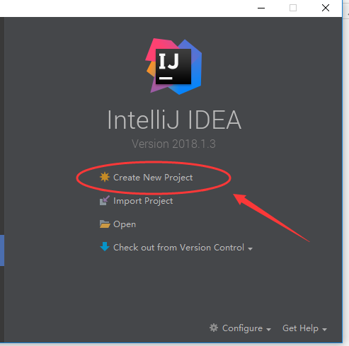
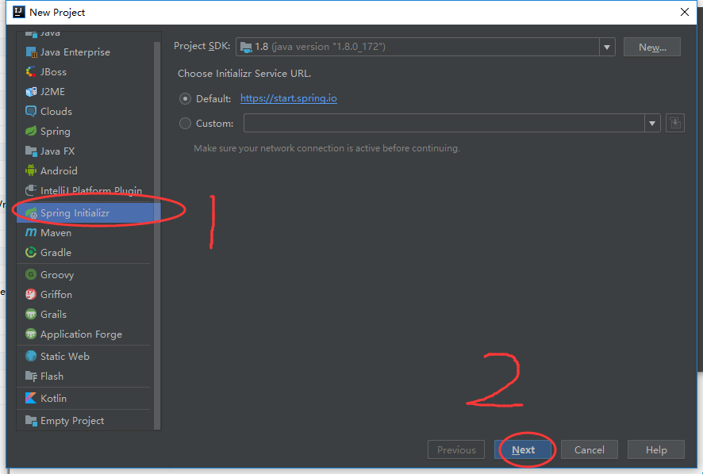
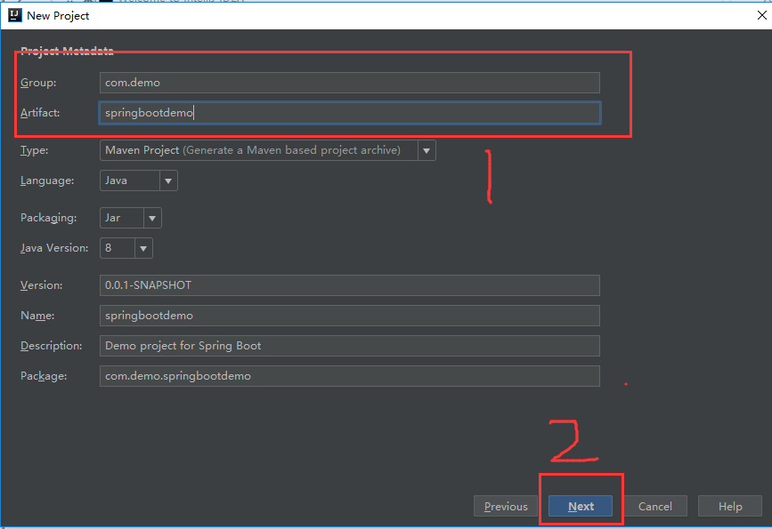
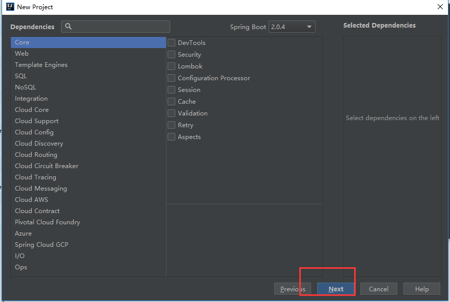
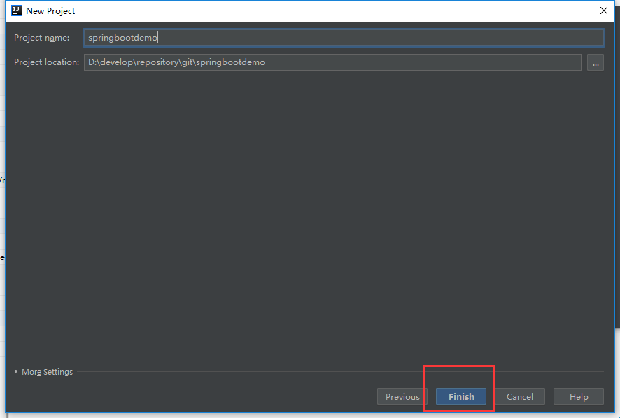
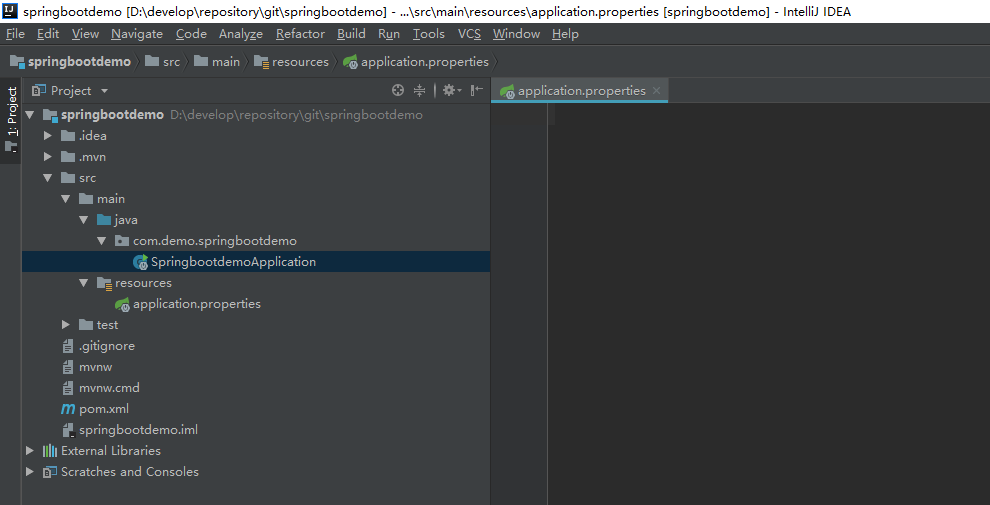

## Quick start with intellij IDEA    

## 使用 Intellij idea 的快速入门  


Create a **SpringBoot** maven web project with intellij idea  

Official documents: [Building an Application with Spring Boot](https://spring.io/guides/gs/spring-boot/)  

Spring Boot project generator: [SPRING INITIALIZR](https://start.spring.io/)  


使用 intellij idea 创建一个 SpringBoot maven 的 web 项目.  

springBoot 官方文档:  [Building an Application with Spring Boot](https://spring.io/guides/gs/spring-boot/)  

spting Boot 项目生成器: [SPRING INITIALIZR](https://start.spring.io/)  


### 1 创建新项目(Create new project)    




### 2 选择 spring boot 项目(select Spring Initializr)    

点击 `Spring Initializr` ---  点击 `Next`  




### 3 填写项目信息(Fill in the project information )    




### 4 选择项目依赖 (add depencies)     

这些 `Maven` 依赖可以在后期添加  




### 5 完成配置(finish)    

项目的名称按照前边的model 名称即可,不需要进行修改  

  


### 6 项目创建之后的效果(Project structure diagram)    

  


### 7 删除多余文件(delete redundant files)    

在项目创建之后, `Spring Boot` 会默认生成一些工具类的文件,这些文件可以不用保留在项目中  

删除文件包括:  

- `.maven` 文件夹  
- `mvnm` 文件  
- `mvnm.cm`  文件  

删除以上文件之后修改 `.gitignore` 文件,该文件为 `git` 仓库的忽略规则,其中有一点尤为重要  

`/target` 必须修改为 `**/target`  ,因为后期项目大多为多模块项目,因此必须将所有模块下编译后的文件目录设置为忽略  

`.gitignore` 文件模板( `.gitignore` template)  

```properties
##ignore this file##

### STS ###
.apt_generated
.classpath
.factorypath
.project
.settings
.springBeans
.sts4-cache

### IntelliJ IDEA ###
.idea
*.iws
*.iml
*.ipr

### NetBeans ###
/nbproject/private/
/build/
/nbbuild/
/dist/
/nbdist/
/.nb-gradle/

## all target dir ###
**/target

##filter databfile、sln file##
*.iml
*.mdb  
*.ldb  
*.sln    
##class file##
*.com  
*.class  
*.dll  
*.exe  
*.o  
*.so  
# compression file
*.7z  
*.dmg  
*.gz  
*.iso  
*.jar  
*.rar  
*.tar  
*.zip  
*.via
*.tmp
*.err 
# OS generated files #  
.DS_Store  
.DS_Store?  
._*  
.Spotlight-V100  
.Trashes  
Icon?  
ehthumbs.db  
Thumbs.db
```

