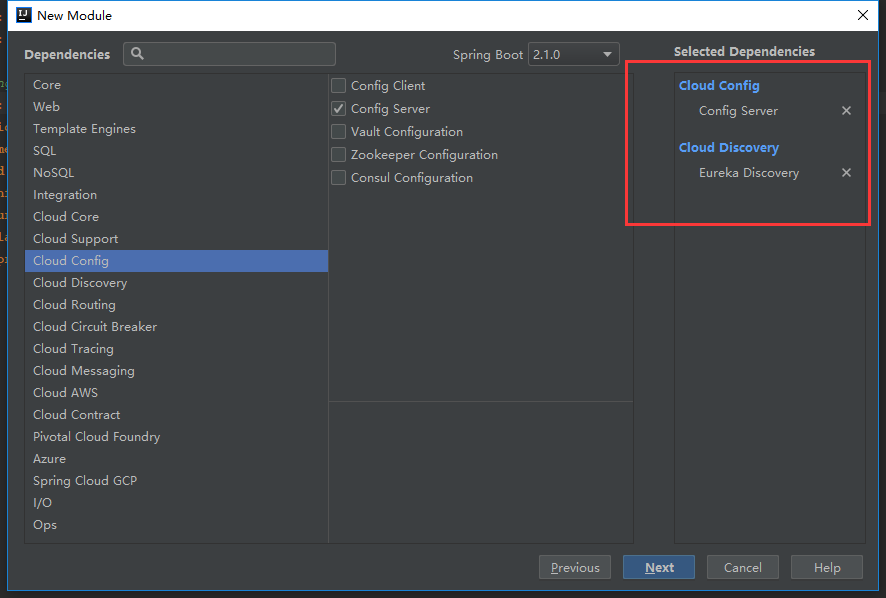
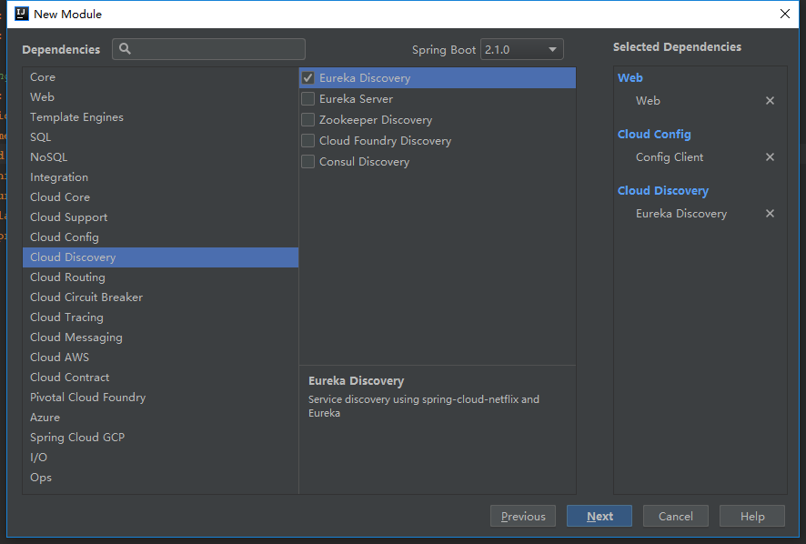

## spring boot 2.0 整合 spring cloud config 分布式配置中心    

​    
​    
​    
​    
​    
Spring cloud config 是 spring cloud 分布式系统中的配置中心技术框架,用于统一管理分布式系统中的配置文件信息。spring cloud config 分为两个模块,一个是 server 模块,一个是 client 模块。server 模块即为「配置中心」,所有的配置信息都放在这里进行管理, client 模块作为配置中心服务的客户端,从 server 模块读取配置信息。  


### 1 搭建 spring cloud config server 服务配置中心  

#### 1.1 创建 spring cloud config server 子模块并添加 maven 依赖    

创建子模块,选择对应的 maven 依赖:  



**说明**: 这里选择添加 `erueka Discovery` 的依赖是因为配置中心需要与 `Eureka` 服务进行整合, cloud config server作为分布式架构的配置中心,但同时也是 cloud 服务集群中的一个子服务。如果不考虑整合,则不需要添加该依赖  


模块创建后按照项目依赖规范整理 pom 文件  

[../cloud-config-server/pom.xml](../cloud-config-server/pom.xml "../cloud-config-server/pom.xml")  

```xml
<?xml version="1.0" encoding="UTF-8"?>
<project xmlns="http://maven.apache.org/POM/4.0.0" xmlns:xsi="http://www.w3.org/2001/XMLSchema-instance"
         xsi:schemaLocation="http://maven.apache.org/POM/4.0.0 http://maven.apache.org/xsd/maven-4.0.0.xsd">
    <modelVersion>4.0.0</modelVersion>

    <groupId>com.ljq.demo</groupId>
    <artifactId>cloud-config-client</artifactId>
    <version>1.0.0</version>
    <packaging>jar</packaging>
    <name>cloud-config-client</name>

    <parent>
        <artifactId>springboot</artifactId>
        <groupId>com.ljq.demo</groupId>
        <version>1.0.0</version>
    </parent>

    <properties>
        <project.build.sourceEncoding>UTF-8</project.build.sourceEncoding>
        <maven.compiler.source>${java.version}</maven.compiler.source>
        <maven.compiler.target>${java.version}</maven.compiler.target>
    </properties>

    <dependencies>
        <!-- spring boot starter -->
        <dependency>
            <groupId>org.springframework.boot</groupId>
            <artifactId>spring-boot-starter-actuator</artifactId>
        </dependency>

        <!-- devtools,hot deploy -->
        <dependency>
            <groupId>org.springframework.boot</groupId>
            <artifactId>spring-boot-devtools</artifactId>
            <optional>true</optional>
            <scope>true</scope>
        </dependency>

        <!-- spring junit test -->
        <dependency>
            <groupId>org.springframework.boot</groupId>
            <artifactId>spring-boot-starter-test</artifactId>
            <scope>test</scope>
        </dependency>

        <!-- web,mvc -->
        <dependency>
            <groupId>org.springframework.boot</groupId>
            <artifactId>spring-boot-starter-web</artifactId>
        </dependency>

        <!-- spring cloud -->
        <dependency>
            <groupId>org.springframework.cloud</groupId>
            <artifactId>spring-cloud-starter-netflix-eureka-client</artifactId>
        </dependency>

        <!-- spring cloud config -->
        <dependency>
            <groupId>org.springframework.cloud</groupId>
            <artifactId>spring-cloud-starter-config</artifactId>
        </dependency>

    </dependencies>

    <!--only in those modules that you want to run, but not in the parent pom-->
    <build>
        <plugins>
            <plugin>
                <groupId>org.springframework.boot</groupId>
                <artifactId>spring-boot-maven-plugin</artifactId>
            </plugin>
        </plugins>
    </build>

</project>
```

 

#### 1.2 添加 spring cloud config server 配置中心信息  

spring cloud config 作为分布式配置服务中心的配置信息建议写在 `bootstrap.properties/yml` 中,模块应用相关的配置信息可以写在 `application.properties/yml` 中  

[../cloud-config-server/src/main/resources/bootstrap.yml](../cloud-config-server/src/main/resources/bootstrap.yml "../cloud-config-server/src/main/resources/bootstrap.yml")  

```yaml
## spring cloud config [server]


# server
server:
  port: 8094

# spring config
spring:
  application:
    name: config-server
  # cloud config[git remote repository]
  cloud:
    config:
      server:
        git:
          uri: https://github.com/forezp/SpringcloudConfig
          search-paths: respo
          username:
          password:
      label: master
```

**说明**:  

`server.port` : 配置中心的服务端口, spring cloud 默认为 `8888`,这个端口的修改很重要,对于后边配置服务客户端(spring cloud config client) 的影响很大  

`spring.cloud.config.server.git.uri` : git 仓库地址,该地址可以为远程 git 仓库,也可以为本地仓库;如果为本地仓库,`windows` 系统中需要以 `file://` 开头, 如 `file:///D:/develop/repository/git/cloudConfigCenter`, **注意盘符与一级目录之间的 `":"`**  

`spring.cloud.config.server.git.search-paths`: 仓库下的文件路径,可以配置多个,中间用 `,` 间隔  

`spring.cloud.config.server.git.username` : git 仓库用户名,如果是公开的仓库,则不需要  

`spring.cloud.config.server.git.password` : git 仓库密码,如果是公开的仓库,则不需要  

`spring.cloud.config.server.label` : git 仓库分支名称  


[../cloud-config-server/src/main/resources/application.yml](../cloud-config-server/src/main/resources/application.yml "../cloud-config-server/src/main/resources/application.yml")  

```yaml
## spring cloud config [server]


# spring config
spring:
  cloud:
    config:
      discovery:
        enabled: true
        serviceId: config-server

## spring cloud eureka
eureka:
  client:
    serviceUrl:
      defaultZone: http://127.0.0.1:8088/eureka/
```


#### 1.3 启用 spring cloud config server 注解  

在 spring boot 启动类上边添加 `@EnableConfigServer` 注解  

```
../cloud-config-server/src/main/java/com/ljq/demo/springboot/cloudconfigserver/CloudConfigServerApplication.java
```

​    

```java
package com.ljq.demo.cloudconfigserver;

import org.springframework.boot.SpringApplication;
import org.springframework.boot.autoconfigure.SpringBootApplication;
import org.springframework.boot.autoconfigure.jdbc.DataSourceAutoConfiguration;
import org.springframework.boot.autoconfigure.orm.jpa.HibernateJpaAutoConfiguration;
import org.springframework.cloud.config.server.EnableConfigServer;
import org.springframework.cloud.netflix.eureka.EnableEurekaClient;

@SpringBootApplication(exclude={DataSourceAutoConfiguration.class,HibernateJpaAutoConfiguration.class})
@EnableConfigServer
@EnableEurekaClient
public class CloudConfigServerApplication {

    public static void main(String[] args) {
        SpringApplication.run(CloudConfigServerApplication.class, args);
    }
}
```

**说明**: 添加 `@EnableEurekaClient` 注解是为了和 `Eureka` 服务进行整合  


#### 1.4 通过配置中心访问远程配置信息  

以上步骤操作完成之后,即可启动运行配置中心,访问远程配置信息的方式为:  

- /{application}/{profile}[/{label}]
- /{application}-{profile}.yml
- /{label}/{application}-{profile}.yml
- /{application}-{profile}.properties
- /{label}/{application}-{profile}.properties

eg: [http://127.0.0.1:8094/config-client-dev/dev](http://127.0.0.1:8094/config-client-dev/dev  "http://127.0.0.1:8094/config-client-dev/dev")  

访问得到的信息为:  

```json
{
    "name": "config-client-dev",
    "profiles": [
        "dev"
    ],
    "label": null,
    "version": "00d32612a38898781bce791a4a845e60a7fbdb4e",
    "state": null,
    "propertySources": [
        {
            "name": "https://github.com/forezp/SpringcloudConfig/respo/config-client-dev.properties",
            "source": {
                "foo": "foo version 2",
                "democonfigclient.message": "hello spring io"
            }
        }
    ]
}
```

到这里，配置中心的服务端配置完成  


### 2 搭建 spring cloud 配置服务客户端   

#### 2.1 创建 spring cloud config client 子模块并添加 maven 依赖   

创建子模块并选择 maven 依赖  



**说明**: 同上, 添加 `Eureka Discovery` 依赖是为了和 `Erueka` 服务进行整合，添加 `web` 依赖是因为需要用到 `spring mvc` 模块功能，对外提供接口访问    


按照依赖管理规范整理 `pom` 文件:  

[../cloud-config-client/pom.xml](../cloud-config-client/pom.xml "../cloud-config-client/pom.xml")  

```xml
<?xml version="1.0" encoding="UTF-8"?>
<project xmlns="http://maven.apache.org/POM/4.0.0" xmlns:xsi="http://www.w3.org/2001/XMLSchema-instance"
         xsi:schemaLocation="http://maven.apache.org/POM/4.0.0 http://maven.apache.org/xsd/maven-4.0.0.xsd">
    <modelVersion>4.0.0</modelVersion>

    <groupId>com.ljq.demo</groupId>
    <artifactId>cloud-config-client</artifactId>
    <version>1.0.0</version>
    <packaging>jar</packaging>
    <name>cloud-config-client</name>

    <parent>
        <artifactId>springboot</artifactId>
        <groupId>com.ljq.demo</groupId>
        <version>1.0.0</version>
    </parent>

    <properties>
        <project.build.sourceEncoding>UTF-8</project.build.sourceEncoding>
        <maven.compiler.source>${java.version}</maven.compiler.source>
        <maven.compiler.target>${java.version}</maven.compiler.target>
    </properties>

    <dependencies>
        <!-- spring boot starter -->
        <dependency>
            <groupId>org.springframework.boot</groupId>
            <artifactId>spring-boot-starter-actuator</artifactId>
        </dependency>

        <!-- devtools,hot deploy -->
        <dependency>
            <groupId>org.springframework.boot</groupId>
            <artifactId>spring-boot-devtools</artifactId>
            <optional>true</optional>
            <scope>true</scope>
        </dependency>

        <!-- spring junit test -->
        <dependency>
            <groupId>org.springframework.boot</groupId>
            <artifactId>spring-boot-starter-test</artifactId>
            <scope>test</scope>
        </dependency>

        <!-- web,mvc -->
        <dependency>
            <groupId>org.springframework.boot</groupId>
            <artifactId>spring-boot-starter-web</artifactId>
        </dependency>

        <!-- spring cloud -->
        <dependency>
            <groupId>org.springframework.cloud</groupId>
            <artifactId>spring-cloud-starter-netflix-eureka-client</artifactId>
        </dependency>

        <!-- spring cloud config -->
        <dependency>
            <groupId>org.springframework.cloud</groupId>
            <artifactId>spring-cloud-starter-config</artifactId>
        </dependency>

    </dependencies>

    <!--only in those modules that you want to run, but not in the parent pom-->
    <build>
        <plugins>
            <plugin>
                <groupId>org.springframework.boot</groupId>
                <artifactId>spring-boot-maven-plugin</artifactId>
            </plugin>
        </plugins>
    </build>

</project>
```


#### 2.2 添加 spring cloud config client 配置信息  

前边提到的 cloud config server 的配置信息是建议放到 `bootstrap.properties/yml` 文件中，这里 cloud config cilent 关于配置中心的配置则 **必须** 放到 `bootstrap.properties/yml` 中,放到 `application.properties/yml` 中并不起作用  

关于 `bootstrap.properties/yml` 与 `application.properties/yml` 的区别,可参考:  

[SpringCloud入门之常用的配置文件 application.yml和 bootstrap.yml区别](https://www.cnblogs.com/BlogNetSpace/p/8469033.html "https://www.cnblogs.com/BlogNetSpace/p/8469033.html")  

`bootstrap.yml` 配置文件:  

[../cloud-config-client/src/main/resources/bootstrap.yml](../cloud-config-client/src/main/resources/bootstrap.yml "../cloud-config-client/src/main/resources/bootstrap.yml")  

```yaml
# spring cloud config client 启动时的默认服务(cloud config server)端口为 8888
# 端口配置在application.properties/yml都不行，必须是配置在bootstrap.properties/yml里面，否则还是会取本机的8888端口！！！
# 官网原话：Bootstrap properties are added with high precedence, so they cannot be overridden by local configuration
# 参考: https://blog.csdn.net/sinat_38843093/article/details/79961283
# 参考: https://www.cnblogs.com/BlogNetSpace/p/8469033.html


server:
  port: 8095

# spring cloud config
spring:
  application:
    name: config-client
  cloud:
    config:
      uri: http://127.0.0.1:8094
      label: master
      profile: dev
```

**说明**:  

`spring.cloud.config.uri` : spring cloud 分布式配置中心地址  

`spring.cloud.config.label` : 远程仓库的分支名称  

`spring.cloud.config.profile` : 本地项目的开发环境,如: `dev`, `test`, `pro`  


`application.yml` 配置文件:  

[../cloud-config-client/src/main/resources/application.yml](../cloud-config-client/src/main/resources/application.yml "../cloud-config-client/src/main/resources/application.yml")  

```yaml
## spring cloud config [client]

# spring config
spring:
  cloud:
    config:
      discovery:
        enabled: true
        serviceId: config-client

# refresh cloud config properties
management:
  endpoints:
    web:
      exposure:
        include: "*"

## spring cloud eureka
eureka:
  client:
    serviceUrl:
      defaultZone: http://127.0.0.1:8088/eureka/
```


### 2.3 通过 spring client  config client 访问配置中心的配置信息    

这里创建一个 controller 用于直观显示配置信息  

```
../cloud-config-client/src/main/java/com/ljq/demo/springboot/cloudconfigclient/controller/CloudConfigClientDemoController.java
```

​    

```java
package com.ljq.demo.cloudconfigclient.controller;

import org.springframework.beans.factory.annotation.Value;
import org.springframework.cloud.context.config.annotation.RefreshScope;
import org.springframework.web.bind.annotation.RequestMapping;
import org.springframework.web.bind.annotation.RestController;

/**
 * @Description: spring cloud config client demo controller
 * @Author: junqiang.lu
 * @Date: 2018/11/5
 */
@RefreshScope
@RestController
public class CloudConfigClientDemoController {

    @Value("${message: Hello default}")
    private String message;

    @Value("${foo: foo default}")
    private String foo;

    @RequestMapping("/message")
    String getMessage() {
        return this.message;
    }

    @RequestMapping("/foo")
    String getFoo(){
        System.out.println("foo: " + this.foo);
        return this.foo;
    }

}
```


spring boot 启动类:   

```
../cloud-config-client/src/main/java/com/ljq/demo/springboot/cloudconfigclient/CloudConfigClientApplication.java
```

​    

```java
package com.ljq.demo.cloudconfigclient;

import org.springframework.boot.SpringApplication;
import org.springframework.boot.autoconfigure.SpringBootApplication;
import org.springframework.boot.autoconfigure.jdbc.DataSourceAutoConfiguration;
import org.springframework.boot.autoconfigure.orm.jpa.HibernateJpaAutoConfiguration;
import org.springframework.cloud.netflix.eureka.EnableEurekaClient;

@SpringBootApplication(exclude={DataSourceAutoConfiguration.class,HibernateJpaAutoConfiguration.class})
@EnableEurekaClient
public class CloudConfigClientApplication {

    public static void main(String[] args) {
        SpringApplication.run(CloudConfigClientApplication.class, args);
    }
}
```

**说明** : 这里添加 `@EnableEurekaClient` 注解是为了和 `Erueka` 进行整合,spring cloud config client 不需要额外添加注解  


保持 cloud config server 服务开启，启动 cloud config client 程序  

通过 config client 访问配置中心的配置信息:  

[http://127.0.0.1:8095/foo](http://127.0.0.1:8095/foo "http://127.0.0.1:8095/foo")  

可以得到一下信息:  

```
foo version 2
```


至此,spring boot 2.0 整合 spring cloud config 完成,分布式系统系统中的所有子服务均可以从配置中心读取配置信息，从而实现分布式系统的配置信息统一管理  

本次提交记录:  

```bash
commit 808a1bbb890700b398eacaaa9ecc2ec3f7f4c7d8 (HEAD -> dev, origin/master, origin/dev, master)
Author: junqiang.lu <flying9001@gmail.com>
Date:   Thu Nov 8 09:38:15 2018 +0800

    spring boot 2.0 整合 spring cloud config
```

  

git 版本回退命令:  

```bash
git reset --soft 808a1bbb890700b398eacaaa9ecc2ec3f7f4c7d8
```


