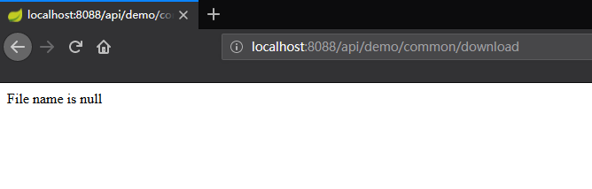
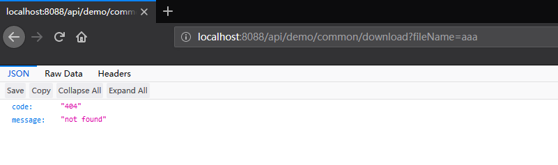
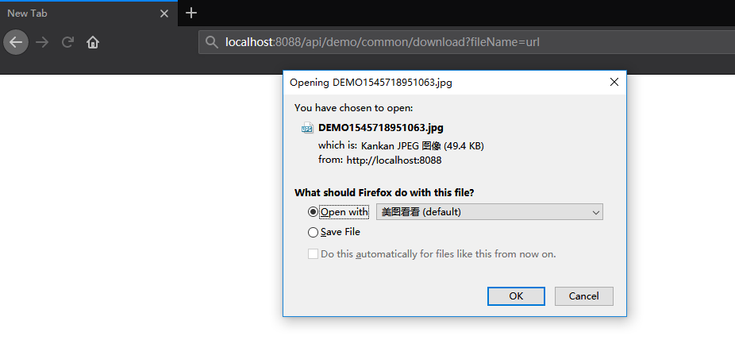
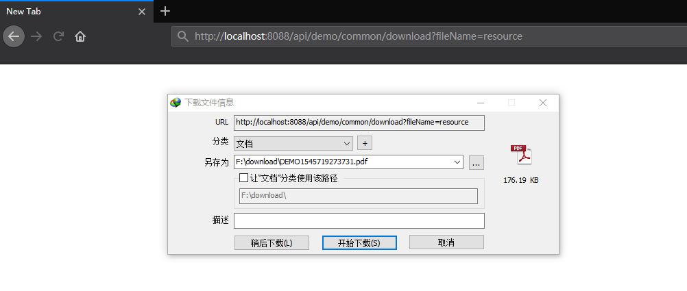
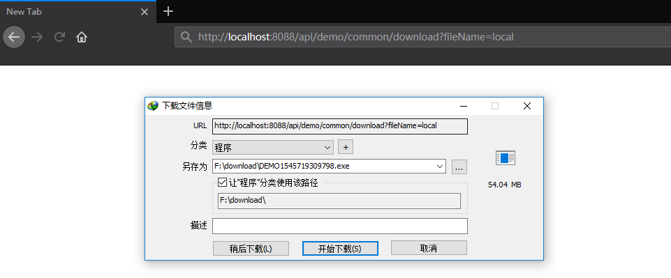

## Spring Boot 文件下载  


​    
​    
### 1 简介    

文件下载功能是项目中常用的功能之一,文件下载包括下载网络文件与服务器本地文件，本文将介绍与 Spring Boot 整合的符合 `RESTful` 风格的文件下载功能.  

### 2 Maven 依赖  

文件下载功能,要求 `Spring Boot` 项目必须包含 `web` 模块,具体依赖为:  

```xml
<!-- web,mvc -->
<dependency>
  <groupId>org.springframework.boot</groupId>
  <artifactId>spring-boot-starter-web</artifactId>
</dependency>
```


### 3文件处理工具类  

[com.ljq.demo.common.util.FileUtil](../demo-common/src/main/java/com/ljq/demo/common/util/FileUtil.java "../demo-common/src/main/java/com/ljq/demo/common/util/FileUtil.java")  

```java
package com.ljq.demo.common.util;

import org.springframework.core.io.ClassPathResource;

import java.io.*;
import java.net.URL;
import java.nio.ByteBuffer;
import java.nio.channels.FileChannel;

/**
 * @Description: 文件处理工具
 * @Author: junqiang.lu
 * @Date: 2018/12/24
 */
public class FileUtil {

    private FileUtil(){}


    /**
     * 从 URL 中读取文件到字节数组,java 读取网络文件
     *
     * @param urlText url 字符串
     * @return
     * @throws Exception
     */
    public static byte[] getBytesFromURLFile(String urlText) throws Exception {
        URL url = new URL(urlText);
        ByteArrayOutputStream output = new ByteArrayOutputStream();
        InputStream inputStream = url.openStream();
        int n = 0;
        byte[] buffer = new byte[1024];
        while (-1 != (n = inputStream.read(buffer))) {
            output.write(buffer, 0, n);
        }

        return output.toByteArray();
    }

    /**
     * 读取项目中的静态资源文件
     *
     * @param fileName 文件相对路径,根路径为 src/main/resources
     * @return
     * @throws IOException
     */
    public static byte[] getBytesFromResource(String fileName) throws IOException {
        ClassPathResource resource =  new ClassPathResource(fileName);
        ByteArrayOutputStream outputStream = new ByteArrayOutputStream();
        InputStream inputStream = resource.getInputStream();
        int n = 0;
        byte[] buffer = new byte[1024];
        while (-1 != (n = inputStream.read(buffer))) {
            outputStream.write(buffer, 0, n);
        }

        return outputStream.toByteArray();
    }

    /**
     * NIO 方式读取本地文件
     * 
     * @param filename 文件绝对路径
     * @return
     * @throws IOException
     */
    public static byte[] getByteFromFileWithNIO(String filename)throws IOException{

        File f = new File(filename);
        if(!f.exists()){
            throw new FileNotFoundException(filename);
        }
        FileChannel channel = null;
        FileInputStream fs = null;
        try{
            fs = new FileInputStream(f);
            channel = fs.getChannel();
            ByteBuffer byteBuffer = ByteBuffer.allocate((int)channel.size());
            channel.read(byteBuffer);
            return byteBuffer.array();
        }catch (IOException e) {
            e.printStackTrace();
            throw e;
        }finally{
            try{
                channel.close();
                fs.close();
            }catch (IOException e) {
                e.printStackTrace();
            }
        }
    }

}
```


### 4 参数接收 javaBean    

[com.ljq.demo.springboot.BaseBean](../demo-model/src/main/java/com/ljq/demo/springboot/BaseBean.java "../demo-model/src/main/java/com/ljq/demo/springboot/BaseBean.java")  

```java
package com.ljq.demo.springboot;

import lombok.Data;

import java.io.Serializable;

/**
 * @Description: 基础 bean
 * @Author: junqiang.lu
 * @Date: 2018/12/24
 */
@Data
public class BaseBean implements Serializable {

    private static final long serialVersionUID = 6877955227522370690L;

}

```


[com.ljq.demo.springboot.vo.DownloadBean](../demo-model/src/main/java/com/ljq/demo/springboot/vo/DownloadBean.java "../demo-model/src/main/java/com/ljq/demo/springboot/vo/DownloadBean.java")    

```java
package com.ljq.demo.springboot.vo;

import com.ljq.demo.springboot.BaseBean;
import lombok.Data;

/**
 * @Description: 下载
 * @Author: junqiang.lu
 * @Date: 2018/12/24
 */
@Data
public class DownloadBean extends BaseBean {

    /**
     * 待下载文件名
     */
    private String fileName;
}
```


### 5 Service 层  

[com.ljq.demo.springboot.service.CommonService](../demo-service/src/main/java/com/ljq/demo/springboot/service/CommonService.java "../demo-service/src/main/java/com/ljq/demo/springboot/service/CommonService.java")

```java
package com.ljq.demo.springboot.service;

import com.ljq.demo.springboot.vo.DownloadBean;
import org.springframework.http.ResponseEntity;

/**
 * @Description: 公共业务
 * @Author: junqiang.lu
 * @Date: 2018/12/24
 */
public interface CommonService {


    /**
     * 下载
     * @param downloadBean
     * @return
     */
    ResponseEntity<?> download(DownloadBean downloadBean) throws Exception;
}
```


[com.ljq.demo.springboot.service.impl.CommonServiceImpl](../demo-service/src/main/java/com/ljq/demo/springboot/service/impl/CommonServiceImpl.java "../demo-service/src/main/java/com/ljq/demo/springboot/service/impl/CommonServiceImpl.java")  

```java
package com.ljq.demo.springboot.service.impl;

import com.ljq.demo.common.util.FileUtil;
import com.ljq.demo.springboot.service.CommonService;
import com.ljq.demo.springboot.vo.DownloadBean;
import org.springframework.http.HttpHeaders;
import org.springframework.http.HttpStatus;
import org.springframework.http.MediaType;
import org.springframework.http.ResponseEntity;
import org.springframework.stereotype.Service;

/**
 * @Description: 公共业务具体实现类
 * @Author: junqiang.lu
 * @Date: 2018/12/24
 */
@Service("commonService")
public class CommonServiceImpl implements CommonService {


    /**
     * 下载
     * @param downloadBean
     * @return
     */
    @Override
    public ResponseEntity<?> download(DownloadBean downloadBean) throws Exception {
        HttpHeaders headers = new HttpHeaders();

        /**
         * 文件名为 null,返回字符串
         */
        if (downloadBean.getFileName() == null || "".equalsIgnoreCase(downloadBean.getFileName())) {
            headers.setContentType(MediaType.TEXT_HTML);
            return new ResponseEntity<String>("File name is null", headers, HttpStatus.NOT_FOUND);
        }

        /**
         * 根据文件名下载对应的文件
         * fileName:
         *     url: 下载网络文件
         *     resource: 下载项目中的文件
         *     local: 下载(服务器)本地文件
         */
        switch (downloadBean.getFileName()) {
            case "url":
                downloadBean.setFileName("https://upload-images.jianshu.io/upload_images/4412479-6895144ef53d208c.jpg?" +
                        "imageMogr2/auto-orient/strip%7CimageView2/2/w/1240");
                byte[] fileBytes = FileUtil.getBytesFromURLFile(downloadBean.getFileName());
                if (fileBytes != null && fileBytes.length > 0) {
                    headers.setContentType(MediaType.APPLICATION_OCTET_STREAM);
                    headers.setContentDispositionFormData("attachment", "DEMO" + System.currentTimeMillis() + ".jpg");
                    return new ResponseEntity<byte[]>(fileBytes, headers, HttpStatus.OK);
                }
                break;
            case "resource":
                downloadBean.setFileName("static/README.pdf");
                byte[] resourceBytes = FileUtil.getBytesFromResource(downloadBean.getFileName());
                if (resourceBytes != null && resourceBytes.length > 0) {
                    headers.setContentType(MediaType.APPLICATION_OCTET_STREAM);
                    headers.setContentDispositionFormData("attachment", "DEMO" + System.currentTimeMillis() + ".pdf");
                    return new ResponseEntity<byte[]>(resourceBytes, headers, HttpStatus.OK);
                }
                break;
            case "local" :
                downloadBean.setFileName("E:\\software\\tools\\AdbeRdr11_zh_CN11.exe");
                byte[] fileByteArray = FileUtil.getByteFromFileWithNIO(downloadBean.getFileName());
                if (fileByteArray != null &&fileByteArray.length > 0) {
                    headers.setContentType(MediaType.APPLICATION_OCTET_STREAM);
                    headers.setContentDispositionFormData("attachment", "DEMO" + System.currentTimeMillis() + ".exe");
                    return new ResponseEntity<byte[]>(fileByteArray, headers, HttpStatus.OK);
                }
                break;
            default:
                headers.setContentType(MediaType.APPLICATION_JSON_UTF8);
                return new ResponseEntity<String>("{ \"code\" : \"404\", \"message\" : \"not found\" }",
                        headers, HttpStatus.NOT_FOUND);
        }

        headers.setContentType(MediaType.APPLICATION_JSON_UTF8);
        return new ResponseEntity<String>("{ \"code\" : \"404\", \"message\" : \"not found\" }",
                headers, HttpStatus.NOT_FOUND);
    }
}
```


### 6 Controller 层  

[com.ljq.demo.springboot.web.controller.CommonController](../demo-web/src/main/java/com/ljq/demo/springboot/web/controller/CommonController.java "../demo-web/src/main/java/com/ljq/demo/springboot/web/controller/CommonController.java")  

```java
package com.ljq.demo.springboot.web.controller;

import com.ljq.demo.springboot.service.CommonService;
import com.ljq.demo.springboot.vo.DownloadBean;
import org.springframework.beans.factory.annotation.Autowired;
import org.springframework.http.HttpHeaders;
import org.springframework.http.HttpStatus;
import org.springframework.http.MediaType;
import org.springframework.http.ResponseEntity;
import org.springframework.web.bind.annotation.RequestMapping;
import org.springframework.web.bind.annotation.RequestMethod;
import org.springframework.web.bind.annotation.RestController;

/**
 * @Description: 公共模块控制中心
 * @Author: junqiang.lu
 * @Date: 2018/12/24
 */
@RestController
@RequestMapping("api/demo/common")
public class CommonController {

    @Autowired
    private CommonService commonService;


    @RequestMapping(value = "download", method = {RequestMethod.POST, RequestMethod.GET},
            produces = MediaType.MULTIPART_FORM_DATA_VALUE)
    public ResponseEntity<?> download(DownloadBean downloadBean){

        try {
            ResponseEntity<?> responseEntity = commonService.download(downloadBean);
            return responseEntity;
        } catch (Exception e) {
            e.printStackTrace();
        }

        HttpHeaders headers = new HttpHeaders();
        headers.setContentType(MediaType.APPLICATION_JSON_UTF8);
        return new ResponseEntity<String>("{ \"code\" : \"404\", \"message\" : \"not found\" }",
                headers, HttpStatus.NOT_FOUND);
    }

}
```


### 7 演示效果  

运行 `DemoWebApplication` 这个类 [com.ljq.demo.springboot.web.DemoWebApplication](../demo-web/src/main/java/com/ljq/demo/springboot/web/DemoWebApplication.java "../demo-web/src/main/java/com/ljq/demo/springboot/web/DemoWebApplication.java")    

#### 7.1 访问路径没有文件名参数    

路径:  [http://localhost:8088/api/demo/common/download](http://localhost:8088/api/demo/common/download "http://localhost:8088/api/demo/common/download")  

效果:   

    

说明: 测试当没有传递文件名时返回字符串至页面,测试结果表明下载文件的接口可以返回字符类型数据    

​    

#### 7.2 设置错误的文件名  

路径: [http://localhost:8088/api/demo/common/download?fileName=aaa](http://localhost:8088/api/demo/common/download?fileName=aaa "http://localhost:8088/api/demo/common/download?fileName=aaa")  

效果:  



说明: 继上一个测试,这里后台将字符串按照 `json` 格式进行封装,符合 `RESTful` 风格  

#### 7.3 下载网络文件  

路径: [http://localhost:8088/api/demo/common/download?fileName=url](http://localhost:8088/api/demo/common/download?fileName=url "http://localhost:8088/api/demo/common/download?fileName=url")  

效果:   

    

说明: 待下载的文件可能并不在当前运行的服务器,因此需要从网络中下载文件,服务器相当于中转；将项目作为下载服务器，用于下载其他资源  

​    

#### 7.4 下载项目中的文件  

路径: [http://localhost:8088/api/demo/common/download?fileName=resource](http://localhost:8088/api/demo/common/download?fileName=resource "http://localhost:8088/api/demo/common/download?fileName=resource")  

效果:  



说明: 通常**少量的资源文件**可以放到项目中一起发布,以便与提供下载,资源文件的根目录是 `src/main/resources`,在拼写文件路径时需要注意的是,填写的是基于根目录的相对路径  

​    

####  7.5 下载本地文件  

下载服务器本地文件,文件存放位置不一定和项目是在一起的。通常有大量的下载文件时,需要在服务器中专门设置一个目录，用于存放下载文件。这时，程序是根据文件在服务器中的绝对路径进行读取的,可以将该下载路径写在配置文件中,然后客户端传递 相对路径/文件名 即可   

路径: [http://localhost:8088/api/demo/common/download?fileName=local](http://localhost:8088/api/demo/common/download?fileName=local "http://localhost:8088/api/demo/common/download?fileName=local")  

效果:  




### X 注意事项  

- 使用 `ResponseEntity<?>` 作为下载文件接口的数据返回体,不指定固定的数据类型,则可以实现文件存在时返回文件,没有文件时返回错误信息。当返回信息使用 `json` 格式书写时,即可实现 `RESTful` 风格的下载功能  

- 文件下载接口不可使用 `@ResquestBody`  注解,否则会读取不到值  

- 使用 `ajax` 以及对 `ajax` 封装的框架(如 `VUE`)访问下载接口时，需要使用 `Form` 表单的形式进行数据提交,否则不会激活浏览器的下载功能。建议直接使用`a` 标签直接访问.关于 `ajax` 下载文件，可参考:  

  [AJAX POST方式上传文件到后台和下载后台传来的文件](https://blog.csdn.net/junehappylove/article/details/81287679 "https://blog.csdn.net/junehappylove/article/details/81287679")  

  [vue.js 使用axios实现下载功能](https://blog.csdn.net/seanxwq/article/details/78975661 "https://blog.csdn.net/seanxwq/article/details/78975661")  

- 在使用 `@RestController` 注解的 `controller` 类中,下载方法最好在 `@RequestMApping` 注解中添加 `produces = MediaType.MULTIPART_FORM_DATA_VALUE`属性,否则可能会也会引起请求接口后不下载  

    
  

本次提交记录  

```bash
commit 99a80f83076ccf535814e6088ac8cbbf41efa62e (HEAD -> dev, origin/master, master)
Author: junqiang.lu <flying9001@gmail.com>
Date:   Tue Dec 25 13:31:58 2018 +0800

    springBoot下载功能添加服务器本地文件下载
```


版本回退  

```bash
git reset --soft 99a80f83076ccf535814e6088ac8cbbf41efa62e
```


  


