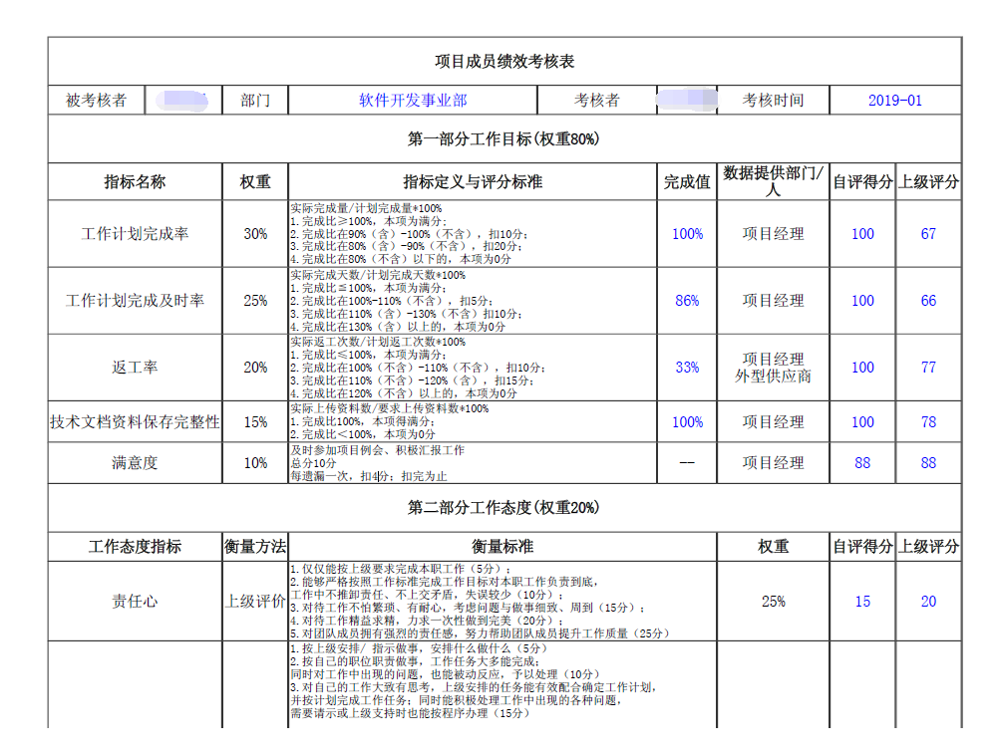
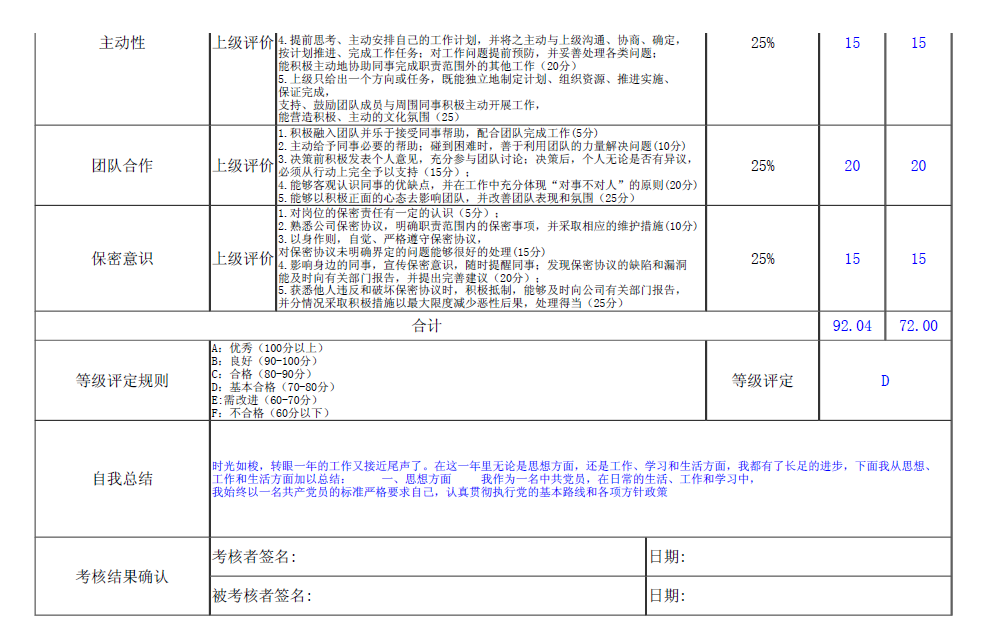
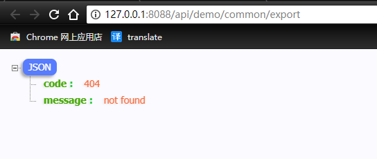

## SpringBoot 通过 freemarker iText 渲染 html 模板导出 PDF  


​    
​    
### 1 摘要  

PDF 导出在需要将信息纸质化存档时会使用到。这里将介绍在 spring boot 框架下使用 Freemarker + iText 将 ftl 模板渲染成 html,然后导出 PDF 文件  

Freemarker 官方文档: [https://freemarker.apache.org/docs/index.html](https://freemarker.apache.org/docs/index.html "https://freemarker.apache.org/docs/index.html")  

​     

### 2 Maven 依赖  

核心 Maven 依赖  

[../pom.xml](../pom.xml "../pom.xml")  

```xml
            <!-- freemarker,生成 html -->
            <dependency>
                <groupId>org.freemarker</groupId>
                <artifactId>freemarker</artifactId>
                <version>${freemarker.version}</version>
            </dependency>
            <!-- 渲染 css 样式 -->
            <dependency>
                <groupId>org.xhtmlrenderer</groupId>
                <artifactId>flying-saucer-pdf</artifactId>
                <version>${flying-saucer-pdf.version}</version>
            </dependency>
            <!-- iText,export pdf -->
            <dependency>
                <groupId>com.itextpdf</groupId>
                <artifactId>itextpdf</artifactId>
                <version>${itextpdf.version}</version>
            </dependency>
```

其中对应的版本为:  

```xml
<freemarker.version>2.3.28</freemarker.version>
<flying-saucer-pdf.version>9.1.16</flying-saucer-pdf.version>
<itextpdf.version>5.5.13</itextpdf.version>
```

​    

### 3 核心代码  

#### 3.1 资源文件处理工具类  

 [com.ljq.demo.common.util.ResourceFileUtil](../demo-common/src/main/java/com/ljq/demo/common/util/ResourceFileUtil.java "../demo-common/src/main/java/com/ljq/demo/common/util/ResourceFileUtil.java")  

```java
package com.ljq.demo.common.util;

import org.springframework.util.ResourceUtils;

import java.io.File;
import java.io.FileNotFoundException;

/**
 * @Description: 项目静态资源文件工具类
 *     仅可用于包含在web项目中的资源文件路径,资源文件必须放置于 web 模块下
 * @Author: junqiang.lu
 * @Date: 2019/1/4
 */
public class ResourceFileUtil {


    /**
     * 获取资源文件
     *
     * @param relativePath 资源文件相对路径(相对于 resources路径,路径 + 文件名)
     *                     eg: "templates/pdf_export_demo.ftl"
     * @return
     * @throws FileNotFoundException
     */
    public static File getFile(String relativePath) throws FileNotFoundException {
        if (relativePath == null || relativePath.length() == 0) {
            return null;
        }
        if (relativePath.startsWith("/")) {
            relativePath = relativePath.substring(1);
        }
        File file = ResourceUtils.getFile(ResourceUtils.CLASSPATH_URL_PREFIX
                + relativePath);

        return file;
    }

    /**
     * 获取资源绝对路径
     *
     * @param relativePath 资源文件相对路径(相对于 resources路径,路径 + 文件名)
     *                     eg: "templates/pdf_export_demo.ftl"
     * @return
     * @throws FileNotFoundException
     */
    public static String getAbsolutePath(String relativePath) throws FileNotFoundException {
        return getFile(relativePath).getAbsolutePath();
    }

    /**
     * 获取资源父级目录
     *
     * @param relativePath 资源文件相对路径(相对于 resources路径,路径 + 文件名)
     *                     eg: "templates/pdf_export_demo.ftl"
     * @return
     * @throws FileNotFoundException
     */
    public static String getParent(String relativePath) throws FileNotFoundException {
        return getFile(relativePath).getParent();
    }

    /**
     * 获取资源文件名
     *
     * @param relativePath 资源文件相对路径(相对于 resources路径,路径 + 文件名)
     *                     eg: "templates/pdf_export_demo.ftl"
     * @return
     * @throws FileNotFoundException
     */
    public static String getFileName(String relativePath) throws FileNotFoundException {
        return getFile(relativePath).getName();
    }

}
```


#### 3.2 PDF 生成工具类  

[com.ljq.demo.common.util.PDFUtil](../demo-common/src/main/java/com/ljq/demo/common/util/PDFUtil.java "../demo-common/src/main/java/com/ljq/demo/common/util/PDFUtil.java")  

```java
package com.ljq.demo.common.util;

import com.lowagie.text.DocumentException;
import com.lowagie.text.pdf.BaseFont;
import freemarker.template.Configuration;
import freemarker.template.Template;
import freemarker.template.TemplateException;
import freemarker.template.TemplateExceptionHandler;
import org.xhtmlrenderer.pdf.ITextFontResolver;
import org.xhtmlrenderer.pdf.ITextRenderer;

import java.io.*;
import java.util.Map;

/**
 * @Description: pdf 导出工具类
 * @Author: junqiang.lu
 * @Date: 2018/12/25
 */
public class PDFUtil {

    private PDFUtil(){}

    private volatile static Configuration configuration;

    static {
        if (configuration == null) {
            synchronized (PDFUtil.class) {
                if (configuration == null) {
                    configuration = new Configuration(Configuration.VERSION_2_3_28);
                }
            }
        }
    }

    /**
     * freemarker 引擎渲染 html
     *
     * @param dataMap 传入 html 模板的 Map 数据
     * @param ftlFilePath html 模板文件相对路径(相对于 resources路径,路径 + 文件名)
     *                    eg: "templates/pdf_export_demo.ftl"
     * @return
     */
    public static String freemarkerRender(Map<String, Object> dataMap, String ftlFilePath) {
        Writer out = new StringWriter();
        configuration.setDefaultEncoding("UTF-8");
        configuration.setTemplateExceptionHandler(TemplateExceptionHandler.RETHROW_HANDLER);
        try {
            configuration.setDirectoryForTemplateLoading(new File(ResourceFileUtil.getParent(ftlFilePath)));
            configuration.setLogTemplateExceptions(false);
            configuration.setWrapUncheckedExceptions(true);
            Template template = configuration.getTemplate(ResourceFileUtil.getFileName(ftlFilePath));
            template.process(dataMap, out);
            out.flush();
            return out.toString();
        } catch (IOException e) {
            e.printStackTrace();
        } catch (TemplateException e) {
            e.printStackTrace();
        } finally {
            try {
                out.close();
            } catch (IOException e) {
                e.printStackTrace();
            }
        }
        return null;
    }

    /**
     * 使用 iText 生成 PDF 文档
     *
     * @param htmlTmpStr html 模板文件字符串
     * @param fontFile 所需字体文件(相对路径+文件名)
     * */
    public static byte[] createPDF(String htmlTmpStr, String fontFile) {
        ByteArrayOutputStream outputStream = null;
        byte[] result = null;
        try {
            outputStream = new ByteArrayOutputStream();
            ITextRenderer renderer = new ITextRenderer();
            renderer.setDocumentFromString(htmlTmpStr);
            ITextFontResolver fontResolver = renderer.getFontResolver();
            // 解决中文支持问题,需要所需字体(ttc)文件
            fontResolver.addFont(ResourceFileUtil.getAbsolutePath(fontFile),BaseFont.IDENTITY_H, BaseFont.NOT_EMBEDDED);
            renderer.layout();
            renderer.createPDF(outputStream);
            result=outputStream.toByteArray();
            if(outputStream != null) {
                outputStream.flush();
                outputStream.close();
            }
        } catch (FileNotFoundException e) {
            e.printStackTrace();
        } catch (DocumentException e) {
            e.printStackTrace();
        } catch (IOException e) {
            e.printStackTrace();
        }
        return result;
    }

}
```

​    

#### 3.3 PDF 导出所需资源文件  

PDF 导出需要 freemarker 的渲染模板 `ftl` 文件  

关于 `ftl` 模板的一些信息: `ftl` 模板使用和 html 一致的标签,和 html 不同的是 `ftl` 模板文件可以添加独有的逻辑元算标签, 如 `if-else`, `for` 等,逻辑运算标签具体可参考 freemarker 官方文档:  

[https://freemarker.apache.org/docs/ref_directives.html](https://freemarker.apache.org/docs/ref_directives.html "https://freemarker.apache.org/docs/ref_directives.html")   

本项目示例模板:  

[templates/pdf_export_employee_kpi.ftl](../demo-web/src/main/resources/templates/pdf_export_employee_kpi.ftl "../demo-web/src/main/resources/templates/pdf_export_employee_kpi.ftl")  

```html
<html>
<head>
    <meta http-equiv="Content-Type" content="text/html; charset=utf-8"/>
    <title>Title</title>
    <style>
        @page {
            size: 279mm 216mm;
        }
        table{
            margin: auto;
            border: 1px solid #333;
            border-bottom: none;
            border-left: none;
            font-family: SimSun;
        }
        td{
            height: 30px;
            border: 1px solid #333;
            border-top: none;
            text-align: center;
            position: relative;
        }
        tr.title{
            font-weight: bold;
        }
        td.title{
            height: 50px;
            font-weight: bold;
        }
        td.value{
            color: blue;
        }
        td.content{
            font-size: 12px;
            text-align: left;
        }
        td.sign{
            text-align: left;
            height: 40px;
        }
    </style>

</head>
<body>

<table class="table" cellspacing="0">

    <tr >
        <td class="title" colspan="10">
            项目成员绩效考核表
        </td>
    </tr>

    <tr >
        <td style="width: 10%;">
            被考核者
        </td>
        <td class="value" style="width: 10%;">
           <#if employee??>
            <#if employee.name??>
                ${employee.name}
            </#if>
           </#if>
        </td>
        <td style="width: 10%;">
            部门
        </td>
        <td colspan="2" class="value" style="width: 20%;">
             <#if employeeDepart??>
                <#if employeeDepart.name??>
                    ${employeeDepart.name}
                </#if>
             </#if>
        </td>
        <td style="width: 10%;">
            考核者
        </td>
        <td class="value" style="width: 10%;">
             <#if acceptUser??>
                <#if acceptUser.name??>
                    ${acceptUser.name}
                </#if>
             </#if>
        </td>
        <td style="width: 10%;">
            考核时间
        </td>
        <td colspan="2" class="value" style="width: 20%;">
             <#if statisticalTime??>
                 ${statisticalTime}
             </#if>
        </td>
    </tr>

    <tr >
        <td colspan="10">
            第一部分工作目标(权重80%)
        </td>
    </tr>

    <tr class="title">
        <td colspan="2">
            指标名称
        </td>
        <td >
            权重
        </td>
        <td colspan="3">
            指标定义与评分标准
        </td>
        <td >
            完成值
        </td>
        <td >
            数据提供部门/人
        </td>
        <td >
            自评得分
        </td>
        <td >
            上级评分
        </td>
    </tr>

    <tr >
        <td colspan="2">
            工作计划完成率
        </td>
        <td >
            30%
        </td>
        <td colspan="3" class="content">
            实际完成量/计划完成量*100%<br/>
            1.完成比≥100%，本项为满分;<br/>
            2.完成比在90%（含）-100%（不含），扣10分；<br/>
            3.完成比在80%（含）-90%（不含），扣20分；<br/>
            4.完成比在80%（不含）以下的，本项为0分
        </td>
        <td class="value">
            <#if jobCompletionRate??>
                ${jobCompletionRate*100}%
            </#if>
        </td>
        <td >
            项目经理
        </td>
        <td class="value">
            <#if jobCompletionRateScore??>
                ${jobCompletionRateScore}
            </#if>
        </td>
        <td class="value">
             <#if jobCompletionRateSuperiorScore??>
                 ${jobCompletionRateSuperiorScore}
             </#if>
        </td>
    </tr>

    <tr >
        <td colspan="2">
            工作计划完成及时率
        </td>
        <td >
            25%
        </td>
        <td colspan="3" class="content">
            实际完成天数/计划完成天数*100%<br/>
            1.完成比≦100%，本项为满分；<br/>
            2.完成比在100%-110%（不含），扣5分；<br/>
            3.完成比在110%（含）-130%（不含）扣10分；<br/>
            4.完成比在130%（含）以上的，本项为0分
        </td>
        <td class="value">
            <#if finishRate??>
                ${finishRate*100}%
            </#if>
        </td>
        <td >
            项目经理
        </td>
        <td class="value">
            <#if finishRateScore??>
                ${finishRateScore}
            </#if>
        </td>
        <td class="value">
             <#if finishRateSuperiorScore??>
                 ${finishRateSuperiorScore}
             </#if>
        </td>
    </tr>

    <tr >
        <td colspan="2">
            返工率
        </td>
        <td >
            20%
        </td>
        <td colspan="3" class="content">
            实际返工次数/计划返工次数*100%<br/>
            1.完成比≤100%，本项为满分；<br/>
            2.完成比在100%（不含）-110%（不含），扣10分；<br/>
            3.完成比在110%（不含）-120%（含），扣15分；<br/>
            4.完成比在120%（不含）以上的，本项为0分
        </td>
        <td class="value">
            <#if returnRate??>
                ${returnRate*100}%
            </#if>
        </td>
        <td >
            项目经理<br/>
            外型供应商
        </td>
        <td class="value">
            <#if returnRateScore??>
                ${returnRateScore}
            </#if>
        </td>
        <td class="value">
             <#if returnRateSuperiorScore??>
                 ${returnRateSuperiorScore}
             </#if>
        </td>
    </tr>

    <tr >
        <td colspan="2">
            技术文档资料保存完整性
        </td>
        <td >
            15%
        </td>
        <td colspan="3" class="content">
            实际上传资料数/要求上传资料数*100%<br/>
            1.完成比100%，本项得满分；<br/>
            2.完成比＜100%，本项为0分
        </td>
        <td class="value">
            <#if uploadRate??>
                ${uploadRate*100}%
            </#if>
        </td>
        <td >
            项目经理
        </td>
        <td class="value">
            <#if uploadRateScore??>
                ${uploadRateScore}
            </#if>
        </td>
        <td class="value">
             <#if uploadRateSuperiorScore??>
                 ${uploadRateSuperiorScore}
             </#if>
        </td>
    </tr>

    <tr >
        <td colspan="2">
            满意度
        </td>
        <td >
            10%
        </td>
        <td colspan="3" class="content">
            及时参加项目例会、积极汇报工作<br/>
            总分10分<br/>
            每遗漏一次，扣4分；扣完为止
        </td>
        <td >
            --
        </td>
        <td >
            项目经理
        </td>
        <td class="value">
            <#if satisfactionScore??>
                ${satisfactionScore}
            </#if>
        </td>
        <td class="value">
             <#if satisfactionSuperiorScore??>
                 ${satisfactionSuperiorScore}
             </#if>
        </td>
    </tr>

    <tr >
        <td colspan="10">
            第二部分工作态度(权重20%)
        </td>
    </tr>

    <tr class="title">
        <td colspan="2">
            工作态度指标
        </td>
        <td>
            衡量方法
        </td>
        <td colspan="4">
            衡量标准
        </td>
        <td >
            权重
        </td>
        <td >
            自评得分
        </td>
        <td >
            上级评分
        </td>
    </tr>

    <tr >
        <td colspan="2">
            责任心
        </td>
        <td>
            上级评价
        </td>
        <td colspan="4" class="content">
            1.仅仅能按上级要求完成本职工作（5分）； <br/>
            2.能够严格按照工作标准完成工作目标对本职工作负责到底，<br/>
            工作中不推卸责任、不上交矛盾，失误较少（10分）； <br/>
            3.对待工作不怕繁琐、有耐心，考虑问题与做事细致、周到（15分）； <br/>
            4.对待工作精益求精，力求一次性做到完美（20分）； <br/>
            5.对团队成员拥有强烈的责任感，努力帮助团队成员提升工作质量（25分）
        </td>
        <td >
            25%
        </td>
        <td class="value">
    		<#if responsibilityScore??>
                ${responsibilityScore}
            </#if>
        </td>
        <td class="value">
    		<#if responsibilitySuperiorScore??>
                ${responsibilitySuperiorScore}
            </#if>
        </td>
    </tr>

    <tr >
        <td colspan="2">
            主动性
        </td>
        <td>
            上级评价
        </td>
        <td colspan="4" class="content">
            1.按上级安排/ 指示做事，安排什么做什么（5分）<br/>
            2.按自己的职位职责做事，工作任务大多能完成；<br/>
            同时对工作中出现的问题，也能被动反应，予以处理（10分）<br/>
            3.对自己的工作大致有思考，上级安排的任务能有效配合确定工作计划，<br/>
            并按计划完成工作任务；同时能积极处理工作中出现的各种问题，<br/>
            需要请示或上级支持时也能按程序办理（15分）<br/>
            4.提前思考、主动安排自己的工作计划，并将之主动与上级沟通、协商、确定，<br/>
            按计划推进、完成工作任务；对工作问题提前预防，并妥善处理各类问题；<br/>
            能积极主动地协助同事完成职责范围外的其他工作（20分）<br/>
            5.上级只给出一个方向或任务，既能独立地制定计划、组织资源、推进实施、保证完成，<br/>
            支持、鼓励团队成员与周围同事积极主动开展工作，<br/>
            能营造积极、主动的文化氛围（25）
        </td>
        <td >
            25%
        </td>
        <td class="value">
    		<#if initiativeScore??>
                ${initiativeScore}
            </#if>
        </td>
        <td class="value">
    		<#if initiativeSuperiorScore??>
                ${initiativeSuperiorScore}
            </#if>
        </td>
    </tr>

    <tr >
        <td colspan="2">
            团队合作
        </td>
        <td>
            上级评价
        </td>
        <td colspan="4" class="content">
            1.积极融入团队并乐于接受同事帮助，配合团队完成工作(5分)<br/>
            2.主动给予同事必要的帮助；碰到困难时，善于利用团队的力量解决问题(10分)<br/>
            3.决策前积极发表个人意见，充分参与团队讨论；决策后，个人无论是否有异议，<br/>
            必须从行动上完全予以支持（15分）；<br/>
            4.能够客观认识同事的优缺点，并在工作中充分体现“对事不对人”的原则(20分)<br/>
            5.能够以积极正面的心态去影响团队，并改善团队表现和氛围（25分）<br/>
        </td>
        <td >
            25%
        </td>
        <td class="value">
    		<#if teamCooperationScore??>
                ${teamCooperationScore}
            </#if>
        </td>
        <td class="value">
    		<#if teamCooperationSuperiorScore??>
                ${teamCooperationSuperiorScore}
            </#if>
        </td>
    </tr>
    <tr >
        <td colspan="2">
            保密意识
        </td>
        <td>
            上级评价
        </td>
        <td colspan="4" class="content">
            1.对岗位的保密责任有一定的认识（5分）；<br/>
            2.熟悉公司保密协议，明确职责范围内的保密事项，并采取相应的维护措施(10分)<br/>
            3.以身作则，自觉、严格遵守保密协议，对保密协议未明确界定的问题能够很好的处理(15分)<br/>
            4.影响身边的同事，宣传保密意识，随时提醒同事；发现保密协议的缺陷和漏洞<br/>
            能及时向有关部门报告，并提出完善建议（20分）；<br/>
            5.获悉他人违反和破坏保密协议时，积极抵制，能够及时向公司有关部门报告，<br/>
            并分情况采取积极措施以最大限度减少恶性后果，处理得当（25分）
        </td>
        <td >
            25%
        </td>
        <td class="value">
    		<#if secrecyScore??>
                ${secrecyScore}
            </#if>
        </td>
        <td class="value">
    		<#if secrecySuperiorScore??>
                ${secrecySuperiorScore}
            </#if>
        </td>
    </tr>

    <tr >
        <td colspan="8">
            合计
        </td>
        <td class="value">
    		<#if totalScore??>
                ${totalScore}
            </#if>
        </td>
        <td class="value">
    		<#if totalSuperiorScore??>
                ${totalSuperiorScore}
            </#if>
        </td>
    </tr>

    <tr >
        <td colspan="2">
            等级评定规则
        </td>
        <td class="content" colspan="5">
            A：优秀（100分以上）<br/>
            B：良好（90-100分）<br/>
            C：合格（80-90分）<br/>
            D：基本合格（70-80分）<br/>
            E:需改进（60-70分）<br/>
            F：不合格（60分以下）
        </td>
        <td >
            等级评定
        </td>
        <td class="value" colspan="2">
            <#if grade??>
                ${grade}
            </#if>
        </td>
    </tr>

    <tr style="height: 100px;" >
        <td colspan="2">
            自我总结
        </td>
        <td colspan="8" class="content value">
    		<#if selfSummary??>
                ${selfSummary}
            </#if>
        </td>
    </tr>

    <tr >
        <td rowspan="2" colspan="2">
            考核结果确认
        </td>
        <td class="sign" colspan="4">
            考核者签名:
        </td>
        <td class="sign" colspan="4">
            日期:
        </td>
    </tr>
    <tr>
        <td class="sign" colspan="4">
            被考核者签名:
        </td>
        <td class="sign" colspan="4">
            日期:
        </td>
    </tr>

</table>

</body>
</html>
```

​    

字体文件  

freemarker 如需使用字体,则需要在项目中添加,**在包含中文的 pdf 导出中，必须添加字体**,否则会出现乱码,本项目示例中添加的为 **宋体**  

[static/font/simsun.ttc](../demo-web/src/main/resources/static/font/simsun.ttc "../demo-web/src/main/resources/static/font/simsun.ttc")  

#### 3.4 配置资源文件路径  

资源文件路径建议使用可配置方式,不推荐在程序中直接写死  

[../demo-web/src/main/resources/application.yml](../demo-web/src/main/resources/application.yml "../demo-web/src/main/resources/application.yml")  

```yaml
## pdf export config
pdfExport:
  fontSimsun: static/font/simsun.ttc
  employeeKpiFtl: templates/pdf_export_employee_kpi.ftl
```

配置文件类:   

[com.ljq.demo.common.config.PDFExportConfig](../demo-common/src/main/java/com/ljq/demo/common/config/PDFExportConfig.java "../demo-common/src/main/java/com/ljq/demo/common/config/PDFExportConfig.java")  

```java
package com.ljq.demo.common.config;

import lombok.Data;
import org.springframework.beans.factory.annotation.Value;
import org.springframework.context.annotation.Configuration;

/**
 * @Description: PDF 文件导出配置文件
 * @Author: junqiang.lu
 * @Date: 2019/1/8
 */
@Configuration
@Data
public class PDFExportConfig {

    /**
     * 宋体字体文件相对路径
     */
    @Value("${pdfExport.fontSimsun}")
    private String fontSimsun;

    /**
     * 员工绩效考核导出模板文件相对路径
     */
    @Value("${pdfExport.employeeKpiFtl}")
    private String employeeKpiFtl;

}
```


### 4 导出流程    

#### 4.1 Service 层  

接口: [com.ljq.demo.springboot.service.CommonService](../demo-service/src/main/java/com/ljq/demo/springboot/service/CommonService.java "../demo-service/src/main/java/com/ljq/demo/springboot/service/CommonService.java")  

```java
package com.ljq.demo.springboot.service;

import com.ljq.demo.springboot.vo.DownloadBean;
import org.springframework.http.ResponseEntity;

/**
 * @Description: 公共业务
 * @Author: junqiang.lu
 * @Date: 2018/12/24
 */
public interface CommonService {

    /**
     * PDF 文件导出
     * @return
     */
    ResponseEntity<?> export();

}
```

实现类: [com.ljq.demo.springboot.service.impl.CommonServiceImpl](../demo-service/src/main/java/com/ljq/demo/springboot/service/impl/CommonServiceImpl.java "../demo-service/src/main/java/com/ljq/demo/springboot/service/impl/CommonServiceImpl.java")  

```java
package com.ljq.demo.springboot.service.impl;

import com.ljq.demo.common.config.PDFExportConfig;
import com.ljq.demo.common.util.FileUtil;
import com.ljq.demo.common.util.PDFUtil;
import com.ljq.demo.springboot.service.CommonService;
import com.ljq.demo.springboot.vo.DownloadBean;
import org.springframework.beans.factory.annotation.Autowired;
import org.springframework.http.HttpHeaders;
import org.springframework.http.HttpStatus;
import org.springframework.http.MediaType;
import org.springframework.http.ResponseEntity;
import org.springframework.stereotype.Service;

import java.util.Date;
import java.util.HashMap;
import java.util.Map;

/**
 * @Description: 公共业务具体实现类
 * @Author: junqiang.lu
 * @Date: 2018/12/24
 */
@Service("commonService")
public class CommonServiceImpl implements CommonService {

    @Autowired
    private PDFExportConfig pdfExportConfig;

    /**
     * PDF 文件导出
     *
     * @return
     */
    @Override
    public ResponseEntity<?> export() {
        HttpHeaders headers = new HttpHeaders();

        /**
         * 数据导出(PDF 格式)
         */
        Map<String, Object> dataMap = new HashMap<>(16);
        dataMap.put("statisticalTime",new Date().toString());

        String htmlStr = PDFUtil.freemarkerRender(dataMap, pdfExportConfig.getEmployeeKpiFtl());
        byte[] pdfBytes = PDFUtil.createPDF(htmlStr, pdfExportConfig.getFontSimsun());
        if (pdfBytes != null && pdfBytes.length > 0) {
            String fileName = System.currentTimeMillis() + (int) (Math.random() * 90000 + 10000) + ".pdf";
            headers.setContentDispositionFormData("attachment", fileName);
            headers.setContentType(MediaType.APPLICATION_OCTET_STREAM);
            return new ResponseEntity<byte[]>(pdfBytes, headers, HttpStatus.OK);
        }

        headers.setContentType(MediaType.APPLICATION_JSON_UTF8);
        return new ResponseEntity<String>("{ \"code\" : \"404\", \"message\" : \"not found\" }",
                headers, HttpStatus.NOT_FOUND);
    }
}
```

​    

#### 4.2 Controller 层  

[com.ljq.demo.springboot.web.controller.CommonController](../demo-web/src/main/java/com/ljq/demo/springboot/web/controller/CommonController.java "../demo-web/src/main/java/com/ljq/demo/springboot/web/controller/CommonController.java")  

```java
package com.ljq.demo.springboot.web.controller;

import com.ljq.demo.common.api.ApiResult;
import com.ljq.demo.springboot.service.CommonService;
import com.ljq.demo.springboot.vo.DownloadBean;
import org.slf4j.Logger;
import org.slf4j.LoggerFactory;
import org.springframework.beans.factory.annotation.Autowired;
import org.springframework.http.HttpHeaders;
import org.springframework.http.HttpStatus;
import org.springframework.http.MediaType;
import org.springframework.http.ResponseEntity;
import org.springframework.web.bind.annotation.RequestMapping;
import org.springframework.web.bind.annotation.RequestMethod;
import org.springframework.web.bind.annotation.RequestParam;
import org.springframework.web.bind.annotation.RestController;
import org.springframework.web.multipart.MultipartFile;

/**
 * @Description: 公共模块控制中心
 * @Author: junqiang.lu
 * @Date: 2018/12/24
 */
@RestController
@RequestMapping("api/demo/common")
public class CommonController {

    private static final Logger logger = LoggerFactory.getLogger(CommonController.class);

    @Autowired
    private CommonService commonService;

    /**
     * PDF 文件导出
     * 使用 a 链接即可下载;如果为 ajax/vue,则需要转换为 form 表单格式
     * eg: http://${apiAddress}/api/demo/common/export?key1=${key}&key2=${key2}
     */
    @RequestMapping(value = "/export", method = {RequestMethod.POST, RequestMethod.GET},
            produces = MediaType.MULTIPART_FORM_DATA_VALUE)
    public ResponseEntity<?> export(){
        try {
            ResponseEntity<?> responseEntity = commonService.export();
            return responseEntity;
        } catch (Exception e) {
            e.printStackTrace();
        }

        HttpHeaders headers = new HttpHeaders();
        headers.setContentType(MediaType.APPLICATION_JSON_UTF8);
        return new ResponseEntity<String>("{ \"code\" : \"404\", \"message\" : \"not found\" }",
                headers, HttpStatus.NOT_FOUND);
    }

}
```

​    

#### 4.3 导出效果  

启动项目,访问导出地址: [http://127.0.0.1:8088/api/demo/common/export](http://127.0.0.1:8088/api/demo/common/export "http://127.0.0.1:8088/api/demo/common/export")  

本项目中导出的 PDF 文件: [resource/1547086678821.pdf](resource/1547086678821.pdf "resource/1547086678821.pdf")  

导出文件参考图:  





​    

导出失败返回效果:  




### 5 注意事项  

PDF 导出看似简单,但是在实际项目应用中仍然存在不少的坑，这里列出一些作者在开发时遇到的问题，仅供参考  

- 5.1 `html` 的标签必须书写规范,标签必须闭合,如 `<br/>,<mate />`  

- 5.2 导出的 PDF 文件包含表格,则建议**使用百分比来设置宽度**，否则可能出现表格右侧内容显示不完整  

- 设置行内元素自动换行,如果不设置,则会导致右侧超出,内容显示不完整;换行示例:   

  ```html
  <tr style="height: 100px;">
        <td class="left" >部门意见</td>
        <td colspan="3">
          <div style="width: 100%;word-wrap:break-word;text-overflow:ellipsis;overflow:hidden;">
            啊啊啊啊啊啊啊啊反反复复反反复复
        </td>
      </tr>
  ```

  换行属性必须用这一种模式,其他换行规则仍然会导致右侧超出 如使用 `style="word-break:break-all;"` ,当一段文字没有标点，长度超过页面最大宽度时，仍然会导致表格右侧内容缺失   

- 5.3 样式 `style` 必须在 `<head> </head>` 标签中书写,否则不生效  

- 5.4对于空值的校验,Freemarker 在渲染模板时不允许取值为空,如果某一项值可能为空,则必须添加校验,推荐取值方式:  

  ```html
  <#if demoValue??>
      ${demoValue}
  </#if>
  ```

  Freemarker 逻辑运算可参考官方文档: [https://freemarker.apache.org/docs/ref_directives.html](https://freemarker.apache.org/docs/ref_directives.html "https://freemarker.apache.org/docs/ref_directives.html")  

- 5.5 不能直接判断二级属性是否为空。在实际开发过程中,可能一个属性是一个对象,该对象中又包含其他属性,对象包含的属性为二级属性，在校验非空时，不能直接校验二级属性,应该先校验一级属性，再校验二级属性,具体示例:  

  ```html
  <#if employee??>  
      <#if employee.name??>
          ${employee.name}
      </#if>
  </#if>
  ```

- 5.6 导出PDF页面大小的设置。windows 与 linux 默认大小有区别    

  可参考: [freemarker生成pdf，linux环境下A4纸的大小为216x279(美国标准？) ，Windows下为210X290](https://segmentfault.com/q/1010000011051831)  

- 5.7 PDF 导出所需的模板以及字体文件不能放在 `jar` 内,否则会找不到文件;可以采用的两种解决方案: (1)将资源文件放在需要部署的 `web` 模块内,和 spring boot 的 `application.yml` 放一起; (2) 放在服务器中的固定位置,在资源路径配置中使用绝对路径  


本次提交记录

```bash
commit 44cd7723ea54f2d55b7beebf47d5e086b4890110
Author: junqiang.lu <flying9001@gmail.com>
Date:   Tue Jan 8 20:51:23 2019 +0800

    spring boot freemarker iText 导出 pdf
```

git 版本回退命令  

```bash
git reset --soft 44cd7723ea54f2d55b7beebf47d5e086b4890110
```


