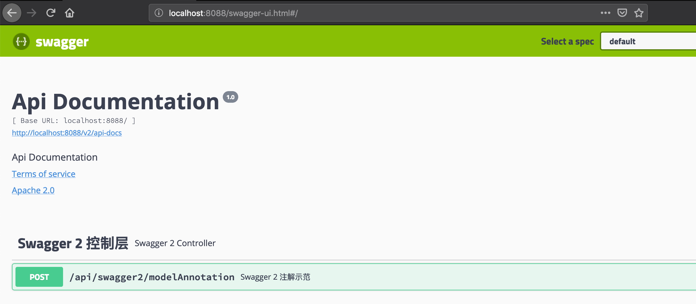
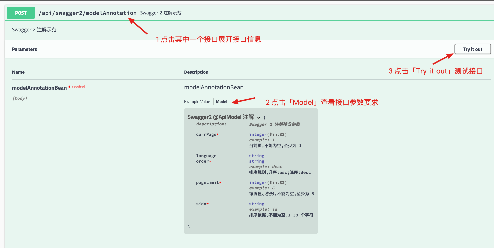
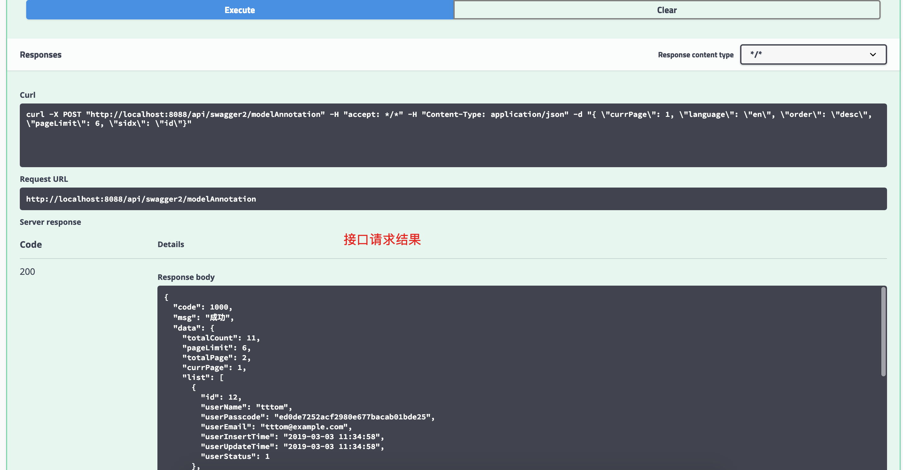
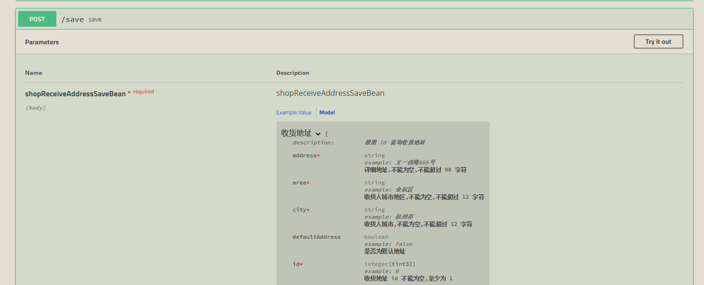
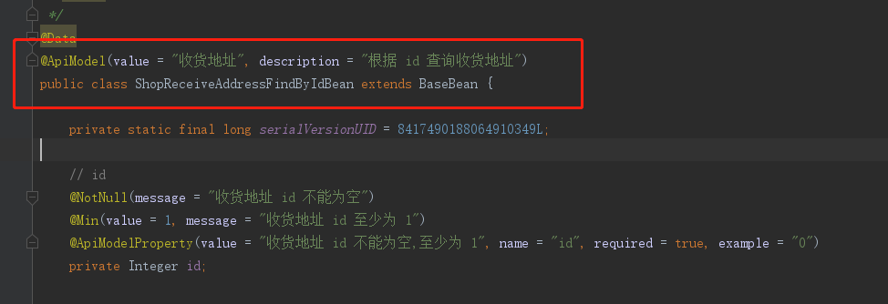
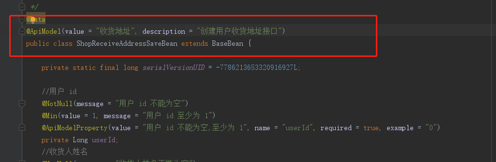

## SpringBoot 2.X 集成 Swagger 2  


​    
​    
### 1 摘要  

在开发过程中，很多后台开发者没有写接口文档的习惯，而接手没有文档的项目令人狂抓，因此在二次开发时大量的时间浪费在解读原代码的过程中。Swagger 是一款优秀的接口文档生成框架，使用注解就可以自动生成接口文档，省去了后台开发者专门写接口文档的时间，也让项目的可读性变得更好。本文将介绍 Spring Boot 2.X 集成 Swagger 2 的教程。

Swagger 官方文档: [https://swagger.io/](https://swagger.io/ "https://swagger.io/")  

​    

### 2 Maven 依赖  

```
../pom.xml
../demo-common/pom.xml
../demo-model/pom.xml
```

```xml
            <!-- Swagger -->
            <dependency>
                <groupId>io.springfox</groupId>
                <artifactId>springfox-swagger2</artifactId>
                <version>${swagger2.version}</version>
            </dependency>
            <dependency>
                <groupId>io.springfox</groupId>
                <artifactId>springfox-swagger-ui</artifactId>
                <version>${swagger2.version}</version>
            </dependency>
```

其中对应的版本号为:  

```xml
 <swagger2.version>2.9.2</swagger2.version>
```

​    

### 3 配置与使用 Swagger2  

#### 3.1 配置 Swagger 2  

```
../demo-common/src/main/java/com/ljq/demo/springboot/common/config/Swagger2Config.java
```

```java
package com.ljq.demo.springboot.common.config;

import org.springframework.beans.factory.annotation.Value;
import org.springframework.context.annotation.Bean;
import org.springframework.context.annotation.Configuration;
import springfox.documentation.builders.PathSelectors;
import springfox.documentation.builders.RequestHandlerSelectors;
import springfox.documentation.spi.DocumentationType;
import springfox.documentation.spring.web.plugins.Docket;
import springfox.documentation.swagger2.annotations.EnableSwagger2;

/**
 * @Description: Swagger2 配置信息
 * @Author: junqiang.lu
 * @Date: 2019/3/23
 */
@Configuration
@EnableSwagger2
public class Swagger2Config {

    @Value("${swagger.enable}")
    private boolean enableSwagger;

    @Bean
    public Docket api() {
        return new Docket(DocumentationType.SWAGGER_2)
                .enable(enableSwagger)
                .select()
                .apis(RequestHandlerSelectors.any())
                .paths(PathSelectors.any())
                .build();
    }
}
```

其中使用 `${swagger.enable}` 属性是为了实现根据不同环境动态开启 `Swagger` 。如在开发环境开启 `Swagger` ,而在生产环境关闭 `Swagger` 功能。

在 `yml` 配置`swagger` 属性  

```
../demo-web/src/main/resources/application-dev.yml
../demo-web/src/main/resources/application-test.yml
```

```yaml
# Swagger config
swagger:
  enable: true
```

```
../demo-web/src/main/resources/application-pro.yml
```

```yaml
# Swagger config
swagger:
  enable: false
```

​    

#### 3.2 使用 Swagger 注解  

参数接收类  

```
../demo-model/src/main/java/com/ljq/demo/springboot/vo/swagger2/ModelAnnotationBean.java
```

```java
package com.ljq.demo.springboot.vo.swagger2;

import com.ljq.demo.springboot.BaseBean;
import io.swagger.annotations.ApiModel;
import io.swagger.annotations.ApiModelProperty;
import lombok.Data;

import javax.validation.constraints.Min;
import javax.validation.constraints.NotNull;
import javax.validation.constraints.Pattern;

/**
 * @Description: Swagger2 注解示例 bean
 * @Author: junqiang.lu
 * @Date: 2019/3/23
 */
@Data
@ApiModel(value = "Swagger2 @ApiModel 注解",description = "Swagger 2 注解接收参数")
public class ModelAnnotationBean extends BaseBean {

    private static final long serialVersionUID = -3891566801822635611L;

    // 当前页
    @NotNull(message = "当前页不能为空")
    @Min(value = 1, message = "当前页至少为 1")
    @ApiModelProperty(value = "当前页,不能为空,至少为 1", name = "currPage", required = true, example = "1")
    private Integer currPage;

    // 每页显示条数
    @NotNull(message = "每页显示条数不能为空")
    @Min(value = 5, message = "每页至少展示 5 条结果")
    @ApiModelProperty(value = "每页显示条数,不能为空,至少为 5", name = "pageLimit", required = true, example = "6")
    private Integer pageLimit;

     // 排序依据,如依据 "id" 排序
    @NotNull(message = "排序依据不能为空")
    @Pattern(regexp = "^[\\s\\S]{1,30}$", message = "排序依据需要控制在 1-30 个字符以内")
    @ApiModelProperty(value = "排序依据,不能为空,1-30 个字符", name = "sidx", required = true, example = "id")
    private String sidx;

    // 排序规则,升序: asc;降序: desc
    @NotNull(message = "排序规则不能为空")
    @Pattern(regexp = "^[\\s\\S]{1,10}$", message = "排序规则需要控制在 1-10 个字符以内")
    @ApiModelProperty(value = "排序规则,升序:asc;降序:desc", name = "order",required = true, example = "desc")
    private String order;
}
```

Controller 层注解  

```
../demo-web/src/main/java/com/ljq/demo/springboot/web/controller/Swagger2Controller.java
```

```java
package com.ljq.demo.springboot.web.controller;

import com.ljq.demo.springboot.common.api.ApiResult;
import com.ljq.demo.springboot.common.api.ResponseCode;
import com.ljq.demo.springboot.common.exception.ParamsCheckException;
import com.ljq.demo.springboot.service.Swagger2Service;
import com.ljq.demo.springboot.vo.swagger2.ModelAnnotationBean;
import io.swagger.annotations.Api;
import io.swagger.annotations.ApiOperation;
import lombok.extern.slf4j.Slf4j;
import org.springframework.beans.factory.annotation.Autowired;
import org.springframework.web.bind.annotation.RequestBody;
import org.springframework.web.bind.annotation.RequestMapping;
import org.springframework.web.bind.annotation.RequestMethod;
import org.springframework.web.bind.annotation.RestController;

/**
 * @Description: Swagger2 示例控制中心
 * @Author: junqiang.lu
 * @Date: 2019/3/23
 */
@RestController
@RequestMapping(value = "api/swagger2")
@Slf4j
@Api(value = "Swagger 2 控制层", tags = "Swagger 2 控制层")
public class Swagger2Controller {

    @Autowired
    private Swagger2Service swagger2Service;

    /**
     * 实体类注解测试
     *
     * @param modelAnnotationBean
     * @return
     */
    @RequestMapping(value = "modelAnnotation", method = RequestMethod.POST)
    @ApiOperation(value = "Swagger 2 注解示范",notes = "Swagger 2 注解示范")
    public ApiResult modelAnnotation(@RequestBody ModelAnnotationBean modelAnnotationBean) {

        ApiResult apiResult = null;
        try {
            apiResult = swagger2Service.modelAnnotation(modelAnnotationBean);
        } catch (Exception e) {
            if (ParamsCheckException.class.isAssignableFrom(e.getClass())){
                log.error("参数错误");
                return apiResult.failure(ResponseCode.PARAM_ERROR.getCode(), e.getMessage());
            }
            log.error("未知异常",e);
            return apiResult.failure(ResponseCode.UNKNOWN_ERROR.getMsg());
        }

        return apiResult;
    }

}
```

其他模块示例代码(不涉及 Swagger 使用)  

Service 层

```
../demo-service/src/main/java/com/ljq/demo/springboot/service/Swagger2Service.java
```

```java
package com.ljq.demo.springboot.service;

import com.ljq.demo.springboot.common.api.ApiResult;
import com.ljq.demo.springboot.vo.swagger2.ModelAnnotationBean;

/**
 * @Description: Swagger2 业务接口
 * @Author: junqiang.lu
 * @Date: 2019/3/23
 */
public interface Swagger2Service {

    /**
     * Swagger2 参数接受实体类注解@ApiModel...示例
     *
     * @param modelAnnotationBean
     * @return
     * @throws Exception
     */
    ApiResult modelAnnotation(ModelAnnotationBean modelAnnotationBean) throws Exception;

}
```

​    

```
../demo-service/src/main/java/com/ljq/demo/springboot/service/impl/Swagger2ServiceImpl.java
```

```java
package com.ljq.demo.springboot.service.impl;

import com.ljq.demo.springboot.common.api.ApiResult;
import com.ljq.demo.springboot.common.page.PageUtil;
import com.ljq.demo.springboot.common.page.QueryUtil;
import com.ljq.demo.springboot.common.util.MapUtil;
import com.ljq.demo.springboot.dao.user.UserDao;
import com.ljq.demo.springboot.entity.UserDO;
import com.ljq.demo.springboot.service.Swagger2Service;
import com.ljq.demo.springboot.vo.swagger2.ModelAnnotationBean;
import lombok.extern.slf4j.Slf4j;
import org.springframework.beans.factory.annotation.Autowired;
import org.springframework.stereotype.Service;
import org.springframework.transaction.annotation.Transactional;

import java.util.List;
import java.util.Map;

/**
 * @Description: Swagger2 业务具体实现类
 * @Author: junqiang.lu
 * @Date: 2019/3/23
 */
@Service("swagger2Service")
@Transactional(rollbackFor = Exception.class)
@Slf4j
public class Swagger2ServiceImpl implements Swagger2Service {

    @Autowired
    private UserDao userDao;

    /**
     * Swagger2 参数接受实体类注解@ApiModel...示例
     *
     * @param modelAnnotationBean
     * @return
     * @throws Exception
     */
    @Override
    public ApiResult modelAnnotation(ModelAnnotationBean modelAnnotationBean) throws Exception {
        /**
         * 获取参数
         */
        Map<String, Object> map = MapUtil.beanToMap(modelAnnotationBean);
        QueryUtil queryUtil = new QueryUtil(map);
        // 列表查询
        List<UserDO> userDBList = userDao.queryList(queryUtil);
        if (userDBList == null || userDBList.isEmpty()) {
            return ApiResult.success(new PageUtil(null, 0, queryUtil.getPageLimit(), queryUtil.getCurrPage()));
        }

        int total = userDao.queryCount(queryUtil);
        // 分页处理
        PageUtil pageUtil = new PageUtil(userDBList, total, queryUtil.getPageLimit(), queryUtil.getCurrPage());

        return ApiResult.success(pageUtil);
    }
}
```

​    

### 4 测试  

启动项目,打开以下链接  

```
http://localhost:8088/swagger-ui.html
```

界面显示如下:  



`Swagger` 界面使用步骤:  

- 1 点击其中的一个接口展开接口详情  
- 2 点击 「Model」 查看接口请求参数信息(要求)  
- 3 点击 「Try it out」 进入接口测试模式  
- 4 点击「Execute」请求接口,此时可以修改请求参数  
- 5 查看接口请求结果  





​    

### 5 注意事项  

- 在使用 `Swagger` 注解的时候, 同一个注解 `value` 值不能设置相同，否则会出现在界面上显示不同的接口，但是接口参数却相同  

如下图,有两个接口,一个 `Save` 接口,一个 `FindById` 接口，两个接口的请求参数不同，使用 `@ApiModel` 注解时设置的`value` 值相同，结果导致在 `swagger-ui` 界面两个接口显示的参数相同，从而导致在请求接口时请求的参数并不是实际接口所需要的参数  








​    

### 6 参考资料推荐  

[Setting Up Swagger 2 with a Spring REST API](https://www.baeldung.com/swagger-2-documentation-for-spring-rest-api "https://www.baeldung.com/swagger-2-documentation-for-spring-rest-api")  

[Spring Boot RESTful API Documentation with Swagger 2](https://springframework.guru/spring-boot-restful-api-documentation-with-swagger-2/ "https://springframework.guru/spring-boot-restful-api-documentation-with-swagger-2/")  

[配置不同环境下启用swagger，在生产环境关闭swagger](https://www.cnblogs.com/woshimrf/p/disable-swagger.html)  

​    

### 7 本次提交记录  

```bash
commit a3a2f9d6a3e02de6d724dee5793c14bb91a5a7ff (HEAD -> dev, origin/dev)
Author: ljq <flying9001@gmail.com>
Date:   Sun Mar 31 11:22:53 2019 +0800

    添加 Swagger 2 Controller 层注解

commit 9780c4a397572839addd547935308a10d5c28182 (origin/master, origin/HEAD, master)
Author: flying9001 <flying9001@gmail.com>
Date:   Mon Mar 25 13:33:59 2019 +0800

    springboot 2.x 集成 Swagger 2
```

版本回退命令  

```bash
git reset --soft a3a2f9d6a3e02de6d724dee5793c14bb91a5a7ff
```

​    


