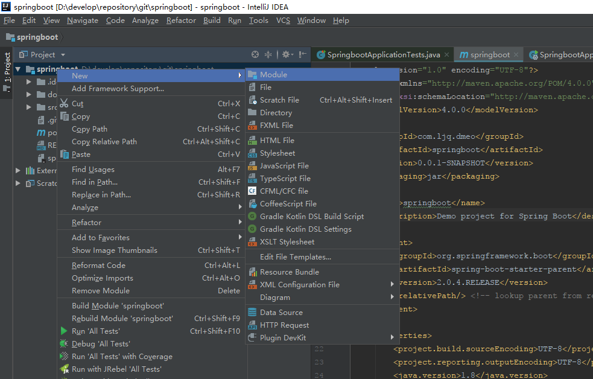
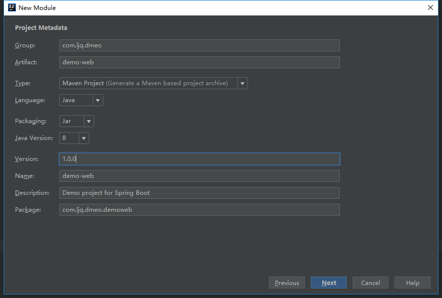
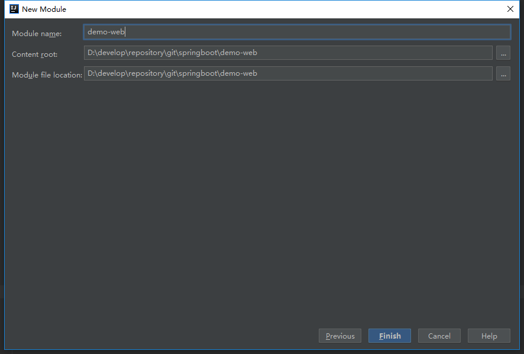
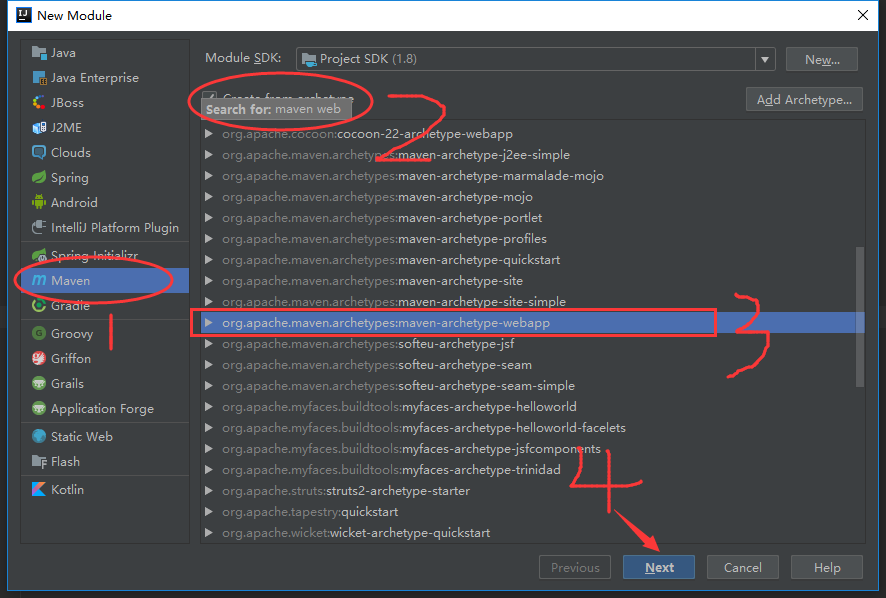
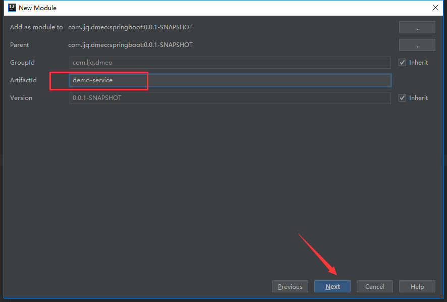
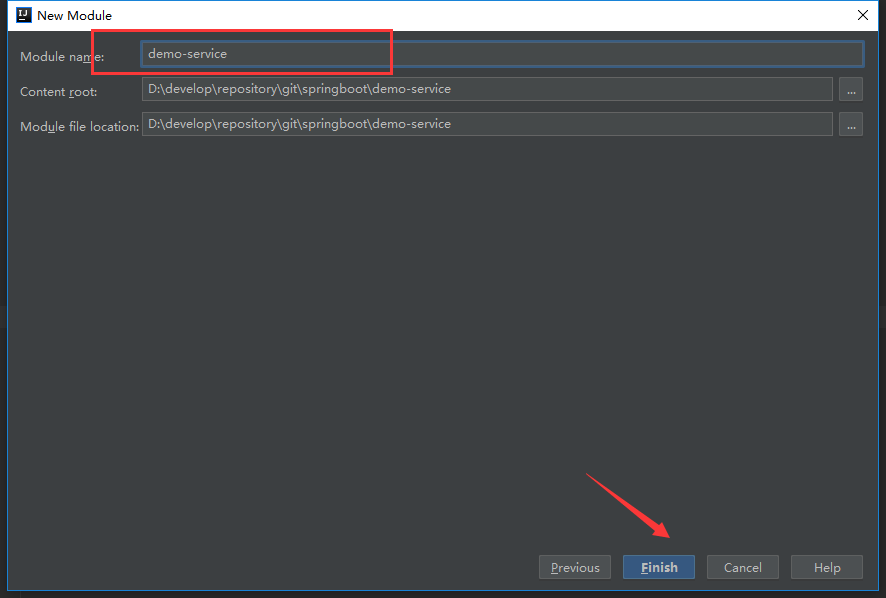
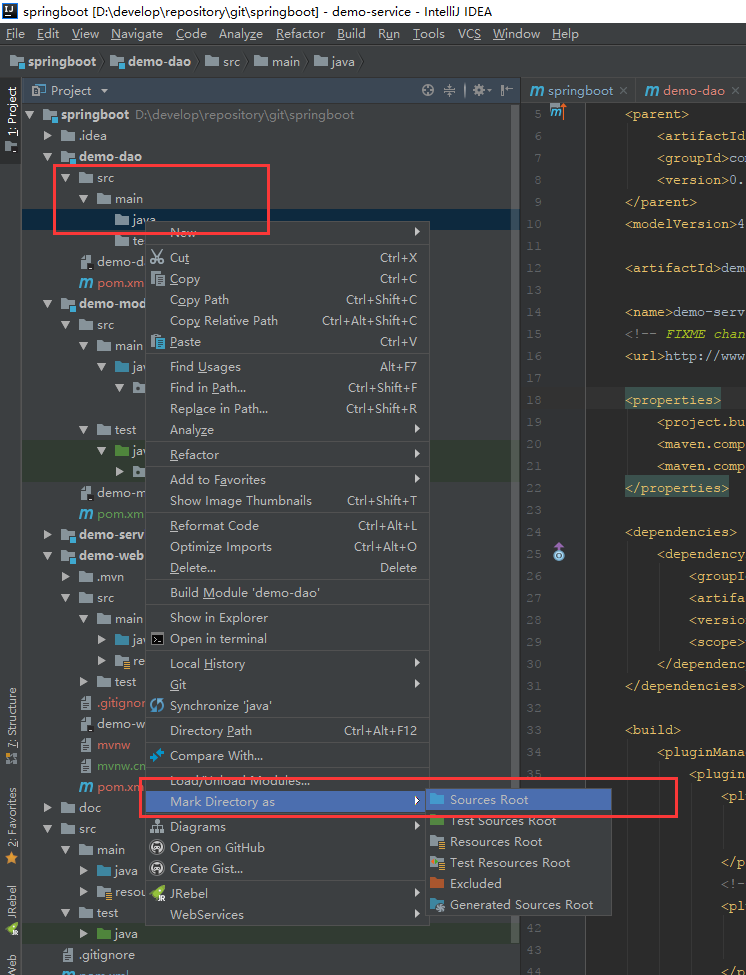

## 2 Spring Boot 创建 maven web 多模块项目  


## 2.1 使用 Spring Initializr创建子项目    


### 2.1.1 新建 module  

右键项目名称(`Springboot`)  ---  选择新建 `Module`  

  


### 2.1.2 选择 `Spring Initializr`    

在左边菜单栏中选择 `Spring Initializr` ，然后直接点击下一步(`Next`)  

  

### 2.1.3 填写模块信息  

作为项目的**子模块**,其 `Group` 必须要与父模块的保持一致    

项目类型(`Type`) 可以选择 `Maven Project`,也可以选择 `Maven POM` , 两者的区别在于:  

`Maven Project` 创建的是标准的 `Spring Boot` 项目,会自动生成 `SpringBootApplication` 等文件  

`Maven POM` 创建的是一个空文件夹,里边只有一个 `POM` 文件  


### 2.1.4 选择子模块的依赖    

关于依赖的选择,可以在创建的时候进行选择,也可以在后期编写业务代码时根据需要进行添加  

`DevTools` 依赖可以提供热部署、实时编译功能,修改代码之后可以直接运行，不需要重启项目(服务)  

`Web` 依赖会提供 `Spring` 系列的依赖,同时会创建一些符合 `RESTful` 风格的文件目录  

  


### 2.1.5 填写子模块的名称等信息    

在 `Module name` 一栏填写子模块的名称,填写之后直接点击完成(`Finish`)  

  

到这里,通过 `Spring Initializr` 创建子模块的步骤已经完成  


## 2.2 使用 Maven 创建子模块  


### 2.2.1 新建Module  

同 2.1.2  右键父项目进行新建即可  


### 2.2.2 选择 `Maven`  

在进入新建模块的菜单中选择 `Maven`    

选中右侧复选框 `Create from archetype`  

同时按 `Ctrl` + `F` ，输入 `maven web` 选中光标锁定的 `Maven` 项目,点击 `Next` 进入下一步  

`maven-archetype-webapp` 表示创建一个 `Maven` 的 `web`  项目,会包含 `webapp` 目录以及 `web.xml` 文件  

这些文件在 `Spring Boot` 项目中都是不需要的,这些文件在后边的步骤中进行删除  

    


### 2.2.3 填写子模块信息  

使用 `Maven` 创建的子模块会直接继承父模块的 `GroupId` ，同时创建之后还会在父模块的 `POM` 文件中添加子模块的依赖,这个不同于使用 `Spring Initializr` 创建的子模块，这一种方式创建的子模块后期调整较少,**推荐使用`Maven` 创建项目子模块**  

子项目在父项目中的依赖:  

```xml
 <modules>
        <module>demo-web</module>
        <module>demo-service</module>
        <module>demo-dao</module>
        <module>demo-model</module>
 </modules>
```


`ArtfactId` 信息填写之后直接点击 `Next` 进入下一步即可  

  


  


    

点击 `Finish` 之后，通过 `Maven` 创建子项目已经完成      


## 2.3 调整项目目录  

无论是通过 `Spring Initializr` 还是 `Maven` 的方式创建子项目,都可能会有一些文件目录不符合规范,需要自行创建  

在使用 `intellij idea` 创建文件目录之后,需要将其标记为对应的资源目录(`sources`),这样编辑器才能够识别其中的代码  

  


## 2.4 项目效果图  

子项目创建之后，留存的项目结构图应如图所示  

对照效果图,删除多余的文件,创建缺少的文件  

本次提交的版本日志为 :   

```properties
commit a494288d658812ea073df042fcd61c27160378da (HEAD -> master, origin/master)
Author: junqiang.lu <flying9001@gmail.com>
Date:   Thu Sep 13 11:59:51 2018 +0800

    使用springBoot 创建maven web 多模块项目
```


版本回退操作命令:  

```shell
git reset --hard a494288d658812ea073df042fcd61c27160378da
```


  


