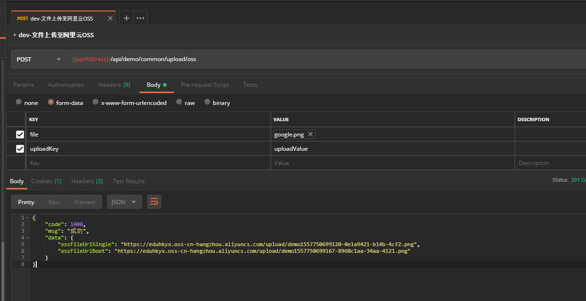

## SpringBoot 2.X 集成阿里云  OSS  文件上传功能  


​    
​    
​    
### 1 摘要  

阿里云作为一个云服务提供商，其提供的稳定、完善的服务让阿里云在国内市场占据相当高的市场份额。众多小型创业公司将阿里云作为服务器的首选。本文将介绍如何在 Spring Boot 项目中集成阿里云的 OSS 文件上传功能。  

阿里云 OSS 官方文档: [https://help.aliyun.com/document_detail/31947.html](https://help.aliyun.com/document_detail/31947.html "https://help.aliyun.com/document_detail/31947.html")  

​    

### 2 Maven 依赖  

```
../pom.xml
../demo-common/pom.xml
```

```xml
            <!-- aliYun oss -->
            <dependency>
                <groupId>com.aliyun.oss</groupId>
                <artifactId>aliyun-sdk-oss</artifactId>
                <version>${aliyun.oss.version}</version>
            </dependency>
```

其中对应的版本为:  

```xml
<aliyun.oss.version>3.4.2</aliyun.oss.version>
```

​    

### 3 配置与使用阿里云 oss  

#### 3.1 配置阿里云 oss  

```
../demo-common/src/main/java/com/ljq/demo/springboot/common/config/OSSConfig.java
```

```java
package com.ljq.demo.springboot.common.config;

import lombok.Data;
import org.springframework.beans.factory.annotation.Value;
import org.springframework.context.annotation.Configuration;

import java.io.Serializable;

/**
 * @Description: 阿里云 OSS 配置信息
 * @Author: junqiang.lu
 * @Date: 2019/5/9
 */
@Data
@Configuration
public class OSSConfig implements Serializable {

    private static final long serialVersionUID = -119396871324982279L;

    /**
     * 阿里云 oss 站点
     */
    @Value("${oss.endpoint}")
    private String endpoint;

    /**
     * 阿里云 oss 资源访问 url
     */
    @Value("${oss.url}")
    private String url;

    /**
     * 阿里云 oss 公钥
     */
    @Value("${oss.accessKeyId}")
    private String accessKeyId;

    /**
     * 阿里云 oss 私钥
     */
    @Value("${oss.accessKeySecret}")
    private String accessKeySecret;

    /**
     * 阿里云 oss 文件根目录
     */
    @Value("${oss.bucketName}")
    private String bucketName;


}
```

在 `yml` 中配置阿里云 `oss` 信息:  

```
../demo-web/src/main/resources/application-dev.yml
../demo-web/src/main/resources/application-test.yml
../demo-web/src/main/resources/application-pro.yml
```

```yaml
## aliyun oss
## 配置说明参考: com.ljq.demo.springboot.common.config.OSSConfig.class
oss:
  endpoint: oss-cn-hangzhou.aliyuncs.com
  url: https://xxxx.oss-cn-hangzhou.aliyuncs.com/
  accessKeyId: your_accessKey_id
  accessKeySecret: your_accessKey_secret
  bucketName: your_bucket_name
```

​    

### 3.2 阿里云 OSS 文件上传工具类  

这里作者写了两个类，作用是相同的，都是用于上传文件至阿里云 OSS。不同之处在意一个是使用较少依赖的版本，另一个是使用较多依赖的版本(必须搭配上边的 oss 配置文件类以及 Spring Boot)  

低依赖版本:  

```
../demo-common/src/main/java/com/ljq/demo/springboot/common/util/OSSSingleUtil.java
```

```java
package com.ljq.demo.springboot.common.util;

import com.aliyun.oss.ClientConfiguration;
import com.aliyun.oss.OSSClient;
import com.aliyun.oss.OSSException;
import com.aliyun.oss.common.auth.DefaultCredentialProvider;

import java.io.InputStream;
import java.util.UUID;

/**
 * @Description: 阿里云 oss 上传工具类(低依赖版)
 * @Author: junqiang.lu
 * @Date: 2019/5/9
 */
public class OSSSingleUtil {

    private OSSSingleUtil(){

    }

    /**
     * oss 工具客户端
     */
    private volatile static OSSClient ossClient = null;

    /**
     *  上传文件至阿里云 oss
     *
     * @param ossEndpoint 阿里云 oss 站点
     * @param ossAccessKeyId 阿里云 oss 公钥
     * @param ossAccessKeySecret 阿里云 oss 私钥
     * @param bucketName 阿里云 oss bucket 名称
     * @param ossUrl 阿里云资源访问 url (不包含具体资源名称部分)
     * @param inputStream 待上传文件流
     * @param fileDir 待上传文件在阿里云 oss 中保存的目录
     * @param fileSuffix 待上传文件类型后缀名(eg: png,doc)
     * @return
     */
    public static String upload(String ossEndpoint, String ossAccessKeyId, String ossAccessKeySecret, String bucketName,
                                String ossUrl, InputStream inputStream, String fileDir, String fileSuffix) {
        initOSS(ossEndpoint, ossAccessKeyId, ossAccessKeySecret);
        try {
            StringBuilder fileUrl = new StringBuilder();
            String point = ".";
            if (!fileSuffix.startsWith(point)) {
                fileSuffix = point + fileSuffix;
            }
            String ossFileName = System.currentTimeMillis() + "-" + UUID.randomUUID().toString().substring(0,18) + fileSuffix;
            fileUrl = fileUrl.append(fileDir + ossFileName);
            ossClient.putObject(bucketName, fileUrl.toString(), inputStream);
            fileUrl = fileUrl.insert(0, ossUrl);
            return fileUrl.toString();
        } catch (OSSException e) {
            e.printStackTrace();
        }
        return null;
    }

    /**
     * 初始化 oss 客户端
     *
     * @param ossEndpoint
     * @param ossAccessKeyId
     * @param ossAccessKeySecret
     * @return
     */
    private static OSSClient initOSS(String ossEndpoint, String ossAccessKeyId, String ossAccessKeySecret) {
        if (ossClient == null ) {
            synchronized (OSSSingleUtil.class) {
                if (ossClient == null) {
                    ossClient = new OSSClient(ossEndpoint,
                            new DefaultCredentialProvider(ossAccessKeyId, ossAccessKeySecret),
                            new ClientConfiguration());
                }
            }
        }
        return ossClient;
    }

}
```

​    

高依赖版本:  

```
../demo-common/src/main/java/com/ljq/demo/springboot/common/util/OSSBootUtil.java
```

```java
package com.ljq.demo.springboot.common.util;

import com.aliyun.oss.ClientConfiguration;
import com.aliyun.oss.OSSClient;
import com.aliyun.oss.common.auth.DefaultCredentialProvider;
import com.ljq.demo.springboot.common.config.OSSConfig;
import org.springframework.web.multipart.MultipartFile;

import java.io.IOException;
import java.util.UUID;

/**
 * @Description: 阿里云 oss 上传工具类(高依赖版)
 * @Author: junqiang.lu
 * @Date: 2019/5/10
 */
public class OSSBootUtil {

    private OSSBootUtil(){}

    /**
     * oss 工具客户端
     */
    private volatile static OSSClient ossClient = null;

    /**
     * 上传文件至阿里云 OSS
     * 文件上传成功,返回文件完整访问路径
     * 文件上传失败,返回 null
     *
     * @param ossConfig oss 配置信息
     * @param file 待上传文件
     * @param fileDir 文件保存目录
     * @return oss 中的相对文件路径
     */
    public static String upload(OSSConfig ossConfig, MultipartFile file, String fileDir){
        initOSS(ossConfig);
        StringBuilder fileUrl = new StringBuilder();
        try {
            String suffix = file.getOriginalFilename().substring(file.getOriginalFilename().lastIndexOf('.'));
            String fileName = System.currentTimeMillis() + "-" + UUID.randomUUID().toString().substring(0,18) + suffix;
            if (!fileDir.endsWith("/")) {
                fileDir.concat("/");
            }
            fileUrl = fileUrl.append(fileDir + fileName);

            ossClient.putObject(ossConfig.getBucketName(), fileUrl.toString(), file.getInputStream());
        } catch (IOException e) {
            e.printStackTrace();
            return null;
        }
        fileUrl = fileUrl.insert(0,ossConfig.getUrl());
        return fileUrl.toString();
    }

    /**
     * 初始化 oss 客户端
     * @param ossConfig
     * @return
     */
    private static OSSClient initOSS(OSSConfig ossConfig) {
        if (ossClient == null ) {
            synchronized (OSSBootUtil.class) {
                if (ossClient == null) {
                    ossClient = new OSSClient(ossConfig.getEndpoint(),
                            new DefaultCredentialProvider(ossConfig.getAccessKeyId(), ossConfig.getAccessKeySecret()),
                            new ClientConfiguration());
                }
            }
        }
        return ossClient;
    }
}
```

​    

### 3.3 使用工具类  

Service 实现类  

```
../demo-service/src/main/java/com/ljq/demo/springboot/service/impl/CommonServiceImpl.java
```

```java
package com.ljq.demo.springboot.service.impl;

import com.ljq.demo.springboot.common.api.ApiResult;
import com.ljq.demo.springboot.common.config.OSSConfig;
import com.ljq.demo.springboot.common.config.PDFExportConfig;
import com.ljq.demo.springboot.common.util.FileUtil;
import com.ljq.demo.springboot.common.util.OSSBootUtil;
import com.ljq.demo.springboot.common.util.OSSSingleUtil;
import com.ljq.demo.springboot.common.util.PDFUtil;
import com.ljq.demo.springboot.service.CommonService;
import com.ljq.demo.springboot.vo.DownloadBean;
import org.springframework.beans.factory.annotation.Autowired;
import org.springframework.http.HttpHeaders;
import org.springframework.http.HttpStatus;
import org.springframework.http.MediaType;
import org.springframework.http.ResponseEntity;
import org.springframework.stereotype.Service;
import org.springframework.web.multipart.MultipartFile;

import java.util.Date;
import java.util.HashMap;
import java.util.Map;

/**
 * @Description: 公共业务具体实现类
 * @Author: junqiang.lu
 * @Date: 2018/12/24
 */
@Service("commonService")
public class CommonServiceImpl implements CommonService {

    @Autowired
    private PDFExportConfig pdfExportConfig;
    @Autowired
    private OSSConfig ossConfig;

    /**
     * 上传文件至阿里云 oss
     *
     * @param file
     * @param uploadKey
     * @return
     * @throws Exception
     */
    @Override
    public ApiResult uploadOSS(MultipartFile file, String uploadKey) throws Exception {

        // 低依赖版本 oss 上传工具
        String fileSuffix = file.getOriginalFilename().substring(file.getOriginalFilename().lastIndexOf('.'));;
        String ossFileUrlSingle = null;
        ossFileUrlSingle = OSSSingleUtil.upload(ossConfig.getEndpoint(), ossConfig.getAccessKeyId(),
                ossConfig.getAccessKeySecret(), ossConfig.getBucketName(), ossConfig.getUrl(), file.getInputStream(),
                "upload/demo", fileSuffix);

        // 高依赖版本 oss 上传工具
        String ossFileUrlBoot = null;
        ossFileUrlBoot = OSSBootUtil.upload(ossConfig, file, "upload/demo");

        Map<String, Object> resultMap = new HashMap<>(16);
        resultMap.put("ossFileUrlSingle", ossFileUrlSingle);
        resultMap.put("ossFileUrlBoot", ossFileUrlBoot);

        return ApiResult.success(resultMap);
    }
}
```

其他流程类:  

Service 接口:  

```
../demo-service/src/main/java/com/ljq/demo/springboot/service/CommonService.java
```

```java
package com.ljq.demo.springboot.service;

import com.ljq.demo.springboot.common.api.ApiResult;
import com.ljq.demo.springboot.vo.DownloadBean;
import org.springframework.http.ResponseEntity;
import org.springframework.web.multipart.MultipartFile;

/**
 * @Description: 公共业务
 * @Author: junqiang.lu
 * @Date: 2018/12/24
 */
public interface CommonService {

    /**
     * 上传文件至阿里云 oss
     *
     * @param file
     * @param uploadKey
     * @return
     * @throws Exception
     */
    ApiResult uploadOSS(MultipartFile file, String uploadKey) throws Exception;


}

```

控制层 Controller:  

```
../demo-web/src/main/java/com/ljq/demo/springboot/web/controller/CommonController.java
```

```java
package com.ljq.demo.springboot.web.controller;

import com.ljq.demo.springboot.common.api.ApiResult;
import com.ljq.demo.springboot.service.CommonService;
import com.ljq.demo.springboot.vo.DownloadBean;
import org.slf4j.Logger;
import org.slf4j.LoggerFactory;
import org.springframework.beans.factory.annotation.Autowired;
import org.springframework.http.HttpHeaders;
import org.springframework.http.HttpStatus;
import org.springframework.http.MediaType;
import org.springframework.http.ResponseEntity;
import org.springframework.web.bind.annotation.RequestMapping;
import org.springframework.web.bind.annotation.RequestMethod;
import org.springframework.web.bind.annotation.RequestParam;
import org.springframework.web.bind.annotation.RestController;
import org.springframework.web.multipart.MultipartFile;

/**
 * @Description: 公共模块控制中心
 * @Author: junqiang.lu
 * @Date: 2018/12/24
 */
@RestController
@RequestMapping("api/demo/common")
public class CommonController {

    private static final Logger logger = LoggerFactory.getLogger(CommonController.class);

    @Autowired
    private CommonService commonService;


    /**
     * 上传文件至阿里云 oss
     *
     * @param file
     * @param uploadKey
     * @return
     * @throws Exception
     */
    @RequestMapping(value = "/upload/oss", method = {RequestMethod.POST}, produces = {MediaType.APPLICATION_JSON_VALUE})
    public ResponseEntity<?> uploadOSS(@RequestParam(value = "file") MultipartFile file, String uploadKey) throws Exception {
        ApiResult apiResult = commonService.uploadOSS(file, uploadKey);

        HttpHeaders headers = new HttpHeaders();
        headers.setContentType(MediaType.APPLICATION_JSON_UTF8);
        return new ResponseEntity<>(apiResult, headers, HttpStatus.CREATED);
    }


}
```

​    

### 4 测试  

测试工具: Postman  

```verilog
POST /api/demo/common/upload/oss
Content-Type: multipart/form-data
User-Agent: PostmanRuntime/7.11.0
Accept: */*
Cache-Control: no-cache
Postman-Token: ac18d0b0-3ffe-432c-9f9e-46f17f8bb788
Host: 127.0.0.1:8848
accept-encoding: gzip, deflate
content-length: 71107
Connection: keep-alive

file=[object Object]uploadKey=uploadValue


HTTP/1.1 201
status: 201
Content-Type: application/json;charset=UTF-8
Transfer-Encoding: chunked
Date: Mon, 13 May 2019 12:31:39 GMT
{"code":1000,"msg":"成功","data":{"ossFileUrlSingle":"https://eduhkyx.oss-cn-hangzhou.aliyuncs.com/upload/demo1557750699120-0e1a9421-b14b-4cf2.png","ossFileUrlBoot":"https://eduhkyx.oss-cn-hangzhou.aliyuncs.com/upload/demo1557750699167-8960c1aa-34aa-4121.png"}}
```



后台日志:  

```verilog
2019-05-13 20:31:39:120 [http-nio-8848-exec-5] INFO  com.ljq.demo.springboot.web.acpect.LogAspect(LogAspect.java 66) -[AOP-LOG-START]
	requestMark: 864f62b1-2687-43f6-9421-43ae3aa6830a
	requestIP: 127.0.0.1
	contentType:multipart/form-data; boundary=--------------------------604023971854029081739034
	requestUrl: http://127.0.0.1:8848/api/demo/common/upload/oss
	requestMethod: POST
	requestParams: uploadKey = uploadValue;fileSize = 70781;fileContentType = image/png;fieldName = file;fileOriginalName = google.png;
	targetClassAndMethod: com.ljq.demo.springboot.web.controller.CommonController#uploadOSS
2019-05-13 20:31:39:225 [http-nio-8848-exec-5] INFO  com.ljq.demo.springboot.web.acpect.LogAspect(LogAspect.java 74) -[AOP-LOG-END]
	<201 Created,ApiResult(code=1000, msg=成功, data={ossFileUrlSingle=https://eduhkyx.oss-cn-hangzhou.aliyuncs.com/upload/demo1557750699120-0e1a9421-b14b-4cf2.png, ossFileUrlBoot=https://eduhkyx.oss-cn-hangzhou.aliyuncs.com/upload/demo1557750699167-8960c1aa-34aa-4121.png}),{Content-Type=[application/json;charset=UTF-8]}>
```


​    

### 5 本次提交记录  

```bash
commit 36e5416fd7d80c7aa6fa027a7e6f64518b85f4a4 (HEAD -> dev, origin/master, origin/dev, origin/HEAD, master)
Author: flying9001 <flying9001@gmail.com>
Date:   Fri May 10 18:13:55 2019 +0800

    公共模块-添加上传文件至阿里云 OSS 功能
```

版本回退命令:  

```
git reset --soft 36e5416fd7d80c7aa6fa027a7e6f64518b85f4a4
```


