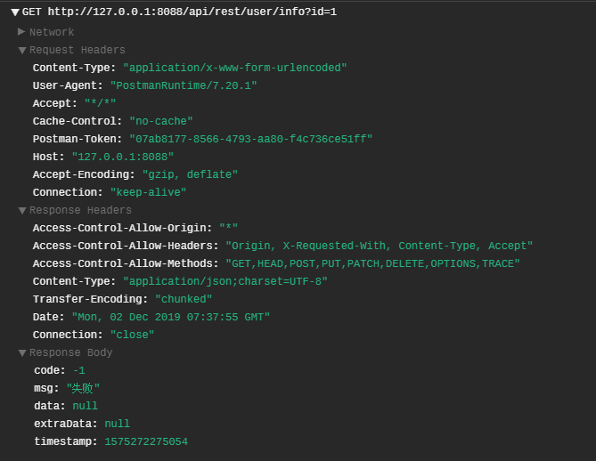
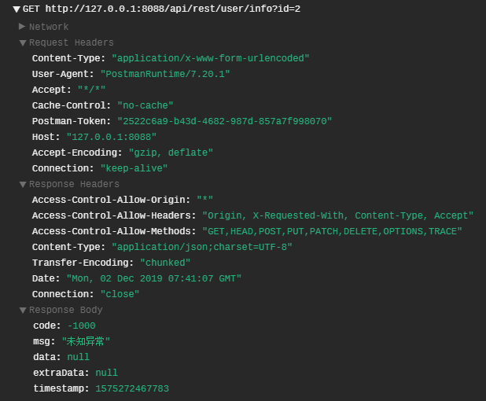
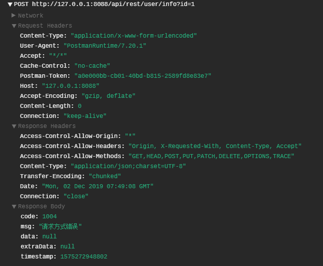
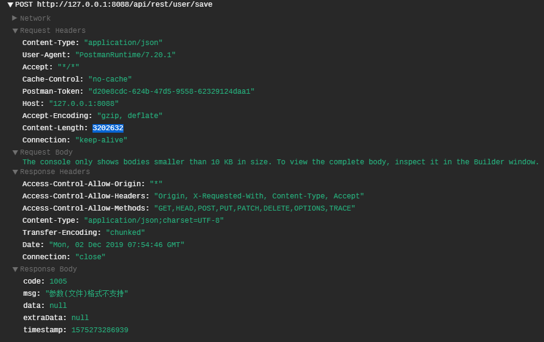
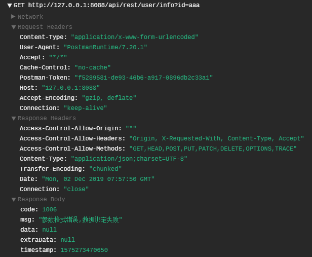
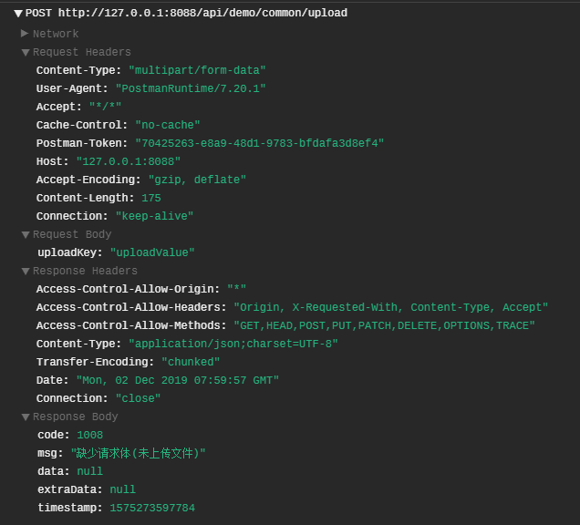
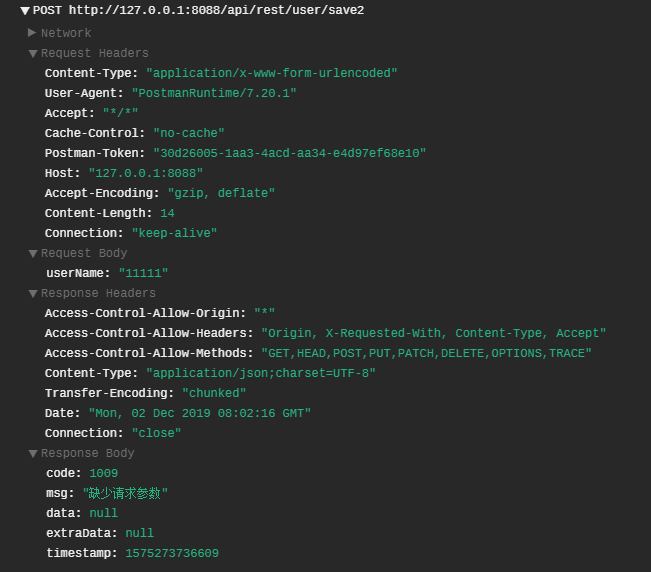

## Spring Boot 2.X REST 风格全局异常处理  


​    
​    
### 1 摘要  

异常是程序的一部分，在项目运行时可能由于各种问题而抛出。一份规范、简洁的程序代码需要有一套合理的异常处理机制，在同一个项目中使用统一的异常处理，能够极大地方便问题的排查、接口的对接以及提升用户体验。本文将介绍一种在 Spring Boot 项目符合 REST 风格的全局异常处理解决方案。  

​    

### 2 核心依赖  

```xml
            <!-- web,mvc -->
            <dependency>
                <groupId>org.springframework.boot</groupId>
                <artifactId>spring-boot-starter-web</artifactId>
                <version>${springboot.version}</version>
            </dependency>
        <!-- Servlet -->
        <dependency>
            <groupId>javax.servlet</groupId>
            <artifactId>javax.servlet-api</artifactId>
            <version>${servlet-api.version}</version>
        </dependency>
```

其中 `${springboot.version}` 的版本为 `2.0.6.RELEASE` , `${servlet-api.version}` 的版本为 `3.1.0`  

​    

### 3 核心代码  

#### 3.1 接口返回码封装类  

```
../demo-common/src/main/java/com/ljq/demo/springboot/common/api/ResponseCode.java
```

```java
package com.ljq.demo.springboot.common.api;

import lombok.Getter;
import lombok.ToString;

/**
 * @Description: 返回码枚举
 * @Author yemiaoxin
 * @Date 2018/5/22
 */
@Getter
@ToString
public enum ResponseCode {

    /**
     * 成功与失败
     */
    SUCCESS(200, "成功"),
    FAIL(-1, "失败"),

    /**
     * 公共参数
     */
    PARAM_ERROR(1001, "参数错误"),
    PARAM_NOT_NULL(1002, "参数不能为空"),
    SIGN_ERROR(1003,"签名错误"),
    REQUEST_METHOD_ERROR(1004, "请求方式错误"),
    MEDIA_TYPE_NOT_SUPPORT_ERROR(1005, "参数(文件)格式不支持"),
    PARAM_BIND_ERROR(1006, "参数格式错误,数据绑定失败"),
    NOT_FOUND_ERROR(1007, "请求资源(接口)不存在"),
    MISS_REQUEST_PART_ERROR(1008, "缺少请求体(未上传文件)"),
    MISS_REQUEST_PARAM_ERROR(1009, "缺少请求参数"),

    /**
     * 用户模块
     */
    ACCOUNT_ERROR(2001, "账号错误"),
    PASSWORD_ERROR(2002,"密码错误"),
    ACCOUNT_NOT_EXIST(2003,"账号不存在"),

    /**
     * 其他
     */
    UNKNOWN_ERROR(-1000,"未知异常");

    /**
     * 返回码
     */
    private int code;

    /**
     * 返回信息
     */
    private String msg;

    private ResponseCode(int code, String msg) {
        this.code = code;
        this.msg = msg;
    }

}
```

#### 3.2 接口返回结果封装类  

```
../demo-common/src/main/java/com/ljq/demo/springboot/common/api/ApiResult.java
```

```java
package com.ljq.demo.springboot.common.api;

import io.swagger.annotations.ApiModel;
import io.swagger.annotations.ApiModelProperty;
import lombok.Data;

import java.io.Serializable;
import java.util.Map;

/**
 * @Description: 接口请求返回结果
 * @Author: junqiang.lu
 * @Date: 2018/10/9
 */
@Data
@ApiModel(value = "接口返回结果")
public class ApiResult<T> implements Serializable {

    private static final long serialVersionUID = -2953545018812382877L;

    /**
     * 返回码，200 正常
     */
    @ApiModelProperty(value = "返回码，200 正常", name = "code")
    private int code = 200;

    /**
     * 返回信息
     */
    @ApiModelProperty(value = "返回信息", name = "msg")
    private String msg = "成功";

    /**
     * 返回数据
     */
    @ApiModelProperty(value = "返回数据对象", name = "data")
    private T data;

    /**
     * 附加数据
     */
    @ApiModelProperty(value = "附加数据", name = "extraData")
    private Map<String, Object> extraData;

    /**
     * 系统当前时间
     */
    @ApiModelProperty(value = "服务器系统时间，时间戳(精确到毫秒)", name = "timestamp")
    private Long timestamp = System.currentTimeMillis();

    /**
     * 获取成功状态结果
     *
     * @return
     */
    public static ApiResult success() {
        return success(null, null);
    }

    /**
     * 获取成功状态结果
     *
     * @param data 返回数据
     * @return
     */
    public static ApiResult success(Object data) {
        return success(data, null);
    }

    /**
     * 获取成功状态结果
     *
     * @param data 返回数据
     * @param extraData 附加数据
     * @return
     */
    public static ApiResult success(Object data, Map<String, Object> extraData) {
        ApiResult apiResult = new ApiResult();
        apiResult.setCode(ResponseCode.SUCCESS.getCode());
        apiResult.setMsg(ResponseCode.SUCCESS.getMsg());
        apiResult.setData(data);
        apiResult.setExtraData(extraData);
        return apiResult;
    }

    /**
     * 获取失败状态结果
     *
     * @return
     */
    public static ApiResult failure() {
        return failure(ResponseCode.FAIL.getCode(), ResponseCode.FAIL.getMsg(), null);
    }

    /**
     * 获取失败状态结果
     *
     * @param msg (自定义)失败消息
     * @return
     */
    public static ApiResult failure(String msg) {
        return failure(ResponseCode.FAIL.getCode(), msg, null);
    }

    /**
     * 获取失败状态结果
     *
     * @param responseCode 返回状态码
     * @return
     */
    public static ApiResult failure(ResponseCode responseCode) {
        return failure(responseCode.getCode(), responseCode.getMsg(), null);
    }

    /**
     * 获取失败状态结果
     *
     * @param responseCode 返回状态码
     * @param data         返回数据
     * @return
     */
    public static ApiResult failure(ResponseCode responseCode, Object data) {
        return failure(responseCode.getCode(), responseCode.getMsg(), data);
    }

    /**
     * 获取失败返回结果
     *
     * @param code 错误码
     * @param msg  错误信息
     * @param data 返回结果
     * @return
     */
    public static ApiResult failure(int code, String msg, Object data) {
        ApiResult result = new ApiResult();
        result.setCode(code);
        result.setMsg(msg);
        result.setData(data);
        return result;
    }


}
```

#### 3.3 自义定异常类  

```
../demo-common/src/main/java/com/ljq/demo/springboot/common/exception/ParamsCheckException.java
```

```java
package com.ljq.demo.springboot.common.exception;

import com.ljq.demo.springboot.common.api.ResponseCode;
import com.ljq.demo.springboot.common.api.ResponseCodeI18n;
import lombok.Data;

/**
 * @Description: 自定义参数校验异常
 * @Author: junqiang.lu
 * @Date: 2019/1/24
 */
@Data
public class ParamsCheckException extends Exception{

    private static final long serialVersionUID = 2684099760669375847L;

    /**
     * 异常编码
     */
    private int code;

    /**
     * 异常信息
     */
    private String message;

    public ParamsCheckException(){
        super();
    }

    public ParamsCheckException(int code, String message){
        this.code = code;
        this.message = message;
    }

    public ParamsCheckException(String message){
        this.message = message;
    }

    public ParamsCheckException(ResponseCode responseCode){
        this.code = responseCode.getCode();
        this.message = responseCode.getMsg();
    }


}

```

#### 3.4 全局异常处理类  

```
../demo-common/src/main/java/com/ljq/demo/springboot/common/interceptor/GlobalExceptionHandler.java
```

```java
package com.ljq.demo.springboot.common.interceptor;

import com.ljq.demo.springboot.common.api.ApiResult;
import com.ljq.demo.springboot.common.api.ResponseCode;
import com.ljq.demo.springboot.common.exception.ParamsCheckException;
import lombok.extern.slf4j.Slf4j;
import org.springframework.http.HttpHeaders;
import org.springframework.http.HttpStatus;
import org.springframework.http.MediaType;
import org.springframework.http.ResponseEntity;
import org.springframework.validation.BindException;
import org.springframework.web.HttpMediaTypeNotSupportedException;
import org.springframework.web.HttpRequestMethodNotSupportedException;
import org.springframework.web.bind.MissingServletRequestParameterException;
import org.springframework.web.bind.annotation.ControllerAdvice;
import org.springframework.web.bind.annotation.ExceptionHandler;
import org.springframework.web.bind.annotation.ResponseBody;
import org.springframework.web.multipart.support.MissingServletRequestPartException;
import org.springframework.web.servlet.NoHandlerFoundException;

/**
 * @Description: 全局异常处理
 * @Author: junqiang.lu
 * @Date: 2019/12/2
 */
@ControllerAdvice
@Slf4j
public class GlobalExceptionHandler {

    /**
     * 全局异常处理
     *
     * @param e
     * @return
     */
    @ResponseBody
    @ExceptionHandler(value = {ParamsCheckException.class, HttpRequestMethodNotSupportedException.class,
            HttpMediaTypeNotSupportedException.class, BindException.class, NoHandlerFoundException.class,
            MissingServletRequestPartException.class, MissingServletRequestParameterException.class,
            Exception.class})
    public ResponseEntity exceptionHandler(Exception e) {
        log.warn("class: {}, message: {}",e.getClass().getName(), e.getMessage());
        HttpHeaders headers = new HttpHeaders();
        headers.setContentType(MediaType.APPLICATION_JSON_UTF8);
        // 自定义异常
        if (ParamsCheckException.class.isAssignableFrom(e.getClass())) {
            return new ResponseEntity(ApiResult.failure(((ParamsCheckException) e).getCode(),e.getMessage(), null),headers, HttpStatus.BAD_REQUEST);
        }
        // 请求方式错误异常
        if (HttpRequestMethodNotSupportedException.class.isAssignableFrom(e.getClass())) {
            return new ResponseEntity(ApiResult.failure(ResponseCode.REQUEST_METHOD_ERROR), headers, HttpStatus.BAD_REQUEST);
        }
        // 参数格式不支持
        if (HttpMediaTypeNotSupportedException.class.isAssignableFrom(e.getClass())) {
            return new ResponseEntity(ApiResult.failure(ResponseCode.MEDIA_TYPE_NOT_SUPPORT_ERROR), headers, HttpStatus.BAD_REQUEST);
        }
        // 参数格式错误,数据绑定失败
        if (BindException.class.isAssignableFrom(e.getClass())) {
            return new ResponseEntity(ApiResult.failure(ResponseCode.PARAM_BIND_ERROR), headers, HttpStatus.BAD_REQUEST);
        }
        // 404
        if (NoHandlerFoundException.class.isAssignableFrom(e.getClass())) {
            return new ResponseEntity(ApiResult.failure(ResponseCode.NOT_FOUND_ERROR), headers, HttpStatus.BAD_REQUEST);
        }
        // 缺少请求体(未上传文件)
        if (MissingServletRequestPartException.class.isAssignableFrom(e.getClass())) {
            return new ResponseEntity(ApiResult.failure(ResponseCode.MISS_REQUEST_PART_ERROR), headers, HttpStatus.BAD_REQUEST);
        }
        // 缺少请求参数
        if (MissingServletRequestParameterException.class.isAssignableFrom(e.getClass())) {
            return new ResponseEntity(ApiResult.failure(ResponseCode.MISS_REQUEST_PARAM_ERROR), headers, HttpStatus.BAD_REQUEST);
        }

        /**
         * 根据情况添加异常类型(如IO，线程，DB 相关等)
         */

        // 其他
        return new ResponseEntity(ApiResult.failure(ResponseCode.UNKNOWN_ERROR), headers, HttpStatus.BAD_REQUEST);
    }

}
```

**说明: **

与网络请求相关的常见异常可参考:  

[Handling Standard Spring MVC Exceptions](https://docs.spring.io/spring/docs/3.2.x/spring-framework-reference/html/mvc.html#mvc-ann-rest-spring-mvc-exceptions "https://docs.spring.io/spring/docs/3.2.x/spring-framework-reference/html/mvc.html#mvc-ann-rest-spring-mvc-exceptions")  

部分异常与出现的场景归纳:  

| 异常名称                                  | 出现情况                                                     |
| ----------------------------------------- | ------------------------------------------------------------ |
| `HttpRequestMethodNotSupportedException`  | 请求方式不是 Controller 中指定的，<br/>eg: Controller 指定 `POST` 请求，实际用 `GET` 请求 |
| `HttpMediaTypeNotSupportedException`      | Controller 中指定接收参数格式为文本,但实际请求<br />包含文件 |
| `BindException`                           | 接收参数为 `int` 类型, 实际传参为 `String` 类型              |
| `NoHandlerFoundException`                 | 请求的地址不存在                                             |
| `MissingServletRequestPartException`      | Controller 指明需要传文件，但实际上没有上传文件              |
| `MissingServletRequestParameterException` | 在使用 `@RequestParam` 注解时,没有传指定的参数<br />(这里建议使用封装的 `Bean` 来接收参数,不要使用 `@RequestParam`) |
|                                           |                                                              |

#### 3.5 配置文件  

```
../demo-web/src/main/resources/application.yml
```

```yml
  ## 异常处理
spring:  
  mvc:
    throw-exception-if-no-handler-found: true
  resources:
    add-mappings: false
```

若不添加此配置,则无法手动拦截 `NoHandlerFoundException` 异常,此时系统会调用 `SpringBoot`默认的拦截器,返回信息也是 REST 风格，但不统一，具体示例如下:  

```json
{
    "timestamp": "2019-12-02T07:34:40.485+0000",
    "status": 404,
    "error": "Not Found",
    "message": "No message available",
    "path": "/api/rest/user/info/dede"
}
```

​    

### 4 测试  

#### 4.1 抛出自定义异常  

展示层:  



请求日志:  

```verilog
2019-12-02 15:41:18 | INFO  | http-nio-8088-exec-5 | com.ljq.demo.springboot.web.acpect.LogAspectLogAspect.java 68| [AOP-LOG-START]
	requestMark: cf0c3e90-39fc-4df9-9fe8-86fcaf3c37a8
	requestIP: 127.0.0.1
	contentType:application/x-www-form-urlencoded
	requestUrl: http://127.0.0.1:8088/api/rest/user/info
	requestMethod: GET
	requestParams: id = [1];
	targetClassAndMethod: com.ljq.demo.springboot.web.controller.RestUserController#info
2019-12-02 15:41:18 | WARN  | http-nio-8088-exec-5 | c.l.d.s.common.interceptor.GlobalExceptionHandlerGlobalExceptionHandler.java 42| class: com.ljq.demo.springboot.common.exception.ParamsCheckException, message: 失败
2019-12-02 15:41:18 | WARN  | http-nio-8088-exec-5 | o.s.w.s.m.m.a.ExceptionHandlerExceptionResolverJdk14Logger.java 87| Resolved exception caused by handler execution: ParamsCheckException(code=-1, message=失败)
```

#### 4.2 抛出其他异常  

展示层:  



请求日志:  

```verilog
2019-12-02 15:41:07 | INFO  | http-nio-8088-exec-4 | com.ljq.demo.springboot.web.acpect.LogAspectLogAspect.java 68| [AOP-LOG-START]
	requestMark: 51e727ac-28fb-4fee-a20f-3e2cd9ccc5f2
	requestIP: 127.0.0.1
	contentType:application/x-www-form-urlencoded
	requestUrl: http://127.0.0.1:8088/api/rest/user/info
	requestMethod: GET
	requestParams: id = [2];
	targetClassAndMethod: com.ljq.demo.springboot.web.controller.RestUserController#info
2019-12-02 15:41:07 | WARN  | http-nio-8088-exec-4 | c.l.d.s.common.interceptor.GlobalExceptionHandlerGlobalExceptionHandler.java 42| class: java.lang.Exception, message: 未知异常
2019-12-02 15:41:07 | WARN  | http-nio-8088-exec-4 | o.s.w.s.m.m.a.ExceptionHandlerExceptionResolverJdk14Logger.java 87| Resolved exception caused by handler execution: java.lang.Exception: 未知异常
```

#### 4.3 错误的请求方式  

展示层:  



请求日志:  

```verilog
2019-12-02 15:49:08 | WARN  | http-nio-8088-exec-6 | c.l.d.s.common.interceptor.GlobalExceptionHandlerGlobalExceptionHandler.java 42| class: org.springframework.web.HttpRequestMethodNotSupportedException, message: Request method 'POST' not supported
2019-12-02 15:49:08 | WARN  | http-nio-8088-exec-6 | o.s.w.s.m.m.a.ExceptionHandlerExceptionResolverJdk14Logger.java 87| Resolved exception caused by handler execution: org.springframework.web.HttpRequestMethodNotSupportedException: Request method 'POST' not supported
```

#### 4.4 向不接受文件参数的接口上传文件  

展示层:  



请求日志:  

```verilog
2019-12-02 15:54:46 | WARN  | http-nio-8088-exec-8 | c.l.d.s.common.interceptor.GlobalExceptionHandlerGlobalExceptionHandler.java 42| class: org.springframework.web.HttpMediaTypeNotSupportedException, message: Content type 'multipart/form-data;boundary=--------------------------099318382469038507746221;charset=UTF-8' not supported
2019-12-02 15:54:46 | WARN  | http-nio-8088-exec-8 | o.s.w.s.m.m.a.ExceptionHandlerExceptionResolverJdk14Logger.java 87| Resolved exception caused by handler execution: org.springframework.web.HttpMediaTypeNotSupportedException: Content type 'multipart/form-data;boundary=--------------------------099318382469038507746221;charset=UTF-8' not supported
```

#### 4.5 参数字段类型对不上  

展示层:  



请求日志:  

```verilog
2019-12-02 15:57:50 | WARN  | http-nio-8088-exec-1 | c.l.d.s.common.interceptor.GlobalExceptionHandlerGlobalExceptionHandler.java 42| class: org.springframework.validation.BindException, message: org.springframework.validation.BeanPropertyBindingResult: 1 errors
Field error in object 'restUserInfoParam' on field 'id': rejected value [aaa]; codes [typeMismatch.restUserInfoParam.id,typeMismatch.id,typeMismatch.java.lang.Long,typeMismatch]; arguments [org.springframework.context.support.DefaultMessageSourceResolvable: codes [restUserInfoParam.id,id]; arguments []; default message [id]]; default message [Failed to convert property value of type 'java.lang.String' to required type 'java.lang.Long' for property 'id'; nested exception is java.lang.NumberFormatException: For input string: "aaa"]
2019-12-02 15:57:50 | WARN  | http-nio-8088-exec-1 | o.s.w.s.m.m.a.ExceptionHandlerExceptionResolverJdk14Logger.java 87| Resolved exception caused by handler execution: org.springframework.validation.BindException: org.springframework.validation.BeanPropertyBindingResult: 1 errors
Field error in object 'restUserInfoParam' on field 'id': rejected value [aaa]; codes [typeMismatch.restUserInfoParam.id,typeMismatch.id,typeMismatch.java.lang.Long,typeMismatch]; arguments [org.springframework.context.support.DefaultMessageSourceResolvable: codes [restUserInfoParam.id,id]; arguments []; default message [id]]; default message [Failed to convert property value of type 'java.lang.String' to required type 'java.lang.Long' for property 'id'; nested exception is java.lang.NumberFormatException: For input string: "aaa"]
```

#### 4.6 上传文件为空  

展示层:  



请求日志:  

```verilog
2019-12-02 15:59:57 | WARN  | http-nio-8088-exec-2 | c.l.d.s.common.interceptor.GlobalExceptionHandlerGlobalExceptionHandler.java 42| class: org.springframework.web.multipart.support.MissingServletRequestPartException, message: Required request part 'file' is not present
2019-12-02 15:59:57 | WARN  | http-nio-8088-exec-2 | o.s.w.s.m.m.a.ExceptionHandlerExceptionResolverJdk14Logger.java 87| Resolved exception caused by handler execution: org.springframework.web.multipart.support.MissingServletRequestPartException: Required request part 'file' is not present
```

#### 4.7 缺少请求参数  

展示层:  



请求日志:  

```verilog
2019-12-02 16:02:16 | WARN  | http-nio-8088-exec-6 | c.l.d.s.common.interceptor.GlobalExceptionHandlerGlobalExceptionHandler.java 42| class: org.springframework.web.bind.MissingServletRequestParameterException, message: Required String parameter 'passcode' is not present
2019-12-02 16:02:16 | WARN  | http-nio-8088-exec-6 | o.s.w.s.m.m.a.ExceptionHandlerExceptionResolverJdk14Logger.java 87| Resolved exception caused by handler execution: org.springframework.web.bind.MissingServletRequestParameterException: Required String parameter 'passcode' is not present
```

   

### 5 其他相关代码  

 ```
../demo-web/src/main/java/com/ljq/demo/springboot/web/controller/RestUserController.java
../demo-service/src/main/java/com/ljq/demo/springboot/service/RestUserService.java
../demo-service/src/main/java/com/ljq/demo/springboot/service/impl/RestUserServiceImpl.java
 ```

​    

### 6 参考资料推荐  

[Error Handling for REST with Spring](https://www.baeldung.com/exception-handling-for-rest-with-spring "https://www.baeldung.com/exception-handling-for-rest-with-spring")  

[Handling Standard Spring MVC Exceptions](https://docs.spring.io/spring/docs/3.2.x/spring-framework-reference/html/mvc.html#mvc-ann-rest-spring-mvc-exceptions "https://docs.spring.io/spring/docs/3.2.x/spring-framework-reference/html/mvc.html#mvc-ann-rest-spring-mvc-exceptions")  

[解决spring boot中rest接口404,500等错误返回统一的json格式](https://blog.csdn.net/gebitan505/article/details/70158870 "https://blog.csdn.net/gebitan505/article/details/70158870")  

​    

### 7 本地提交记录  

```bash
commit 67f83548467ba44891a1d7c1cae0cc478e28aac9
Author: flying9001 <flying9001@gmail.com>
Date:   Mon Dec 2 14:28:07 2019 +0800

    代码-spring boot REST 风格全局异常处理(包括 404 not found)
```

版本回退命令  

```
git reset --soft 67f83548467ba44891a1d7c1cae0cc478e28aac9
```

