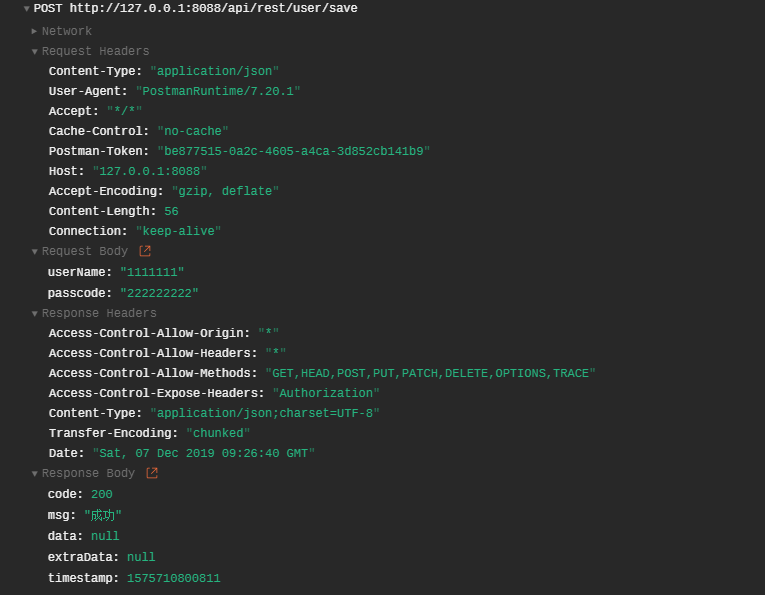
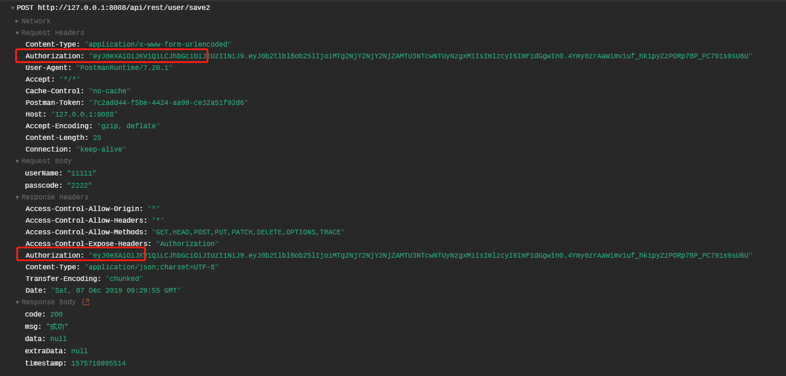
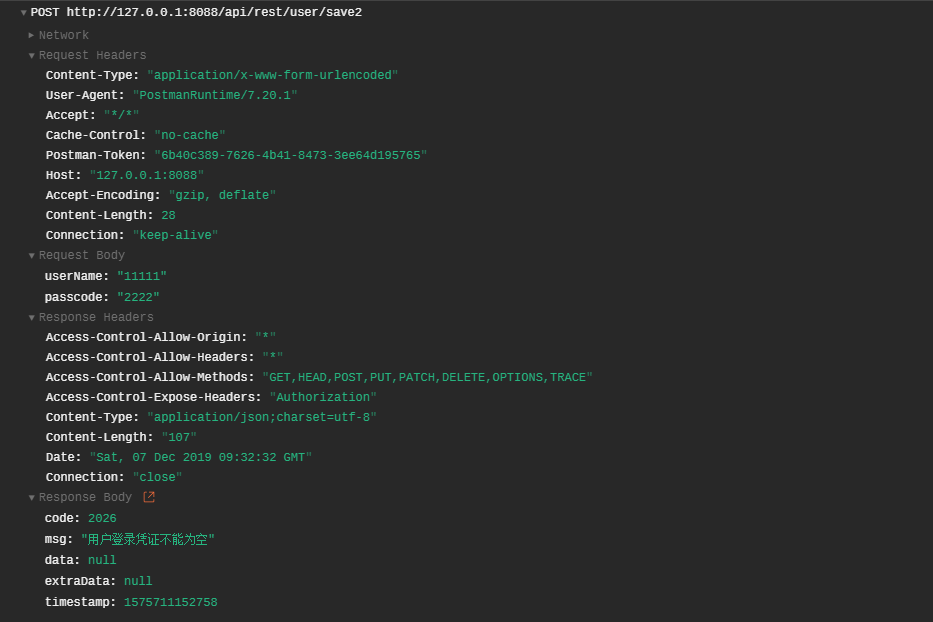

## Spring Boot REST 风格 API 接口 JWT Token 认证 1.0  


​    
​    
​    

### 1 摘要  

接口的权限认证能够有效保护接口不被滥用。常用的REST风格接口权限认证方式有签名校验和基于Auth2.0的Token校验方式。本文将介绍基于 JWT 实现的接口 Token 认证解决方案1.0。  

​    

### 2 需求分析  

接口认证**需求**:  

- 1 能够有选择地过滤没有权限(Token)的请求  
- 2 Token 具有时效性  
- 3 如果用户连续操作,Token 能够自动刷新(自动延长有效期，eg: 加入 Token 有效期为 10 小时，若用户在 10 小时以内有操作，则在时间到达 10 时，Token 能够自动刷新，而不是失效，从而影响用户体验)  

解决思路:  

- 1 使用过滤器，可针对需要的接口进行权限认证，对于不需要校验的接口进行放行  
- 2 使用 JWT 设置 Token 有效期  
- 3 用户每次操作都返回最新的 Token ,用户的新操作都基于上一次请求返回的 Token(Token 放在 Response Header 中,前端自行获取)
- 4 对 Token 设置刷新时间(刷新时间 `<` 有效时间)，当 Token 的时间小于刷新时间时， Token 不用更新，可连续使用；当 Token 时间超过刷新时间，但是在有效时间以内时，刷新 Token ,刷新 Token 的有效期从刷新时间开始算起，往后延长有效时间,返回用户最新 Token,当 Token 操作时间在有效时间以外时，提示 Token 失效。  

​    

### 3 核心依赖  

```
../pom.xml
../demo-common/pom.xml
```

```xml
            <!-- JWT -->
            <dependency>
                <groupId>com.auth0</groupId>
                <artifactId>java-jwt</artifactId>
                <version>${auth.jwt.version}</version>
            </dependency>
```

其中 `${auth.jwt.version}` 版本为 `3.8.3`  

​    

### 4 核心代码  

#### 4.1 JWT Token 生成与校验工具类  

```
../demo-common/src/main/java/com/ljq/demo/springboot/common/util/JwtUtil.java
```

```java
package com.ljq.demo.springboot.common.util;

import com.auth0.jwt.JWT;
import com.auth0.jwt.JWTVerifier;
import com.auth0.jwt.algorithms.Algorithm;
import com.auth0.jwt.exceptions.JWTCreationException;
import com.auth0.jwt.exceptions.JWTDecodeException;

import java.io.Serializable;
import java.util.Date;

/**
 * @Description: JWT 工具类
 * @Author: junqiang.lu
 * @Date: 2019/12/3
 */
public class JwtUtil implements Serializable {

    private static final long serialVersionUID = -9101115541530000111L;

    /**
     * 默认秘钥
     */
    private final static String DEFAULT_SECRET = "TS2XIUYNOKJZZDXD8YA9JJH5PM1IAHXPYCX7Q3JO";

    private JwtUtil(){

    }

    /**
     * 加密
     *
     * @param key
     * @param value
     * @return
     * @throws JWTCreationException
     */
    public static String encode(String key, String value) throws Exception {
        return encode(key, value, 0);
    }

    /**
     * 加密
     *
     * @param key
     * @param value
     * @param expTime
     * @return
     * @throws JWTCreationException
     */
    public static String encode(String key, String value, long expTime) throws Exception {
        return encode(null, key, value, expTime);
    }

    /**
     * 加密
     *
     * @param secret
     * @param key
     * @param value
     * @param expMillis
     * @return
     */
    public static String encode(String secret, String key, String value, long expMillis) throws Exception {
        if (secret == null || secret.length() < 1) {
            secret = DEFAULT_SECRET;
        }
        Date expDate = null;
        if (expMillis > 1) {
            expDate = new Date(System.currentTimeMillis() + expMillis);
        }
        Algorithm algorithm = Algorithm.HMAC256(secret);
        String token = JWT.create()
                .withIssuer("auth0")
                .withClaim(key,value)
                .withExpiresAt(expDate)
                .sign(algorithm);
        return token;
    }

    /**
     * 解密
     *
     * @param key
     * @param encodedToken
     * @return
     * @throws JWTDecodeException
     */
    public static String decode(String key, String encodedToken) throws Exception {
        return decode(null, key, encodedToken);
    }

    /**
     * 解密
     *
     * @param secret
     * @param key
     * @param encodedToken
     * @return
     */
    public static String decode(String secret, String key, String encodedToken) throws Exception {
        if (secret == null || secret.length() < 1) {
            secret = DEFAULT_SECRET;
        }
        Algorithm algorithm = Algorithm.HMAC256(secret);
        JWTVerifier verifier = JWT.require(algorithm)
                .withIssuer("auth0")
                .build();
        return verifier.verify(encodedToken).getClaim(key).asString();
    }


}
```

#### 4.2 Token 拦截器  

```
../demo-web/src/main/java/com/ljq/demo/springboot/web/acpect/SimpleCORSFilter.java
```

```java
package com.ljq.demo.springboot.web.acpect;

import com.fasterxml.jackson.databind.ObjectMapper;
import com.ljq.demo.springboot.common.api.ApiResult;
import com.ljq.demo.springboot.common.api.ResponseCode;
import com.ljq.demo.springboot.common.constant.TokenConst;
import com.ljq.demo.springboot.common.util.JwtUtil;
import lombok.extern.slf4j.Slf4j;

import javax.servlet.*;
import javax.servlet.http.HttpServletRequest;
import javax.servlet.http.HttpServletResponse;
import java.io.IOException;
import java.io.PrintWriter;
import java.util.Arrays;
import java.util.Date;
import java.util.Objects;

/**
 * @Description: 跨域请求拦截器(简易版)
 * @Author: junqiang.lu
 * @Date: 2019/5/21
 */
@Slf4j
public class SimpleCORSFilter implements Filter {

    /**
     * 不需要 Token 校验的接口
     */
    private final static String[] NO_TOKEN_API_PATHS ={
            "/api/rest/user/save",
            "/api/rest/user/info"
    };

    @Override
    public void init(FilterConfig filterConfig) throws ServletException {

    }

    @Override
    public void doFilter(ServletRequest servletRequest, ServletResponse servletResponse, FilterChain filterChain) throws IOException, ServletException {
        HttpServletRequest httpRequest = (HttpServletRequest) servletRequest;
        HttpServletResponse httpResponse = (HttpServletResponse) servletResponse;
        // *表示允许所有域名跨域
        httpResponse.addHeader("Access-Control-Allow-Origin", "*");
        httpResponse.addHeader("Access-Control-Allow-Headers","*");
        // 允许跨域的Http方法
        httpResponse.addHeader("Access-Control-Allow-Methods", "GET,HEAD,POST,PUT,PATCH,DELETE,OPTIONS,TRACE");
        // 允许浏览器访问 Token 认证响应头
        httpResponse.addHeader("Access-Control-Expose-Headers", TokenConst.TOKEN_HEADERS_FIELD);
        // 默认返回原 Token
        httpResponse.setHeader(TokenConst.TOKEN_HEADERS_FIELD, httpRequest.getHeader(TokenConst.TOKEN_HEADERS_FIELD));
        // 应对探针模式请求(OPTIONS)
        String methodOptions = "OPTIONS";
        if (httpRequest.getMethod().equals(methodOptions)) {
            httpResponse.setStatus(HttpServletResponse.SC_ACCEPTED);
            return;
        }
        /**
         * 校验用户 Token
         */
        boolean flag = !Arrays.asList(NO_TOKEN_API_PATHS).contains(httpRequest.getRequestURI());
        if (flag) {
            ResponseCode responseCode = checkToken(httpRequest, httpResponse);
            if (!Objects.equals(responseCode, ResponseCode.SUCCESS)) {
                log.warn("{}", responseCode);
                httpResponse.setStatus(HttpServletResponse.SC_BAD_REQUEST);
                httpResponse.setContentType("application/json; charset=utf-8");
                httpResponse.setCharacterEncoding("utf-8");
                PrintWriter writer = httpResponse.getWriter();
                writer.write(new ObjectMapper().writeValueAsString(ApiResult.failure(responseCode)));
                return;
            }
        }

        filterChain.doFilter(httpRequest, servletResponse);
    }

    @Override
    public void destroy() {

    }

    /**
     * 用户 Token 校验
     *
     * @param request
     * @param response
     * @return
     */
    private ResponseCode checkToken(HttpServletRequest request, HttpServletResponse response) {
        try {
            String token = request.getHeader(TokenConst.TOKEN_HEADERS_FIELD);
            if (token == null || token.length() < 1) {
                return ResponseCode.USER_TOKEN_NULL_ERROR;
            }
            String tokenValue = JwtUtil.decode(TokenConst.TOKEN_KEY, token);
            long time = Long.parseLong(tokenValue.substring(tokenValue.indexOf("@") + 1));
            String userPhone = tokenValue.substring(0, tokenValue.indexOf("@"));
            log.info("{}, date: {}, userPhone: {}", tokenValue, new Date(time), userPhone);
            // 校验 Token 有效性
            long subResult = System.currentTimeMillis() - time;
            if (subResult >= TokenConst.TOKEN_EXPIRE_TIME_MILLIS) {
                return ResponseCode.USER_TOKEN_ERROR;
            }
            if (subResult < TokenConst.TOKEN_REFRESH_TIME_MILLIS) {
                return ResponseCode.SUCCESS;
            }
            // 刷新 Token
            String newToken = JwtUtil.encode(TokenConst.TOKEN_KEY,userPhone + "@" + System.currentTimeMillis());
            response.setHeader(TokenConst.TOKEN_HEADERS_FIELD, newToken);
        } catch (Exception e) {
            log.warn("Token 校验失败,{}:{}", e.getClass().getName(), e.getMessage());
            return ResponseCode.USER_TOKEN_ERROR;
        }
        return ResponseCode.SUCCESS;
    }
}
```

其中 `NO_TOKEN_API_PATHS` 为一些不需要 Token 校验的接口  

#### 4.3 Token 相关的常量  

```
../demo-common/src/main/java/com/ljq/demo/springboot/common/constant/TokenConst.java
```

```java
package com.ljq.demo.springboot.common.constant;

/**
 * @Description: Token 相关常量
 * @Author: junqiang.lu
 * @Date: 2019/12/3
 */
public class TokenConst {


    /**
     * Token headers 字段
     */
    public static final String TOKEN_HEADERS_FIELD = "Authorization";
    /**
     * token key
     */
    public static final String TOKEN_KEY = "tokenPhone";
    /**
     * Token 刷新时间(单位: 毫秒)
     */
    public static final long TOKEN_REFRESH_TIME_MILLIS = 1000 * 60 * 60 * 2L;
    /**
     * token 有效期(单位: 毫秒)
     */
    public static final long TOKEN_EXPIRE_TIME_MILLIS = 1000 * 60 * 60 * 24 * 30L;


}
```

#### 4.4 其他相关类  

```
../demo-common/src/main/java/com/ljq/demo/springboot/common/api/ResponseCode.java
```

​    

### 5 测试  

Token 生成,参考:  

```
com.ljq.demo.springboot.common.util.JwtUtil#encode(java.lang.String, java.lang.String)
```

#### 5.1 不需要 Token 

请求接口:  

```
/api/rest/user/save
```

请求参数&返回结果:  



#### 5.2 需要 Token,请求成功  

请求接口:  

```
/api/rest/user/save2
```

请求参数&返回结果:  



### 5.3 需要 Token,请求失败  

请求接口:  

```
/api/rest/user/save2
```

请求参数与返回结果:  



​    

### 6 参考资料推荐  

[SpringBoot系列 - 集成JWT实现接口权限认证](https://www.xncoding.com/2017/07/09/spring/sb-jwt.html "https://www.xncoding.com/2017/07/09/spring/sb-jwt.html")  

[JWT(JSON Web Token)自动延长到期时间](https://blog.csdn.net/qq_17775871/article/details/80766973 "https://blog.csdn.net/qq_17775871/article/details/80766973")  

[基于无状态的token刷新机制](https://blog.csdn.net/weixin_44172434/article/details/99594870 "https://blog.csdn.net/weixin_44172434/article/details/99594870")  

[Response返回JSON数据](https://blog.csdn.net/qq_17775871/article/details/80766973 "https://blog.csdn.net/qq_17775871/article/details/80766973")  

​    

### 7 本次提交记录  

```bash
commit 72c61ce5f2b96ae43088c8bb873211333f890c7d
Author: flying9001 <flying9001@gmail.com>
Date:   Thu Dec 5 16:18:32 2019 +0800

    代码-添加 Spring Boot REST API 接口 Token 认证1.0
```

版本回退命令  

```bash
git reset --soft 72c61ce5f2b96ae43088c8bb873211333f890c7d
```


