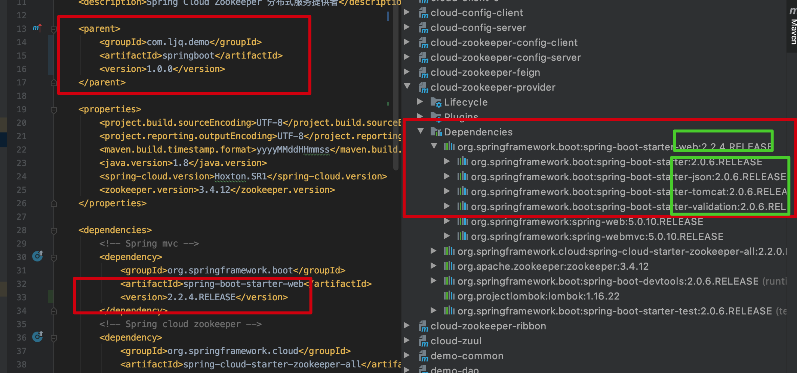

### Spring Cloud Zookeeper 分布式服务框架搭建常见问题  


​    
​    

### 1 子项目如何不继承主项目,而继承最新的 Spring Boot 依赖?  

对于一个多模块的项目而言,新建的项目通常是继承主项目，但是新建的子项目也可以选择继承最新的 SpringBoot 项目，具体操作如下:  

子项目 `pom.xml` 文件中指定最新的 SpringBoot parent 模块进行继承:  

```
./cloud-zookeeper-provider/pom.xml
```

```xml
    <parent>
        <groupId>org.springframework.boot</groupId>
        <artifactId>spring-boot-starter-parent</artifactId>
        <version>2.2.4.RELEASE</version>
        <relativePath/>
    </parent>
```

父项目 `pom.xml` 文件添加子模块的 `module`:  

```
./pom.xml
```

```xml
    <modules>
        <module>cloud-zookeeper-provider</module>
    </modules>
```

在父项目 `pom.xml` 的 `module` 中添加之后，使用 `maven` 命令可以将子模块一起打包  

​    

### 2 子项目继承主项目，然后选择不同的 SpringBoot 版本，是否可行?  

理论上是可行的，但是实际操作不行。具体看下图:  



操作的 `pom.xml` 文件为: `./cloud-zookeeper-provider/pom.xml`  

将主项目作为父项目进行继承,更改 `spring-boot-starter-web` 的版本为当前最新版 `2.2.4.RELEASE`,但是实际的 `Maven` 依赖却依旧是主项目的版本,即 `2.0.6.RELEASE`  

​    

### 3 Zookeeper 的 Maven 版本选择  

官方文档推荐的 `Zookeeper` 的 `Maven` 依赖使用方式为:  

```xml
        <!-- Zookeeper -->
        <dependency>
            <groupId>org.apache.zookeeper</groupId>
            <artifactId>zookeeper</artifactId>
            <version>${zookeeper.version}</version>
            <exclusions>
                <exclusion>
                    <groupId>org.slf4j</groupId>
                    <artifactId>slf4j-log4j12</artifactId>
                </exclusion>
            </exclusions>
        </dependency>
```

具体可参考:  

[Spring Cloud Zookeeper](https://cloud.spring.io/spring-cloud-zookeeper/reference/html "https://cloud.spring.io/spring-cloud-zookeeper/reference/html")  

作者在示例中使用的版本是 `3.4.12`, 2018 年 4 月推出的，这不是最新版，`3.4` 系列的最新版本为 `3.4.14`,2019 年 4 月推出的，当前(2020年3月) 的最新版为 `3.5.7`，2020 年 2 月推出的。  

在实际操作中，使用 `3.4.12` 版本，连接 `zookeeper` 耗时不到 3 秒,基本都是秒连；使用 `3.4.14` 版本，连接 `zookeeper` 需要耗时 60 秒；使用 `3.5.7` 版本根本连接不上 `zookeeper` 

使用 `3.4.14` 版本的 SpringBoot 项目启动日志:  

```verilog
2020-03-01 16:33:20.630  INFO 50249 --- [  restartedMain] org.apache.zookeeper.ZooKeeper           : Initiating client connection, connectString=172.16.140.10:2181 sessionTimeout=60000 watcher=org.apache.curator.ConnectionState@29fd1024
2020-03-01 16:33:20.650  INFO 50249 --- [  restartedMain] o.a.c.f.imps.CuratorFrameworkImpl        : Default schema

  .   ____          _            __ _ _
 /\\ / ___'_ __ _ _(_)_ __  __ _ \ \ \ \
( ( )\___ | '_ | '_| | '_ \/ _` | \ \ \ \
 \\/  ___)| |_)| | | | | || (_| |  ) ) ) )
  '  |____| .__|_| |_|_| |_\__, | / / / /
 =========|_|==============|___/=/_/_/_/
 :: Spring Boot ::        (v2.2.4.RELEASE)

2020-03-01 16:34:20.651  INFO 50249 --- [16.140.10:2181)] org.apache.zookeeper.ClientCnxn          : Opening socket connection to server 172.16.140.10/172.16.140.10:2181. Will not attempt to authenticate using SASL (unknown error)
2020-03-01 16:34:20.674  INFO 50249 --- [16.140.10:2181)] org.apache.zookeeper.ClientCnxn          : Socket connection established to 172.16.140.10/172.16.140.10:2181, initiating session
2020-03-01 16:34:20.683  INFO 50249 --- [16.140.10:2181)] org.apache.zookeeper.ClientCnxn          : Session establishment complete on server 172.16.140.10/172.16.140.10:2181, sessionid = 0x1000575d4b10047, negotiated timeout = 40000
2020-03-01 16:34:20.689  INFO 50249 --- [ain-EventThread] o.a.c.f.state.ConnectionStateManager     : State change: CONNECTED
```

根据日志可以看出从 `2020-03-01 16:33:20` 开始初始化 `zookeeper` 连接到 `2020-03-01 16:34:20` 成功连接,中间消耗了 60 秒，虽然项目可以运行，但是连接耗时太多，每次启动项目需要太长时间，因此不建议使用该版本  

使用 `3.5.7` 版本 SpringBoot 项目启动日志:  

```verilog
2020-03-01 16:43:53.931 ERROR 50516 --- [tor-Framework-0] o.a.c.f.imps.CuratorFrameworkImpl        : Background operation retry gave up

org.apache.zookeeper.KeeperException$ConnectionLossException: KeeperErrorCode = ConnectionLoss
	at org.apache.zookeeper.KeeperException.create(KeeperException.java:102) ~[zookeeper-3.5.7.jar:3.5.7]
	at org.apache.curator.framework.imps.CuratorFrameworkImpl.checkBackgroundRetry(CuratorFrameworkImpl.java:844) [curator-framework-4.0.1.jar:4.0.1]
	at org.apache.curator.framework.imps.CuratorFrameworkImpl.performBackgroundOperation(CuratorFrameworkImpl.java:972) [curator-framework-4.0.1.jar:4.0.1]
	at org.apache.curator.framework.imps.CuratorFrameworkImpl.backgroundOperationsLoop(CuratorFrameworkImpl.java:925) [curator-framework-4.0.1.jar:4.0.1]
	at org.apache.curator.framework.imps.CuratorFrameworkImpl.access$300(CuratorFrameworkImpl.java:73) [curator-framework-4.0.1.jar:4.0.1]
	at org.apache.curator.framework.imps.CuratorFrameworkImpl$4.call(CuratorFrameworkImpl.java:322) [curator-framework-4.0.1.jar:4.0.1]
	at java.util.concurrent.FutureTask.run$$$capture(FutureTask.java:266) [na:1.8.0_191]
	at java.util.concurrent.FutureTask.run(FutureTask.java) [na:1.8.0_191]
	at java.util.concurrent.ScheduledThreadPoolExecutor$ScheduledFutureTask.access$201(ScheduledThreadPoolExecutor.java:180) [na:1.8.0_191]
	at java.util.concurrent.ScheduledThreadPoolExecutor$ScheduledFutureTask.run(ScheduledThreadPoolExecutor.java:293) [na:1.8.0_191]
	at java.util.concurrent.ThreadPoolExecutor.runWorker(ThreadPoolExecutor.java:1149) [na:1.8.0_191]
	at java.util.concurrent.ThreadPoolExecutor$Worker.run(ThreadPoolExecutor.java:624) [na:1.8.0_191]
	at java.lang.Thread.run(Thread.java:748) [na:1.8.0_191]

2020-03-01 16:43:53.931 ERROR 50516 --- [tor-Framework-0] o.a.c.f.imps.CuratorFrameworkImpl        : Background retry gave up

org.apache.curator.CuratorConnectionLossException: KeeperErrorCode = ConnectionLoss
	at org.apache.curator.framework.imps.CuratorFrameworkImpl.performBackgroundOperation(CuratorFrameworkImpl.java:954) [curator-framework-4.0.1.jar:4.0.1]
	at org.apache.curator.framework.imps.CuratorFrameworkImpl.backgroundOperationsLoop(CuratorFrameworkImpl.java:925) [curator-framework-4.0.1.jar:4.0.1]
	at org.apache.curator.framework.imps.CuratorFrameworkImpl.access$300(CuratorFrameworkImpl.java:73) [curator-framework-4.0.1.jar:4.0.1]
	at org.apache.curator.framework.imps.CuratorFrameworkImpl$4.call(CuratorFrameworkImpl.java:322) [curator-framework-4.0.1.jar:4.0.1]
	at java.util.concurrent.FutureTask.run$$$capture(FutureTask.java:266) [na:1.8.0_191]
	at java.util.concurrent.FutureTask.run(FutureTask.java) [na:1.8.0_191]
	at java.util.concurrent.ScheduledThreadPoolExecutor$ScheduledFutureTask.access$201(ScheduledThreadPoolExecutor.java:180) [na:1.8.0_191]
	at java.util.concurrent.ScheduledThreadPoolExecutor$ScheduledFutureTask.run(ScheduledThreadPoolExecutor.java:293) [na:1.8.0_191]
	at java.util.concurrent.ThreadPoolExecutor.runWorker(ThreadPoolExecutor.java:1149) [na:1.8.0_191]
	at java.util.concurrent.ThreadPoolExecutor$Worker.run(ThreadPoolExecutor.java:624) [na:1.8.0_191]
	at java.lang.Thread.run(Thread.java:748) [na:1.8.0_191]

```

根据日志可以看出 `3.5` 系列的 `zookeeper` 连接方式已经发生了改变，与当前SpringBoot 的版本中包含的相关依赖是不兼容的，因此切不可贸然使用最新版本  

​    

### 4 SpringBoot Zookeeper 项目正在运行时删除 Zookeeper 的节点会怎么样?  

SpringBoot Zookeeper 项目在启动的时候会向 `Zookeeper` 中注册节点，节点的名称即为 Spring Boot `application.yml`配置文件中的 `spring.application.name` 属性  

本着不作死就不会死的心态，作者将正在运行的 `cloud-zookeeper-provider` 项目注册的 `zookeeper` 节点进行删除，然后看看项目是否会自动重新注册节点，然而实际情况是不会，而且项目还会报错。  

具体操作流程如下:  

-  1 启动 `cloud-zookeeper-provider` 项目  
- 2 查询 `cloud-zookeeper-provider` 注册的 `zookeeper` 节点，校验节点是否成功注册,结果是节点注册成功       
- 3 请求 `cloud-zookeeper-provider` 项目的接口 `http://127.0.0.1:8100/api/cloud/zookeeper/hello?name=dakhfak` ,验证服务是否可用，结果是可用  
- 4 删除 `cloud-zookeeper-provider` 注册的 `zookeeper` 节点(删除命令: `rmr /services/cloud-zookeeper-provider`)  
- 5 再次请求 `cloud-zookeeper-provider` 项目的接口 `http://127.0.0.1:8100/api/cloud/zookeeper/hello?name=dakhfak` ,验证服务是否可用，结果是可用  
- 6 启动 `cloud-zookeeper-feign` 项目，用于调用 `cloud-zookeeper-provider` 服务，项目可成功启动  
- 7 请求 `cloud-zookeeper-feign` 项目的接口 `http://127.0.0.1:8102/api/cloud/zookeeper/feign/sayHello?name=dada666` ，校验 `cloud-zookeeper-provider` 的 `zookeeper` 服务是否可调用,结果是抛出异常,抛出的异常如下:  

```verilog
com.netflix.client.ClientException: Load balancer does not have available server for client: cloud-zookeeper-provider
	at com.netflix.loadbalancer.LoadBalancerContext.getServerFromLoadBalancer(LoadBalancerContext.java:483) ~[ribbon-loadbalancer-2.3.0.jar:2.3.0]
	at com.netflix.loadbalancer.reactive.LoadBalancerCommand$1.call(LoadBalancerCommand.java:184) ~[ribbon-loadbalancer-2.3.0.jar:2.3.0]
	at com.netflix.loadbalancer.reactive.LoadBalancerCommand$1.call(LoadBalancerCommand.java:180) ~[ribbon-loadbalancer-2.3.0.jar:2.3.0]
	at rx.Observable.unsafeSubscribe(Observable.java:10327) ~[rxjava-1.3.8.jar:1.3.8]

```

根据日志可以看出 `cloud-zookeeper-provider` 服务已经不存在，从而导致系统异常。`cloud-zookeeper-provider` 项目在没有重启的情况下并没有在 `zookeeper` 节点删除之后重新创建新节点  
    

### 5 Feign 调用 Spring Cloud Zookeeper 服务只能设置一种请求方式  

在 Cloud Zookeeper 服务注册中心项目中 ,服务允许两种请求方式,即 GET 和 POST,但是在使用 Feign 进行调用时，只能设置成一种,具体代码如下:  

服务注册中心的控制层:  

```
./cloud-zookeeper-provider/src/main/java/com/ljq/demo/springboot/cloud/zookeeper/provider/controller/CloudZookeeperProviderController.java
```

```java
    @RequestMapping(value = "/hello", method = {RequestMethod.GET, RequestMethod.POST},
            produces = {MediaType.APPLICATION_JSON_VALUE})
    public ResponseEntity<String> hello(@RequestParam("name") String name) {
```

`hello` 方法对应的接口是允许使用 GET 和 POST 方法进行请求的  

服务调用者-Feign 客户端:  

```
./cloud-zookeeper-feign/src/main/java/com/ljq/demo/springboot/cloud/zookeeper/feign/service/CloudZookeeperFeignService.java
```

```java
    @GetMapping(value = "/api/cloud/zookeeper/hello", produces = {MediaType.APPLICATION_JSON_VALUE})
    String sayHello(@RequestParam("name") String name);
```

这里调用远程 `cloud-zookeeper-provider` 的服务，只能指定一种请求方式,如果按照上边的方式 `method = {RequestMethod.GET, RequestMethod.POST` 允许了两种方式请求的话，会抛出异常    

```verilog
org.springframework.beans.factory.UnsatisfiedDependencyException: Error creating bean with name 'cloudZookeeperFeignController': Unsatisfied dependency expressed through field 'cloudZookeeperFeignService'; nested exception is org.springframework.beans.factory.BeanCreationException: Error creating bean with name 'com.ljq.demo.springboot.cloud.zookeeper.feign.service.CloudZookeeperFeignService': FactoryBean threw exception on object creation; nested exception is java.lang.IllegalStateException: Method sayHello can only contain 1 method field. Found: [GET, POST]

```

   

### 6 使用 Feign 调用远程 Zookeeper 服务提示 FeignException$BadRequest: status 400  

很多人会纳闷，方法，参数，请求地址都没有问题，为什么还会抛出 BadRequest 异常呢？这里有一个很难让人想到的问题，通常在写 Controller 中方法时，很多人不会专门写 `@requestParam` 注解来指定参数的名称，请求依然可以成功，但是在使用 Feign 进行远程调用的时候就必须使用 `@requestParam` 注解指定请求参数名称  

```
./cloud-zookeeper-feign/src/main/java/com/ljq/demo/springboot/cloud/zookeeper/feign/service/CloudZookeeperFeignService.java
```

```java
    @GetMapping(value = "/api/cloud/zookeeper/hello", produces = {MediaType.APPLICATION_JSON_VALUE})
    String sayHello(@RequestParam("name") String name);
```

​    

### 7 使用 Feign 调用远程 Zookeeper 服务提示 FeignException$MethodNotAllowed: status 405  

方法不被允许，这个问题就比较好排查了，通常出现在服务注册中心的接口允许的请求方式与 Feign 调用的请求方式不一致导致的，如注册中心的接口只允许 POST 方式请求，而 Feign 调用时为 GET 方式。  

Feign 调用远程 Zookeeper 服务时与服务端接口请求方式保持一致即可。  

参考文档: [【feign】解决--feign.FeignException$MethodNotAllowed: status 405 reading](https://blog.csdn.net/noDr_butTry/article/details/99361407 "https://blog.csdn.net/noDr_butTry/article/details/99361407")    

​    

### 8 Spring Cloud Zookeeper 的 @LoadBalanced 注解是什么？有什么用？不用可不可以？  

`@LoadBalanced` 是用于客户端负载均衡的注解，可以根据 URL 解析来确定使用哪一个服务实例。  

具体说明可参考: [由springcloud ribbon的 @LoadBalanced注解的使用理解](https://blog.csdn.net/xiao_jun_0820/article/details/78917215 "https://blog.csdn.net/xiao_jun_0820/article/details/78917215")  

不用可不可以？答案是不行，否则默认使用的是 http 请求  

异常日志如下:  

```verilog
2020-03-01 20:42:18.411 ERROR 55042 --- [nio-8101-exec-1] o.a.c.c.C.[.[.[/].[dispatcherServlet]    : Servlet.service() for servlet [dispatcherServlet] in context with path [] threw exception [Request processing failed; nested exception is org.springframework.web.client.ResourceAccessException: I/O error on GET request for "http://cloud-zookeeper-provider/api/cloud/zookeeper/hello": cloud-zookeeper-provider; nested exception is java.net.UnknownHostException: cloud-zookeeper-provider] with root cause

java.net.UnknownHostException: cloud-zookeeper-provider
```

​    

### 9 Spring Cloud Config 配置中心的配置文件有哪些注意事项？

- 1 中文需要进行 Unicode 转码  
- 2 不要对配置信息添加引号，否则引号也被算作配置的一部分  
- 3 若同时存在同名的 `properties` 和 `yml` 配置文件,则只能读取到同名的 `properties` 文件中的配置信息 
- 4 如果配置中心的配置与项目中的本地配置名冲突，则会在项目启动时覆盖本地的配置  
- 5 如果使用 Git 仓库存储配置信息，那么 Spring Cloud Config Server 职能读取到已经提交的配置信息
- 6 配置中心的配置更新不能及时更新到客户端。直接调用 Cloud Config Server 端配置可获取到最新配置，但是 Client 端不能读取到最新配置(关于这个问题，可通过 webHook 或 Spring Cloud Bus 解决，参考: [Spring Cloud（七）：配置中心（Git 版与动态刷新）【Finchley 版】](https://windmt.com/2018/04/19/spring-cloud-7-config-sample/ "https://windmt.com/2018/04/19/spring-cloud-7-config-sample/")  )  


