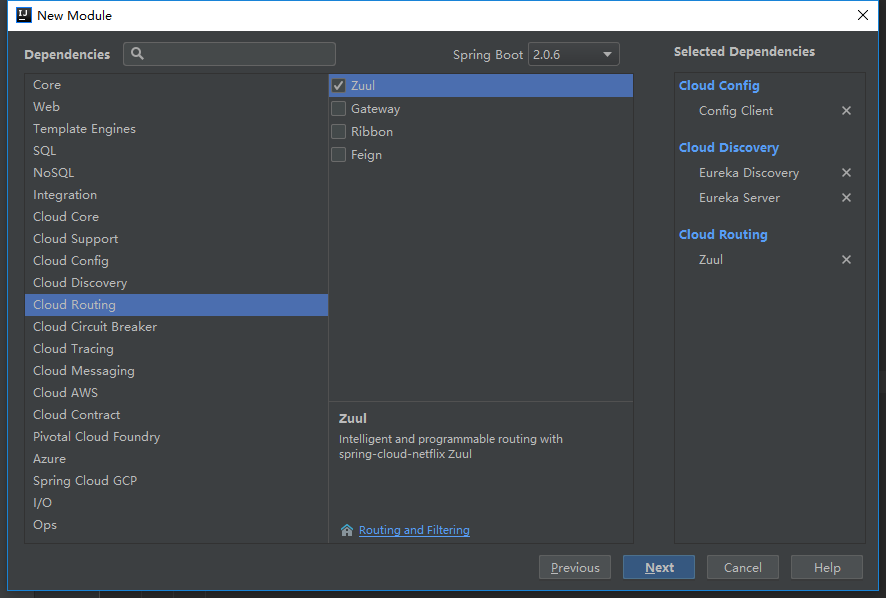
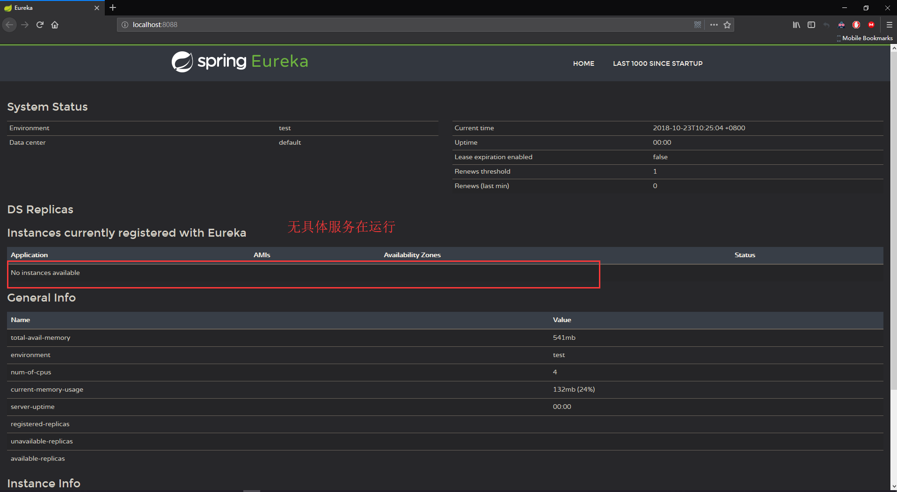
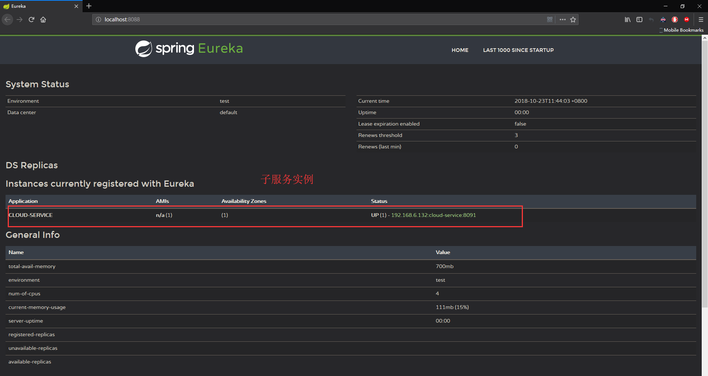
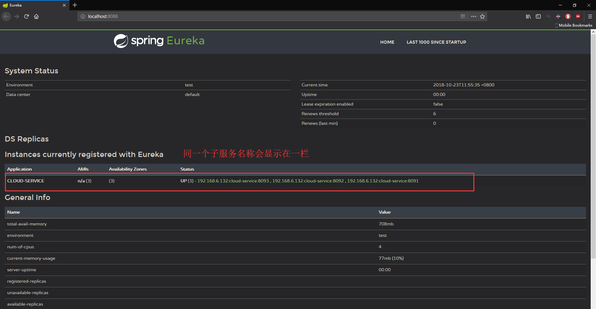
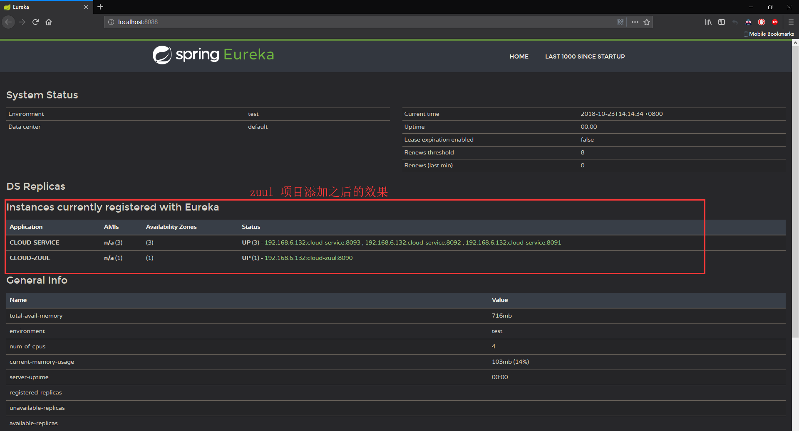
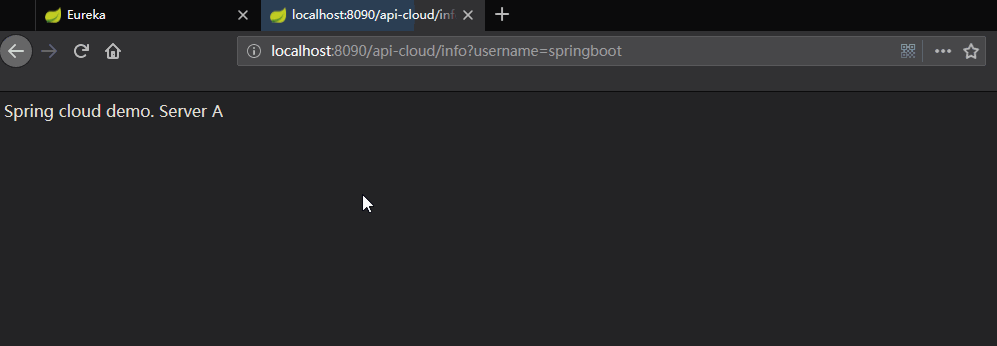
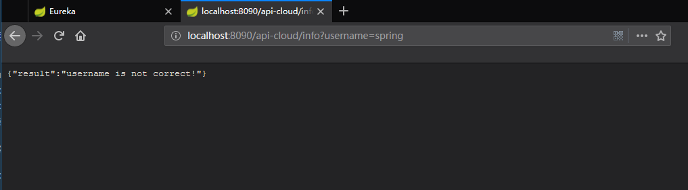

## 基于 Spring Boot 2.0 创建 Spring Cloud 2.0 项目  


### 1 添加 maven 依赖  

```xml
<!-- spring cloud -->
        <dependency>
            <groupId>org.springframework.cloud</groupId>
            <artifactId>spring-cloud-starter-config</artifactId>
        </dependency>
        <dependency>
            <groupId>org.springframework.cloud</groupId>
            <artifactId>spring-cloud-starter-netflix-eureka-client</artifactId>
        </dependency>
        <dependency>
            <groupId>org.springframework.cloud</groupId>
            <artifactId>spring-cloud-starter-netflix-eureka-server</artifactId>
        </dependency>
        <dependency>
            <groupId>org.springframework.cloud</groupId>
            <artifactId>spring-cloud-starter-netflix-zuul</artifactId>
        </dependency>
    <dependencyManagement>
        <dependencies>
            <dependency>
                <groupId>org.springframework.cloud</groupId>
                <artifactId>spring-cloud-dependencies</artifactId>
                <version>${spring-cloud.version}</version>
                <type>pom</type>
                <scope>import</scope>
            </dependency>
        </dependencies>
    </dependencyManagement>

```

这里的 `${spring.cloud}` 在 spring cloud 2.0 之后的版本为: `Finchley.SR1`  

以上依赖可在通过 `Spring Initializr`创建新的 `module` 时选择一下依赖包:  

  


### 2 添加 spring cloud 服务注册中心  

#### 2.1 在 spring boot 启动程序上边开启 spring cloud  

将以上 spring cloud 依赖添加之后,即可以使用 spring cloud 管理工具  

在 spring boot 的启动程序 `DemoWebApplication` 类上边添加 `@EnableEurekaServer` 注解  

参考: [com.ljq.demo.springboot.web.DemoWebApplication](../demo-web/src/main/java/com/ljq/demo/springboot/web/DemoWebApplication.java "../demo-web/src/main/java/com/ljq/demo/springboot/web/DemoWebApplication.java")    

```java
package com.ljq.demo.springboot.web;

import org.mybatis.spring.annotation.MapperScan;
import org.springframework.boot.SpringApplication;
import org.springframework.boot.autoconfigure.EnableAutoConfiguration;
import org.springframework.boot.autoconfigure.SpringBootApplication;
import org.springframework.cloud.netflix.eureka.server.EnableEurekaServer;
import org.springframework.context.annotation.ComponentScan;

@SpringBootApplication
@EnableEurekaServer
@EnableAutoConfiguration
@ComponentScan(basePackages = {"com.ljq.demo.springboot"})
@MapperScan("com.ljq.demo.springboot.dao")
public class DemoWebApplication {

    public static void main(String[] args) {
        SpringApplication.run(DemoWebApplication.class, args);
    }
}
```


#### 2.2 配置 spring cloud 服务中心    

在 spring boot 的配置文件 `application.yml` 中添加以下配置:  

参考: [application.yml](../demo-web/src/main/resources/application.yml "../demo-web/src/main/resources/application.yml")   

```yaml
# spring cloud
eureka:
  instance:
    hostname: 127.0.0.1
  client:
    register-with-eureka: false
    fetch-registry: false
    serviceUrl:
      defaultZone: http://${eureka.instance.hostname}:${server.port}/eureka/

spring:
    application:
      name: demo-server  # spring cloud server center ID
```


#### 2.3 启动 spring cloud 服务中心  

配置以上两步之后,即可启动 spring cloud 项目,运行 `DemoWebApplication` 类:    




### 3 创建 spring cloud 实例/客户端  

#### 3.1 使用 `spring Initializr` 创建 spring boot 项目    

选择 spring cloud 相关依赖,所选依赖参考  

1 添加 maven 依赖  

由于先前已经在父项目的 `pom` 文件中已经添加了 spring cloud 依赖,因此新创建的 spring cloud 子项目的 `pom` 文件直接修改为如下格式:  

[../cloud-client-a/pom.xml](../cloud-client-a/pom.xml "../cloud-client-a/pom.xml")  

```xml
<?xml version="1.0" encoding="UTF-8"?>
<project xmlns="http://maven.apache.org/POM/4.0.0" xmlns:xsi="http://www.w3.org/2001/XMLSchema-instance"
	xsi:schemaLocation="http://maven.apache.org/POM/4.0.0 http://maven.apache.org/xsd/maven-4.0.0.xsd">
	<modelVersion>4.0.0</modelVersion>

	<groupId>com.ljq.demo</groupId>
	<artifactId>cloud-client-a</artifactId>
	<version>1.0.0</version>
	<packaging>jar</packaging>
	<name>cloud-client-a</name>

	<parent>
		<artifactId>springboot</artifactId>
		<groupId>com.ljq.demo</groupId>
		<version>1.0.0</version>
	</parent>

	<properties>
		<project.build.sourceEncoding>UTF-8</project.build.sourceEncoding>
		<maven.compiler.source>${java.version}</maven.compiler.source>
		<maven.compiler.target>${java.version}</maven.compiler.target>
	</properties>

	<!--only in those modules that you want to run, but not in the parent pom-->
	<build>
		<plugins>
			<plugin>
				<groupId>org.springframework.boot</groupId>
				<artifactId>spring-boot-maven-plugin</artifactId>
				<configuration>
					<fork>true</fork>
				</configuration>
			</plugin>
		</plugins>
	</build>

</project>

```

#### 3.2 配置 spring cloud 子项目配置文件    

[../cloud-client-a/src/main/resources/application.yml](../cloud-client-a/src/main/resources/application.yml "../cloud-client-a/src/main/resources/application.yml")  

```yaml
# spring cloud module A

# spring config
spring:
  application:
    name: cloud-service
  devtools:
    restart:
      enabled: false
  cloud:
    config:
      discovery:
        enabled: true
        serviceId: demo-server

# tomcat server
server:
  port: 8091

## spring cloud eureka
eureka:
  client:
    serviceUrl:
      defaultZone: http://127.0.0.1:8088/eureka/
```

**注意:** 配置中的spring cloud 服务中心 id(`spring.cloud.config.discovery.serviceId`) 必须是先前已经注册的 spring cloud服务中心,`eureka` 的配置也是一样,这项项目启动之后才会成为 spring cloud 服务中心的一个子服务  

如果有多个功能相同的子服务,则这些子服务的服务名称必须相同,如多个子服务的都采用 `spring.application.name=cloud-service` 的配置  

### 3.3 在 子服务项目中启用 spring cloud  

在子服务的 spring boot 启动程序上边添加 `@EnableEurekaClient` 注解:  

```
../cloud-client-a/src/main/java/com/ljq/demo/springboot/clouda/CloudAApplication.java
```


```java
package com.ljq.demo.clouda;

import org.springframework.boot.SpringApplication;
import org.springframework.boot.autoconfigure.SpringBootApplication;
import org.springframework.boot.autoconfigure.jdbc.DataSourceAutoConfiguration;
import org.springframework.cloud.netflix.eureka.EnableEurekaClient;

@SpringBootApplication(exclude = DataSourceAutoConfiguration.class) 
@EnableEurekaClient
public class CloudAApplication {

	public static void main(String[] args) {
		SpringApplication.run(CloudAApplication.class, args);
	}
}
```


#### 3.3 启动一个 spring cloud 子项目  

将新建的 `cloud-a` 项目启动,刷新spring cloud 管理后台页面:   

  


### 3.4 创建多个 spring cloud 子项目,为实现负载均衡做准备  

重复 3.1-3.3 步骤,新建多个 spring cloud 子项目,**新建的子项目配置文件的不同之处仅在于服务的端口号(`server.port`)**,其他的都保持一致  

可参考:  

[../cloud-client-b/src/main/resources/application.yml](../cloud-client-b/src/main/resources/application.yml "../cloud-client-b/src/main/resources/application.yml")  

[../cloud-client-c/src/main/resources/application.yml](../cloud-client-c/src/main/resources/application.yml "../cloud-client-c/src/main/resources/application.yml")  


### 3.5 启动所有的 spring cloud 子项目  

将所有的 spring cloud 子项目启动:  

  

以上步骤实现了创建多个 spring cloud 实例,仍然属于相对独立的项目，还不能起到负载均衡的目的  


### 4 使用 zuul 实现 spring cloud 负载均衡  

#### 4.1 配置 zuul  

使用 `Spring Initializr` 创建 spring cloud 子项目,配置文件 `application.yml` 配置如下:  

[../cloud-zuul/src/main/resources/application.yml](../cloud-zuul/src/main/resources/application.yml "../cloud-zuul/src/main/resources/application.yml")  

```yaml
## spring cloud module

## spring config
spring:
  application:
    name: cloud-zuul
  devtools:
    restart:
      enabled: false

## tomcat server
server:
  port: 8090

## spring cloud eureka
eureka:
  client:
    serviceUrl:
      defaultZone: http://127.0.0.1:8088/eureka/

## zuul config
## 表明只要访问以 '/api-cloud/' 开头的多层目录都可以路由到 id 为 'cloud-service' 的服务上
zuul:
  routes:
    cloud-service: /api-cloud/**
```

zuul 路由配置: `zuul.routes` 下边的配置项需要与前边的 spring cloud 子项目服务名称保持一致,这样才可以通过路由去访问指定的服务  

#### 4.2 配置 zuul 路由注解    

在 spring cloud zuul 子项目的 spring boot 启动程序上边添加 `@EnableZuulProxy` 注解,具体的程序如下:  

```
../cloud-zuul/src/main/java/com/ljq/demo/springboot/cloudzuul/CloudZuulApplication.java
```


```java
package com.ljq.demo.cloudzuul;

import com.ljq.demo.cloudzuul.interceptor.AccessInterceptor;
import org.springframework.boot.SpringApplication;
import org.springframework.boot.autoconfigure.EnableAutoConfiguration;
import org.springframework.boot.autoconfigure.SpringBootApplication;
import org.springframework.boot.autoconfigure.jdbc.DataSourceAutoConfiguration;
import org.springframework.cloud.client.SpringCloudApplication;
import org.springframework.cloud.netflix.zuul.EnableZuulProxy;
import org.springframework.context.annotation.Bean;

@SpringCloudApplication
@EnableZuulProxy
@EnableAutoConfiguration(exclude = {DataSourceAutoConfiguration.class})
public class CloudZuulApplication {

	public static void main(String[] args) {
		SpringApplication.run(CloudZuulApplication.class, args);
	}

}

```


### 4.3 启动 zuul 项目  

zuul 配置完成之后的启动效果:    

  

现在,zuul 路由已经配置,可以通过路由来访问 spring cloud 子项目(cloud-client-a,cloud-client-b,cloud-client-c)，以达到均衡负载的目的，如直接访问 [http://localhost:8090/api-cloud](http://localhost:8090/api-cloud "http://localhost:8090/api-cloud") 即是访问 cloud-client-a,cloud-client-b,cloud-client-c 中的一个(**到这一步暂时看不出效果,因为没有对应的 controller 来处理请求**)  

#### 4.4 给 spring cloud 项目添加 controller  

分别在 cloud-client-a,cloud-client-b,cloud-client-c 三个 spring cloud 项目中添加相同的 controller:  

```
../cloud-client-a/src/main/java/com/ljq/demo/springboot/clouda/controller/CloudDemoController.java
```

​    

 ```java
package com.ljq.demo.clouda.controller;

import org.springframework.web.bind.annotation.RequestMapping;
import org.springframework.web.bind.annotation.RequestMethod;
import org.springframework.web.bind.annotation.RestController;

import java.util.Date;

/**
 * @Description: spring cloud demo controller
 * @Author: junqiang.lu
 * @Date: 2018/10/17
 */
@RestController
public class CloudDemoController {

    @RequestMapping(value = "/info", method = {RequestMethod.GET,RequestMethod.POST})
    public String info(){
        System.out.println("Spring cloud module A controller,date: " + new Date());
        String demoStr = "Spring cloud demo. Server A";
        return demoStr;
    }

}
 ```

三个项目中 controller 的拦截信息要保持一致(即都拦截 `/info` 请求),为了作为区分,在每个返回信息中添加一些不同信息  

此时通过配置的路由进行访问:  

访问地址: [http://localhost:8090/api-cloud/info](http://localhost:8090/api-cloud/info "http://localhost:8090/api-cloud/info")  

连续刷新页面,效果:  

  


### 5 使用 zuul 进行访问拦截  

zuul 实现了对服务的路由,也可以在这一层对访问请求进行过滤  

在 cloud-zuul 项目中定义拦截器,继承 `ZuulFilter` 类

参考:   

```
../cloud-zuul/src/main/java/com/ljq/demo/springboot/cloudzuul/interceptor/AccessInterceptor.java
```

​    

```java
package com.ljq.demo.cloudzuul.interceptor;

import com.netflix.zuul.ZuulFilter;
import com.netflix.zuul.context.RequestContext;
import com.netflix.zuul.exception.ZuulException;
import org.slf4j.Logger;
import org.slf4j.LoggerFactory;
import org.springframework.util.StringUtils;

import javax.servlet.http.HttpServletRequest;
import java.util.Date;

/**
 * @Description: spring cloud route interceptor
 * @Author: junqiang.lu
 * @Date: 2018/10/19
 */
public class AccessInterceptor extends ZuulFilter {

    /**
     * 拦截器执行时间点
     *
     * pre：可以在请求被路由之前调用
     * route：在路由请求时候被调用
     * post：在route和error过滤器之后被调用
     * error：处理请求时发生错误时被调用
     * @return
     */
    @Override
    public String filterType() {
        return "pre";
    }

    /**
     * 拦截器优先级
     * 数字越大，优先级越低
     *
     * @return
     */
    @Override
    public int filterOrder() {
        return 0;
    }

    /**
     * 是否执行该拦截器
     * true 执行; false 不执行
     *
     * @return
     */
    @Override
    public boolean shouldFilter() {
        return true;
    }

    /**
     * 拦截器执行方法
     *
     * @return
     * @throws ZuulException
     */
    @Override
    public Object run() throws ZuulException {
        RequestContext ctx = RequestContext.getCurrentContext();
        HttpServletRequest request = ctx.getRequest();
        System.out.println(String.format("%s %s demoFilter request to %s",new Date(), request.getMethod(), request.getRequestURL().toString()));
        String username = request.getParameter("username");// 获取请求的参数
        if (!StringUtils.isEmpty(username) && username.equalsIgnoreCase("springBoot")) {//通过
            ctx.setSendZuulResponse(true);// 对该请求进行路由
            ctx.setResponseStatusCode(200);
            ctx.set("isSuccess", true);// 设值，让下一个Filter看到上一个Filter的状态
            return null;
        } else {
            ctx.setSendZuulResponse(false);// 过滤该请求，不对其进行路由
            ctx.setResponseStatusCode(401);// 返回错误码
            ctx.setResponseBody("{\"result\":\"username is not correct!\"}");// 返回错误内容
            ctx.set("isSuccess", false);
            return null;
        }
    }

}
```

这里定义的拦截器要求访问者必须携带 `username=springboot` 参数才可以访问服务,否则返回错误内容  

拦截器定义之后,需要在 zuul 项目的 spring boot 启动类中添加拦截器的调用  

参考:   

```
../cloud-zuul/src/main/java/com/ljq/demo/springboot/cloudzuul/CloudZuulApplication.java
```

​    

```java
package com.ljq.demo.cloudzuul;

import com.ljq.demo.cloudzuul.interceptor.AccessInterceptor;
import org.springframework.boot.SpringApplication;
import org.springframework.boot.autoconfigure.EnableAutoConfiguration;
import org.springframework.boot.autoconfigure.SpringBootApplication;
import org.springframework.boot.autoconfigure.jdbc.DataSourceAutoConfiguration;
import org.springframework.cloud.client.SpringCloudApplication;
import org.springframework.cloud.netflix.zuul.EnableZuulProxy;
import org.springframework.context.annotation.Bean;

@SpringCloudApplication
@EnableZuulProxy
@EnableAutoConfiguration(exclude = {DataSourceAutoConfiguration.class})
public class CloudZuulApplication {

	public static void main(String[] args) {
		SpringApplication.run(CloudZuulApplication.class, args);
	}

	@Bean
	public AccessInterceptor accessInterceptor(){
		return new AccessInterceptor();
	}

}

```

拦截效果:  

  


到这里,已经实现了在 spring boot 2.0 的基础上搭建 spring cloud 2.0 项目，并且实现了负载均衡以及服务拦截的功能  

本次搭建 spring cloud 微服务框架提交记录为:  

```bash
commit c3b826757aba88fff2278528de66aa269dbcda5d (HEAD -> master, origin/master)
Author: junqiang.lu <flying9001@gmail.com>
Date:   Fri Oct 19 16:40:07 2018 +0800

    完善 spring cloud 模块,使用 spring cloud zuul 做负载均衡处理

```


版本回退命令:  

```shell
git reset --soft c3b826757aba88fff2278528de66aa269dbcda5d
```


  


