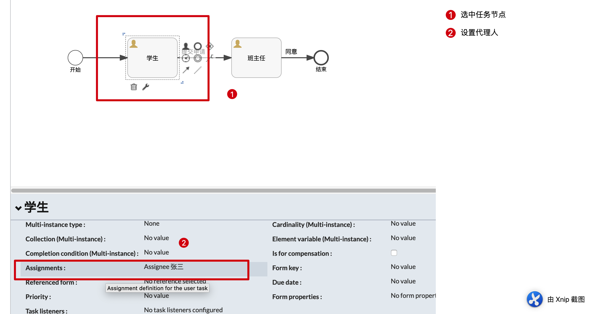
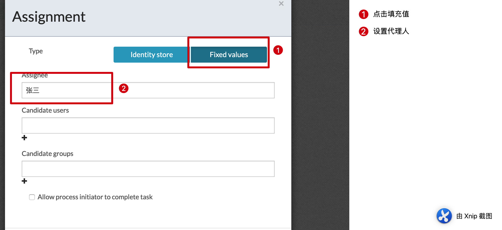
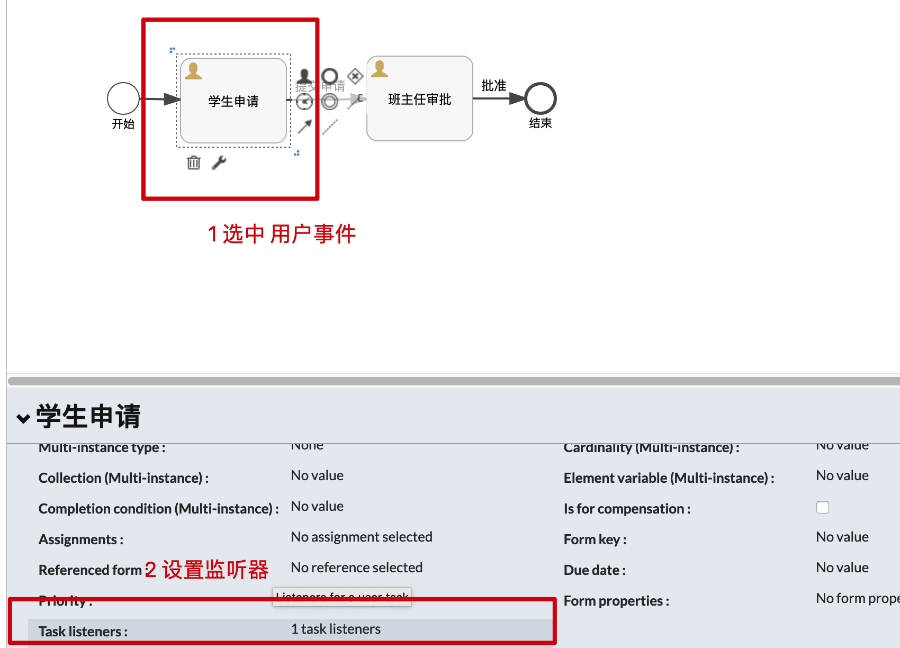
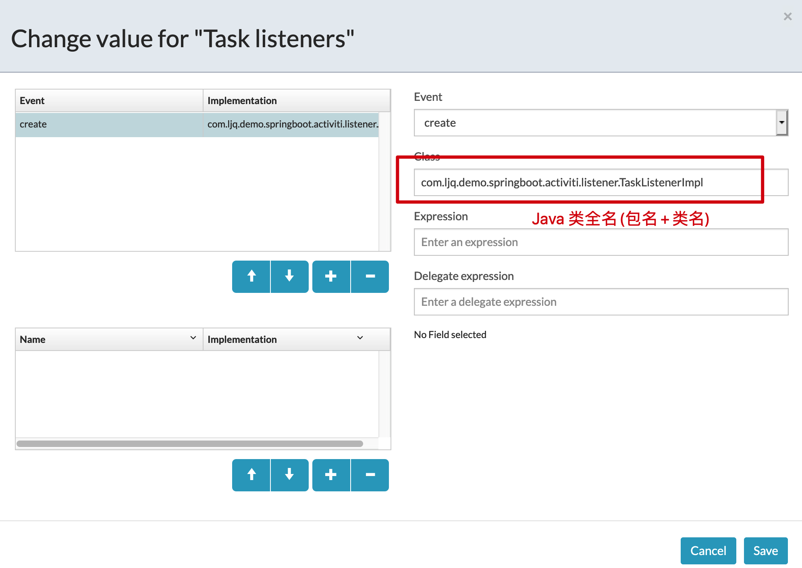
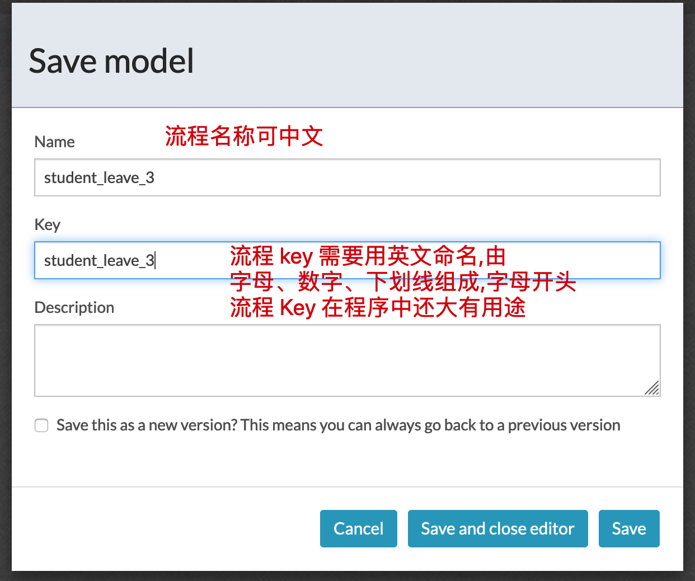
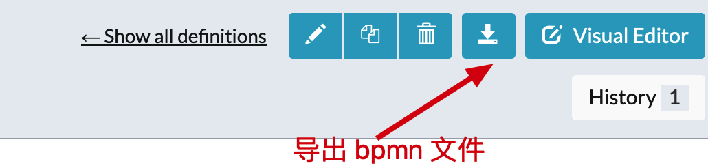

### 绘制一个 Activiti BPMN 流程图  


​    
​    
### 1 摘要  

BPMN 的全称是: Business Process Model and Nation，直译为：业务流程建模与标注，俗称流程图。本文将介绍使用 Activiti 官方的 web 工具绘制简易流程图。  

​    

### 2 流程绘制  

#### 2.1 流程绘制  

一个流程，必须包含一个开始事件，一个结束事件，中间由具体的流程事件组成  

流程示例:  

学生请假流程:  


#### 2.2 指定代理人  

每一个流程节点需要指定一个代理人，即流程执行到某个任务，需要有指定的用户来进行审批  





指定代理人的方式有3种:  

第一种: 固定代理人，如上图  

第二种: 使用 UEL 表达式动态设置代理人  


第三种，使用监听器实现动态设置代理人  





​    

#### 2.3 保存与导出  

流程图绘制完成之后即可保存模板  



此时流程配置是保存在数据库中，查看流程列表，选中刚配置好的流程图，查看详情并导出  

导出的文件为 `xml` 格式，将其改为 `bpmn` 格式，然后复制到 Activiti 项目中  



#### 2.4 流程图配置文件  

上边介绍了3中设置代理人的方式，每一种生成的 `bpmn` 文件如下:  

第一种，固定代理人:  

```
./activiti-workflow/src/main/resources/processes/student_leave.bpmn
```

```xml
<?xml version="1.0" encoding="UTF-8"?>
<definitions xmlns="http://www.omg.org/spec/BPMN/20100524/MODEL" xmlns:xsi="http://www.w3.org/2001/XMLSchema-instance" xmlns:xsd="http://www.w3.org/2001/XMLSchema" xmlns:activiti="http://activiti.org/bpmn" xmlns:bpmndi="http://www.omg.org/spec/BPMN/20100524/DI" xmlns:omgdc="http://www.omg.org/spec/DD/20100524/DC" xmlns:omgdi="http://www.omg.org/spec/DD/20100524/DI" typeLanguage="http://www.w3.org/2001/XMLSchema" expressionLanguage="http://www.w3.org/1999/XPath" targetNamespace="http://www.activiti.org/processdef">
  <process id="student_leave" name="student_leave" isExecutable="true">
    <startEvent id="startEvent1" name="开始"></startEvent>
    <userTask id="sid-8D6861B2-9FE9-4909-B091-73F2B6400764" name="学生" activiti:assignee="张三">
      <extensionElements>
        <modeler:initiator-can-complete xmlns:modeler="http://activiti.com/modeler"><![CDATA[false]]></modeler:initiator-can-complete>
      </extensionElements>
    </userTask>
    <userTask id="sid-436168A2-4968-4D3F-9A33-51776F9733FE" name="班主任" activiti:assignee="李四">
      <extensionElements>
        <modeler:initiator-can-complete xmlns:modeler="http://activiti.com/modeler"><![CDATA[false]]></modeler:initiator-can-complete>
      </extensionElements>
    </userTask>
    <endEvent id="sid-EA98BD32-1A93-4AF2-A374-7DF39A33ABAA" name="结束"></endEvent>
    <sequenceFlow id="sid-385279BD-97C2-44BC-9A9E-84179F795459" sourceRef="startEvent1" targetRef="sid-8D6861B2-9FE9-4909-B091-73F2B6400764"></sequenceFlow>
    <sequenceFlow id="sid-6B7E69AB-52AA-4CD8-BF45-CD76E6CC7CEC" name="提交申请" sourceRef="sid-8D6861B2-9FE9-4909-B091-73F2B6400764" targetRef="sid-436168A2-4968-4D3F-9A33-51776F9733FE"></sequenceFlow>
    <sequenceFlow id="sid-2A3D7AD7-E0F8-42ED-A521-A22E42F5B8CA" name="同意" sourceRef="sid-436168A2-4968-4D3F-9A33-51776F9733FE" targetRef="sid-EA98BD32-1A93-4AF2-A374-7DF39A33ABAA"></sequenceFlow>
  </process>
  
</definitions>
```

第二种，使用 UEL 表达式设置代理人  

```
./activiti-workflow/src/main/resources/processes/student_leave_2.bpmn
```

```xml
<?xml version="1.0" encoding="UTF-8"?>
<definitions xmlns="http://www.omg.org/spec/BPMN/20100524/MODEL" xmlns:xsi="http://www.w3.org/2001/XMLSchema-instance" xmlns:xsd="http://www.w3.org/2001/XMLSchema" xmlns:activiti="http://activiti.org/bpmn" xmlns:bpmndi="http://www.omg.org/spec/BPMN/20100524/DI" xmlns:omgdc="http://www.omg.org/spec/DD/20100524/DC" xmlns:omgdi="http://www.omg.org/spec/DD/20100524/DI" typeLanguage="http://www.w3.org/2001/XMLSchema" expressionLanguage="http://www.w3.org/1999/XPath" targetNamespace="http://www.activiti.org/processdef">
  <process id="student_leave_2" name="student_leave_2" isExecutable="true">
    <startEvent id="startEvent1" name="开始"></startEvent>
    <userTask id="sid-486A7692-35E4-476A-94EF-3566C01B8F39" name="学生申请" activiti:assignee="${student}">
      <extensionElements>
        <modeler:initiator-can-complete xmlns:modeler="http://activiti.com/modeler"><![CDATA[false]]></modeler:initiator-can-complete>
      </extensionElements>
    </userTask>
    <userTask id="sid-23DCF2CD-D1E0-4B66-9853-352B2E505782" name="班主任审批" activiti:assignee="${teacher}">
      <extensionElements>
        <modeler:initiator-can-complete xmlns:modeler="http://activiti.com/modeler"><![CDATA[false]]></modeler:initiator-can-complete>
      </extensionElements>
    </userTask>
    <endEvent id="sid-52FDCD77-D54C-4340-B624-93B92D941E77" name="结束"></endEvent>
    <sequenceFlow id="sid-96C3385F-899C-4149-B695-CEF25F5213CB" sourceRef="startEvent1" targetRef="sid-486A7692-35E4-476A-94EF-3566C01B8F39"></sequenceFlow>
    <sequenceFlow id="sid-5602EE93-61DC-4326-80A6-C76661889900" name="提交申请" sourceRef="sid-486A7692-35E4-476A-94EF-3566C01B8F39" targetRef="sid-23DCF2CD-D1E0-4B66-9853-352B2E505782"></sequenceFlow>
    <sequenceFlow id="sid-EABF7DE5-1A32-4EFF-9627-9B5AB70D5E8A" name="同意" sourceRef="sid-23DCF2CD-D1E0-4B66-9853-352B2E505782" targetRef="sid-52FDCD77-D54C-4340-B624-93B92D941E77"></sequenceFlow>
  </process>

</definitions>
```

第三种，使用监听器动态设置代理人  

```
./activiti-workflow/src/main/resources/processes/student_leave_3.bpmn
```

```xml
<?xml version="1.0" encoding="UTF-8"?>
<definitions xmlns="http://www.omg.org/spec/BPMN/20100524/MODEL" xmlns:xsi="http://www.w3.org/2001/XMLSchema-instance" xmlns:xsd="http://www.w3.org/2001/XMLSchema" xmlns:activiti="http://activiti.org/bpmn" xmlns:bpmndi="http://www.omg.org/spec/BPMN/20100524/DI" xmlns:omgdc="http://www.omg.org/spec/DD/20100524/DC" xmlns:omgdi="http://www.omg.org/spec/DD/20100524/DI" typeLanguage="http://www.w3.org/2001/XMLSchema" expressionLanguage="http://www.w3.org/1999/XPath" targetNamespace="http://www.activiti.org/processdef">
  <process id="student_leave_3" name="student_leave_3" isExecutable="true">
    <startEvent id="startEvent1" name="开始"></startEvent>
    <userTask id="sid-569880EE-EF90-4CA2-BF03-8CE45BADD383" name="学生申请">
      <extensionElements>
        <activiti:taskListener event="create" class="com.ljq.demo.springboot.activiti.listener.TaskListenerImpl"></activiti:taskListener>
      </extensionElements>
    </userTask>
    <userTask id="sid-38242A27-92B1-4225-BE1E-1BEF001C6323" name="班主任审批">
      <extensionElements>
        <activiti:taskListener event="create" class="com.ljq.demo.springboot.activiti.listener.TaskListenerImpl"></activiti:taskListener>
      </extensionElements>
    </userTask>
    <endEvent id="sid-D4A37973-6FD9-4797-8F76-4741F1CED489" name="结束"></endEvent>
    <sequenceFlow id="sid-66EACD0C-9A58-4D52-8CB8-B910D78A248B" sourceRef="startEvent1" targetRef="sid-569880EE-EF90-4CA2-BF03-8CE45BADD383"></sequenceFlow>
    <sequenceFlow id="sid-C45AB0DF-5784-4DED-B73C-DDBD104962D2" name="批准" sourceRef="sid-38242A27-92B1-4225-BE1E-1BEF001C6323" targetRef="sid-D4A37973-6FD9-4797-8F76-4741F1CED489"></sequenceFlow>
    <sequenceFlow id="sid-B9CE8749-BE0E-4669-A079-E97444983341" name="提交申请" sourceRef="sid-569880EE-EF90-4CA2-BF03-8CE45BADD383" targetRef="sid-38242A27-92B1-4225-BE1E-1BEF001C6323"></sequenceFlow>
  </process>
 
</definitions>
```

一个简单的流程图至此已经绘制完成，如何启动流程，将在后边的博客讲解  

​    

### 3 推荐参考资料  

[【官方文档】Activiti User Guide](https://www.activiti.org/userguide "https://www.activiti.org/userguide")  

[Activiti工作流实战开发](https://xuzhongcn.github.io/activiti/activiti.html "https://xuzhongcn.github.io/activiti/activiti.html")  

[Activiti第一篇【介绍、配置开发环境、快速入门】](https://juejin.im/post/5a647759518825732f7ed55e "https://juejin.im/post/5a647759518825732f7ed55e")  

​    

### 4 本次提交记录  

```bash
commit 0510343b79ee8f2931892d55b64b9af7fa1981a4
Author: ljq <flying9001@gmail.com>
Date:   Wed Jul 15 15:33:15 2020 +0800

    代码-新增 SpringBoot2.x 集成 Activiti 工作流
```

版本回退命令:  

```bash
git reset --soft 0510343b79ee8f2931892d55b64b9af7fa1981a4
```

