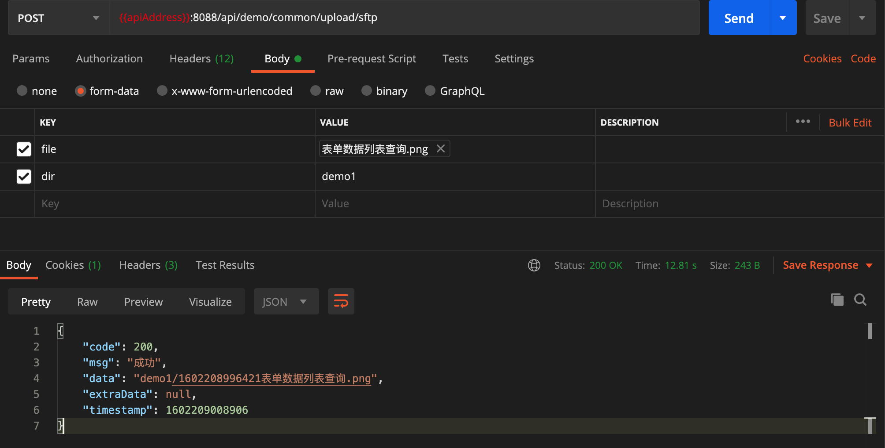
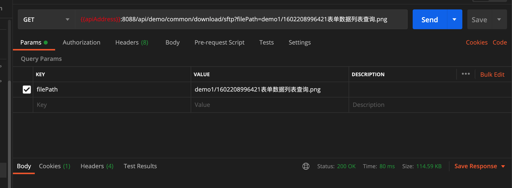

### Spring Boot 集成 SFTP 文件上传和下载功能  


​    
​    
### 1 摘要  

在项目中附件上传和下载是一个常用的功能。可采用的方案有三种，第一种，将附件保存至应用服务器上，这一种应对少量不重要附件可以使用，但对于大量附件或者有重要附件的，不建议使用；第二种，将附件保存至专门的文件服务器上，这一种可应对大量、重要的附件，但是需要自行架设大存储空间的服务器；第三种保存至类似阿里云的 OSS 的服务器上，这一种也可以应对大批量、重要的附件，不过租用第三方服务器也需要付费。本文将介绍第二种，在Spring Boot 项目中通过 SFTP 的方式上传和下载附件。  

​    

### 2 核心 Maven 依赖  

```
./demo-common/pom.xml
```

```xml
        <!-- jsch ssh/sftp client -->
        <dependency>
            <groupId>com.jcraft</groupId>
            <artifactId>jsch</artifactId>
            <version>${jsch.version}</version>
        </dependency>
```

其中 `${jsch.version}` 的版本为 `0.1.55`  

​    

### 3 核心代码  

#### 3.1 核心 SFTP 上传下载工具类  

```
./demo-common/src/main/java/com/ljq/demo/springboot/common/util/SftpUtil.java
```

```java
package com.ljq.demo.springboot.common.util;

import com.jcraft.jsch.*;
import lombok.AllArgsConstructor;
import lombok.Data;
import lombok.NoArgsConstructor;

import java.io.ByteArrayOutputStream;
import java.io.IOException;
import java.io.InputStream;
import java.util.Objects;
import java.util.Properties;

/**
 * @Description: sftp 工具类
 * @Author: junqiang.lu
 * @Date: 2020/9/23
 */
public class SftpUtil {

    private SftpUtil() {
    }

    /**
     * 每个目录下最大子文件(夹)数量
     */
    private static final int MAX_CHILD_FILE_NUMBER = 1000;
    private static volatile ChannelSftp sftp = null;
    private static volatile Session sshSession = null;

    /**
     * 附件上传
     *
     * @param sftpConfig sftp 配置信息
     * @param fileName 文件名
     * @param inputStream 文件流
     * @return
     * @throws SftpException
     * @throws JSchException
     */
    public static String upload(SftpConfig sftpConfig, String fileName, InputStream inputStream) throws SftpException, JSchException {
        return upload(sftpConfig,null, fileName, inputStream);
    }

    /**
     * 文件上传
     *
     * @param sftpConfig sftp 配置信息
     * @param relativePath 文件保存的相对路径(最后一级目录)
     * @param fileName 文件名
     * @param inputStream 文件流
     * @return
     * @throws JSchException
     * @throws SftpException
     */
    public static String upload(SftpConfig sftpConfig, String relativePath, String fileName, InputStream inputStream)
            throws JSchException, SftpException {
        init(sftpConfig);
        createFolder(sftpConfig.getPath());
        String filePath = sftpConfig.getPath();
        if (relativePath != null && !relativePath.trim().isEmpty()) {
            filePath = sftpConfig.getPath() + "/" + relativePath;
        }
        filePath = generateValidPath(filePath);
        filePath = filePath + "/" + fileName;
        sftp.put(inputStream, filePath);
        return filePath.substring(sftpConfig.getPath().length() + 1);
    }

    /**
     * 文件下载
     *
     * @param sftpConfig sftp 配置信息
     * @param fileName
     * @return
     * @throws JSchException
     * @throws SftpException
     */
    public static byte[] download(SftpConfig sftpConfig, String fileName) throws JSchException, SftpException,
            IOException {
        init(sftpConfig);
        InputStream inputStream = sftp.get(sftpConfig.getPath() + "/" + fileName);
        ByteArrayOutputStream buffer = new ByteArrayOutputStream();
        int n;
        byte[] data = new byte[1024];
        while ((n = inputStream.read(data, 0, data.length)) != -1) {
            buffer.write(data, 0, n);
        }
        buffer.flush();
        return buffer.toByteArray();
    }

    /**
     * 判断是否关闭
     *
     * @return
     */
    public static boolean isClosed() {
        if (Objects.isNull(sshSession) || Objects.isNull(sftp)) {
            return false;
        }
        if (Objects.nonNull(sshSession) && sshSession.isConnected() && Objects.nonNull(sftp) && sftp.isConnected()) {
            return true;
        }
        return false;
    }

    /**
     * 关闭
     */
    public static void close(){
        if (sshSession != null && sshSession.isConnected()) {
            sshSession.disconnect();
        }
        if (sftp != null && sftp.isConnected()) {
            sftp.disconnect();
        }
    }

    /**
     * 初始化
     *
     * @throws JSchException
     */
    private static void init(SftpConfig sftpConfig) throws JSchException {
        if (!isClosed()) {
            synchronized (SftpUtil.class) {
                if (!isClosed()) {
                    JSch jsch = new JSch();
                    jsch.getSession(sftpConfig.getUsername(), sftpConfig.getHost(), sftpConfig.getPort());
                    sshSession = jsch.getSession(sftpConfig.getUsername(), sftpConfig.getHost(), sftpConfig.getPort());
                    sshSession.setPassword(sftpConfig.getPassword());
                    Properties sshConfig = new Properties();
                    sshConfig.put("StrictHostKeyChecking", "no");
                    sshSession.setConfig(sshConfig);
                    sshSession.connect();
                    Channel channel = sshSession.openChannel("sftp");
                    channel.connect();
                    sftp = (ChannelSftp) channel;
                }
            }
        }
    }

    /**
     * 创建目录
     *
     * @param path 目录路径
     * @return
     */
    private static boolean createFolder(String path) {
        try {
            sftp.mkdir(path);
        } catch (SftpException e) {
            return false;
        }
        return true;
    }

    /**
     * 统计目录下文件(夹)数量
     *
     * @param path
     * @return
     */
    private static int countFiles(String path) throws SftpException {
        sftp.cd(path);
        return sftp.ls(path).size();
    }

    /**
     * 校验路径是否可用
     *
     * @param path
     * @return
     */
    private static boolean validatePathValid(String path) {
        int countFiles = 0;
        try {
            countFiles = countFiles(path);
        } catch (SftpException e) {
            createFolder(path);
        }
        if (countFiles <= MAX_CHILD_FILE_NUMBER) {
            return true;
        }
        return false;
    }

    /**
     * 生成有效路径
     *
     * @param path
     * @return
     */
    private static String generateValidPath(String path) {
        if (validatePathValid(path)) {
            return path;
        } else {
            String newPath = path + String.valueOf(System.currentTimeMillis()).substring(9);
            createFolder(newPath);
            return newPath;
        }
    }

    /**
     * sftp 配置信息
     */
    @Data
    @NoArgsConstructor
    @AllArgsConstructor
    public class SftpConfig {
        /**
         * 主机地址
         */
        private String host;
        /**
         * sftp 连接端口
         */
        private int port;
        /**
         * 用户名
         */
        private String username;
        /**
         * 密码
         */
        private String password;
        /**
         * 文件保存根路径
         */
        private String path;

    }

    public static SftpConfig sftpConfig() {
        return new SftpUtil().new SftpConfig();
    }

    public static SftpConfig sftpConfig(String host, int port, String username, String password, String path) {
        return new SftpUtil().new SftpConfig(host, port, username, password, path);
    }


}
```

​    

#### 3.2 SFTP 附件上传配置  

SFTP 配置类  

```
./demo-base-web/src/main/java/com/ljq/demo/springboot/baseweb/config/SftpUploadConfig.java
```

```java
package com.ljq.demo.springboot.baseweb.config;

import lombok.Getter;
import lombok.ToString;
import org.springframework.beans.factory.annotation.Value;
import org.springframework.context.annotation.Configuration;

/**
 * @Description: sftp 附件上传配置
 * @Author: junqiang.lu
 * @Date: 2020/9/27
 */
@ToString
@Getter
@Configuration
public class SftpUploadConfig {

    /**
     * 主机地址
     */
    @Value("${uploadSftp.host}")
    private String host;
    /**
     * sftp 连接端口
     */
    @Value("${uploadSftp.port}")
    private int port;
    /**
     * 用户名
     */
    @Value("${uploadSftp.username}")
    private String username;
    /**
     * 密码
     */
    @Value("${uploadSftp.password}")
    private String password;
    /**
     * 文件保存路径
     */
    @Value("${uploadSftp.path}")
    private String path;


}
```

SFTP 配置信息  

```
./demo-web/src/main/resources/application-dev.yml
./demo-web/src/main/resources/application-test.yml
./demo-web/src/main/resources/application-pro.yml
```

```yaml
## sftp 附件上传配置
uploadSftp:
  host: 172.16.140.10
  port: 22
  username: root
  password: root
  path: /home/ljq/upload
```

​    

#### 3.3 SFTP 附件上传与下载示例  

Service 层  

Service 接口:  

```
./demo-service/src/main/java/com/ljq/demo/springboot/service/CommonService.java
```

```java
package com.ljq.demo.springboot.service;

import com.jcraft.jsch.JSchException;
import com.jcraft.jsch.SftpException;
import com.ljq.demo.springboot.baseweb.api.ApiResult;
import com.ljq.demo.springboot.baseweb.exception.ParamsCheckException;
import com.ljq.demo.springboot.vo.DownloadBean;
import org.springframework.http.ResponseEntity;
import org.springframework.web.multipart.MultipartFile;

import java.io.IOException;

/**
 * @Description: 公共业务
 * @Author: junqiang.lu
 * @Date: 2018/12/24
 */
public interface CommonService {

    /**
     * 通过 sftp 上传附件至固定服务器
     *
     * @param file 文件
     * @param dir 文件夹名称
     * @return
     * @throws ParamsCheckException
     */
    ApiResult uploadSftp(MultipartFile file, String dir) throws ParamsCheckException;

    /**
     *
     * 通过 sftp 下载文件
     *
     * @param filePath 文件路径
     * @return
     * @throws JSchException
     * @throws SftpException
     * @throws IOException
     */
    ResponseEntity<byte[]> downloadSftp(String filePath) throws JSchException, SftpException, IOException;


}
```

Service 实现类:  

```
./demo-service/src/main/java/com/ljq/demo/springboot/service/impl/CommonServiceImpl.java
```

```java
package com.ljq.demo.springboot.service.impl;

import cn.hutool.core.bean.BeanUtil;
import cn.hutool.core.bean.copier.CopyOptions;
import cn.hutool.core.util.StrUtil;
import com.jcraft.jsch.JSchException;
import com.jcraft.jsch.SftpException;
import com.ljq.demo.springboot.baseweb.api.ApiResult;
import com.ljq.demo.springboot.baseweb.api.ResponseCode;
import com.ljq.demo.springboot.baseweb.config.OSSConfig;
import com.ljq.demo.springboot.baseweb.config.PDFExportConfig;
import com.ljq.demo.springboot.baseweb.config.SftpUploadConfig;
import com.ljq.demo.springboot.baseweb.exception.ParamsCheckException;
import com.ljq.demo.springboot.baseweb.util.OSSBootUtil;
import com.ljq.demo.springboot.baseweb.util.OSSSingleUtil;
import com.ljq.demo.springboot.baseweb.util.PDFUtil;
import com.ljq.demo.springboot.baseweb.util.ResourceFileUtil;
import com.ljq.demo.springboot.common.util.SftpUtil;
import com.ljq.demo.springboot.service.CommonService;
import com.ljq.demo.springboot.vo.DownloadBean;
import lombok.extern.slf4j.Slf4j;
import org.springframework.beans.factory.annotation.Autowired;
import org.springframework.http.HttpHeaders;
import org.springframework.http.HttpStatus;
import org.springframework.http.MediaType;
import org.springframework.http.ResponseEntity;
import org.springframework.stereotype.Service;
import org.springframework.web.multipart.MultipartFile;

import java.io.IOException;
import java.util.Date;
import java.util.HashMap;
import java.util.Map;
import java.util.Objects;

/**
 * @Description: 公共业务具体实现类
 * @Author: junqiang.lu
 * @Date: 2018/12/24
 */
@Slf4j
@Service("commonService")
public class CommonServiceImpl implements CommonService {

    @Autowired
    private PDFExportConfig pdfExportConfig;
    @Autowired
    private OSSConfig ossConfig;
    @Autowired
    private SftpUploadConfig uploadConfig;

    /**
     * 通过 sftp 上传附件至固定服务器
     *
     * @param file 文件
     * @param dir 文件夹名称
     * @return
     * @throws ParamsCheckException
     */
    @Override
    public ApiResult uploadSftp(MultipartFile file, String dir) throws ParamsCheckException {
        if (Objects.isNull(file) || file.isEmpty()) {
            throw new ParamsCheckException(ResponseCode.MISS_REQUEST_PART_ERROR);
        }
        log.debug("原始文件名:{},文件大小: {} Mb", file.getOriginalFilename(), (file.getSize()/1048576));
        // 储存文件
        SftpUtil.SftpConfig sftpConfig = SftpUtil.sftpConfig();
        BeanUtil.copyProperties(uploadConfig, sftpConfig, CopyOptions.create().ignoreNullValue().ignoreError());
        String filePath;
        if (StrUtil.isNotBlank(dir)) {
            dir = dir.replaceAll("[^a-zA-Z0-9]", "");
        }
        try {
            filePath = SftpUtil.upload(sftpConfig,dir, System.currentTimeMillis() +
                    file.getOriginalFilename(), file.getInputStream());
        } catch (Exception e) {
            log.warn("文件上传失败,{}", e.getMessage());
            throw new ParamsCheckException(ResponseCode.FAIL);
        }
        return ApiResult.success(filePath);
    }

    /**
     * 通过 sftp 下载文件
     *
     * @param filePath 文件路径
     * @return
     * @throws JSchException
     * @throws SftpException
     * @throws IOException
     */
    @Override
    public ResponseEntity<byte[]> downloadSftp(String filePath) throws JSchException, SftpException, IOException {
        SftpUtil.SftpConfig sftpConfig = SftpUtil.sftpConfig();
        BeanUtil.copyProperties(uploadConfig, sftpConfig, CopyOptions.create().ignoreNullValue().ignoreError());
        byte[] bytes = SftpUtil.download(sftpConfig, filePath);
        HttpHeaders headers = new HttpHeaders();
        String fileName = filePath.substring(filePath.lastIndexOf("/") + 1);
        headers.setContentType(MediaType.APPLICATION_OCTET_STREAM);
        headers.setContentDispositionFormData("attachment", new String(fileName.getBytes("UTF-8"),"ISO-8859-1"));
        return new ResponseEntity<>(bytes, headers, HttpStatus.OK);
    }
}
```

Controller 层:  

```
./demo-web/src/main/java/com/ljq/demo/springboot/web/controller/CommonController.java
```

```java
package com.ljq.demo.springboot.web.controller;

import com.jcraft.jsch.JSchException;
import com.jcraft.jsch.SftpException;
import com.ljq.demo.springboot.baseweb.api.ApiResult;
import com.ljq.demo.springboot.baseweb.exception.ParamsCheckException;
import com.ljq.demo.springboot.common.annotation.ParamsCheck;
import com.ljq.demo.springboot.service.CommonService;
import com.ljq.demo.springboot.vo.DownloadBean;
import io.swagger.annotations.ApiOperation;
import org.slf4j.Logger;
import org.slf4j.LoggerFactory;
import org.springframework.beans.factory.annotation.Autowired;
import org.springframework.http.HttpHeaders;
import org.springframework.http.HttpStatus;
import org.springframework.http.MediaType;
import org.springframework.http.ResponseEntity;
import org.springframework.web.bind.annotation.*;
import org.springframework.web.multipart.MultipartFile;

import java.io.IOException;

/**
 * @Description: 公共模块控制中心
 * @Author: junqiang.lu
 * @Date: 2018/12/24
 */
@RestController
@RequestMapping("api/demo/common")
public class CommonController {

    private static final Logger logger = LoggerFactory.getLogger(CommonController.class);

    @Autowired
    private CommonService commonService;

    /**
     * 通过 sftp 上传附件至固定服务器
     *
     * @param file 文件
     * @param dir 文件夹名称
     * @return
     * @throws ParamsCheckException
     */
    @PostMapping(value = "/upload/sftp", produces = {MediaType.APPLICATION_JSON_VALUE})
    @ApiOperation(value = "文件上传", notes = "文件上传")
    public ResponseEntity<ApiResult> uploadSftp(@RequestParam("file") MultipartFile file,
                                            String dir) throws ParamsCheckException {
        ApiResult apiResult = commonService.uploadSftp(file, dir);
        HttpHeaders headers = new HttpHeaders();
        headers.setContentType(MediaType.APPLICATION_JSON);
        return new ResponseEntity<>(apiResult, headers, HttpStatus.OK);
    }

    /**
     * 通过 sftp 下载文件
     *
     * @param filePath 文件路径
     * @return
     * @throws JSchException
     * @throws SftpException
     * @throws IOException
     */
    @ParamsCheck(ignore = true)
    @GetMapping(value = "/download/sftp", produces = {MediaType.MULTIPART_FORM_DATA_VALUE})
    public ResponseEntity<byte[]> downloadSftp(String filePath) throws JSchException, SftpException, IOException {
        ResponseEntity<byte[]> responseEntity = commonService.downloadSftp(filePath);
        return responseEntity;
    }

}
```

​    

### 4 测试  

上传:  



下载:  



​    

### 5 推荐参考资料  

[JAVA SFTP文件上传、下载及批量下载](https://www.cnblogs.com/foxting/p/10248105.html "https://www.cnblogs.com/foxting/p/10248105.html")  

[Java InputStream to Byte Array and ByteBuffer](https://www.baeldung.com/convert-input-stream-to-array-of-bytes "https://www.baeldung.com/convert-input-stream-to-array-of-bytes")  

[Java – Write to File](https://www.baeldung.com/java-write-to-file "https://www.baeldung.com/java-write-to-file")  

​    

### 6 本次提交记录  

```bash
commit 8038d0e8721516a0870cb668ac6ec9c44bbcad65 (HEAD -> dev, origin/master, origin/dev, origin/HEAD, master)
Author: ljq <flying9001@gmail.com>
Date:   Fri Oct 9 10:10:18 2020 +0800

    代码-新增sftp文件上传于下载功能
```

版本回退命令:  

```bash
git reset --soft 8038d0e8721516a0870cb668ac6ec9c44bbcad65
```


