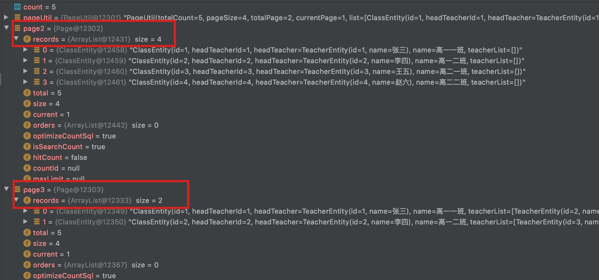

### 在 Spring Boot 项目中充分利用 Mybatis Mapper 文件  


​    
​    

### 1 摘要  

Mybatis 作为国内最受欢迎的 Java 数据持久层框架，不可能有程序员不知道吧。本文将根据作者本人在开发过程中使用到的 mybatis 属性，尽可能充分利用 Mybatis Mapper 文件，基本覆盖日常开发的需求。  

Mybatis 官方文档:  [https://mybatis.org/mybatis-3/getting-started.html](https://mybatis.org/mybatis-3/getting-started.html "https://mybatis.org/mybatis-3/getting-started.html")  

本文是基于 Spring Boot 集成 Mybatis、Mybatis Plus，其中利用到了 Mybatis Plus 的特性，同时也保留了在 Mapper 文件中手写 SQL 的用法。文章将重点讲解 Mybatis Mapper 文件的属性使用。

Spring Boot 集成 Mybatis: [2.3 springBoot 与 mybatis mysql 整合----2018-10-09](doc/3.springBoot与mybatis_mysql整合.md "3.springBoot与mybatis_mysql整合.md")  

Spring Boot 集成 Mybatis Plus : [3.9.1 SpringBoot 2.3 集成 Mybatis Plus 3.4 --- 2020-09-01](./doc/47.spring_boot_2.3_mybatis_plus_3.4.md "./doc/47.spring_boot_2.3_mybatis_plus_3.4.md")  

​    

### 2 演示所用数据库表  

```
./doc/sql/class_database_creat.sql
```

测试数据脚本  

```
./doc/sql/class_data_demo.sql
```

​    

### 3 核心代码  

#### 3.1 实体类  

```
./demo-mybatis-plus/src/main/java/com/ljq/demo/springboot/mybatisplus/model/entity/TeacherEntity.java
./demo-mybatis-plus/src/main/java/com/ljq/demo/springboot/mybatisplus/model/entity/ClassEntity.java
./demo-mybatis-plus/src/main/java/com/ljq/demo/springboot/mybatisplus/model/entity/ClassTeacherEntity.java
```

#### 3.2 DAO 层  

```
./demo-mybatis-plus/src/main/java/com/ljq/demo/springboot/mybatisplus/dao/ClassDao.java
```


#### 3.3 Service 层  

Service 接口  

```
./demo-mybatis-plus/src/main/java/com/ljq/demo/springboot/mybatisplus/service/ClassService.java
```

Service 实现类  

```
./demo-mybatis-plus/src/main/java/com/ljq/demo/springboot/mybatisplus/service/impl/ClassServiceImpl.java
```

#### 3.4 Controller 层  

```
./demo-mybatis-plus/src/main/java/com/ljq/demo/springboot/mybatisplus/controller/ClassController.java
```

#### 3.5 Mybatis Mapper 标签 介绍  

Mabatis Mapper 标签定义文件(dtd)参考官方文档: [http://mybatis.org/dtd/mybatis-3-mapper.dtd](http://mybatis.org/dtd/mybatis-3-mapper.dtd "http://mybatis.org/dtd/mybatis-3-mapper.dtd")  

##### 3.5.1 mapper  

```
<mapper namespace="com.ljq.demo.springboot.mybatisplus.dao.ClassDao">
```

`namespace` 用于指定该 mapper 文件对应的 DAO 接口  

##### 3.5.2 resultMap  

```
<resultMap type="com.ljq.demo.springboot.mybatisplus.model.entity.ClassEntity" id="classMap">
```

`resultMap` :用于定义数据库字段与Java实体类的映射关系  

`type` : 用于指定返回结果的实体类  

`resultMap` 标签中包含的子标签:  

`id` 用于指定数据库主键字段与Java实体类属性的关系  

`result` 用于指定非主键字段与Java实体类属性的关系  

```
<association property="headTeacher" javaType="com.ljq.demo.springboot.mybatisplus.model.entity.TeacherEntity">
```

`association`  用于指定 **一对一** 关系映射的对象，在本示例中，一个班级只有一个班主任，班级与班主任之间是一对一关系，而班主任也是老师，具有老师的相关属性，因此可以使用 `association` 标签在班级的返回结果中关联查询出班主任信息  

`association` 标签里的属性 `javaType` 即为 **一对一** 关系中右边一的Java实体类, `property` 即为左边一实体类中定义的属性  

`association` 标签同样包含 `id`, `result` 子标签  

```
<collection property="teacherList" javaType="java.util.List" ofType="com.ljq.demo.springboot.mybatisplus.model.entity.TeacherEntity">
```

`collection` 标签用于指定 **一对多** 关系映射对象，在本示例中，一个班级有多个老师，班级与教师之间是一对多关系，使用 `collection` 标签可以在查询班级时同时返回该班级老师的信息  

`collection` 标签里的属性 `javaType` 需要定义为 `java.util.List` , `ofType` 需要定义为一对多中多的一方Java实体类  

`association` 标签同样包含 `id`, `result` 子标签   

**在一个 resultMap 中，如果同时存在一对一，一对多的关系，则 association 标签必须要至于 collection 之上才可以**  

##### 3.5.3 sql  

`sql` 标签可以用于定义一些通用的 `sql` 语句，然后在需要用到的地方直接应用即可，`sql` 标签同时支持引用另一个 `sql` 标签。

引用 `sql` 标签的语法为:  

 ```
 <include refid="class_list_field" />
 ```

`refid` 即为 `sql` 标签的 `id` 属性  

**这里作者建议使用 `sql` 标签来定义需要查询的字段，这样就可以在每一个查询的语句中直接引用，而不需要重复书写。极大地精简代码和减少工作量。如果遇到字段的更新，那么使用这种方式就更加方便**  

##### 3.5.4 select  

```
    <select id="queryOne" parameterType="java.lang.Long" resultMap="classMap">
```

查询语句标签，该标签包含的属性有:  

`id`: 标识  

`parameterType`: 入参Java类，常用  

`parameterMap` : 入参对象，类似于 `resultMap`，需要用户定义一个单独的 `parameterMap` 标签，里边包含入参属性。不常用  

`resultMap`: 出参对象，上边已有解释  

`resultType`: 出参Java类，如果不定义， Mybatis 自动匹配DAO接口定义的返回对象，属性也能够自动匹配，即使数据库字段包含 `_` ，而Java对象为驼峰标识也能够自动匹配。不过使用 `resultType` 在一对一、一对多中难以实现，建议使用 `resultMap` 标签  

**如果 resultMap 中定义了字段与属性的关联，但是实际数据库查询结果中没有该字段，不会影响返回结果，程序也不会报错；如果数据库中查询的结果中有某些字段，而并没有在 resultMap 中定义，同样不会影响程序运行**  

`select` 标签下常用的子标签有:  

`include`: 引用 `sql` 定义的语句  

`if` ： 用于构造判断条件  

`trim` : 可与 `if` 构造连续判断条件，使用 `trim` 也可实现动态插入字段的功能    

```xml
        <trim prefix="(" suffix=")" suffixOverrides=",">
            <if test="headTeacherId != null"> `HEAD_TEACHER_ID`,  </if>
            <if test="name != null"> `NAME` </if>
        </trim>
        <trim prefix="values (" suffix=")" suffixOverrides=",">
            <if test="headTeacherId != null">#{headTeacherId}, </if>
            <if test="name != null">#{name}</if>
        </trim>
```

`foreach` : 构建循环遍历  

```xml
        <foreach item="id" collection="array" open="(" separator="," close=")">
            #{id}
        </foreach>
```

`foreach` 中的 `collection` 类型是 `array` 还是 `list` 根据 DAO 接口中的传参来定  

`chrose` : 构建复杂判断，类似  `switch-case` 功能  

```xml
        <choose>
            <when test="map.properties != null and map.direction.trim() != ''">
                c.${map.properties} ${map.direction}
            </when>
            <otherwise>
                c.id DESC
            </otherwise>
        </choose>
```

`chrose` 中可以包含多个 `when` 标签  

##### 3.5.5 insert 标签  

```xml
    <insert id="save" parameterType="com.ljq.demo.springboot.mybatisplus.model.entity.ClassEntity" useGeneratedKeys="true" keyProperty="id">
```

```xml
<insert id="saveClassTeacherBatch" parameterType="java.util.List" useGeneratedKeys="true">
        <selectKey resultType="long" keyProperty="id" order="AFTER">
```


`insert` 标签为插入数据标签，该标签常用的属性有:  

`id`(必须)、`parameterMap`、`parameterType`、  

`keyProperty` ：用于指定主键属性  

`useGeneratedKeys`: 使用使用主键生成策略  

`insert` 下常用的子标签有：  

`if` 、`trim` 、 `foreach`   

##### 3.5.6 update 标签  

```xml
<update id="updateOne" parameterType="com.ljq.demo.springboot.mybatisplus.model.entity.ClassEntity">
```

`update` 标签为更新数据标签，该标签常用的属性有:  

`id`(必须)、`parameterMap`、`parameterType`  

`update` 下常用子标签：  

`if` 

`set` : 即为更新操作时的 `set` 关键字，`set` 标签下可包含多个 `if` 标签，可实现动态更新字段的功能  

##### 3.5.7 delete 标签  

```xml
    <delete id="deleteOne">
```

`delete` 标签为删除标签，该标签常用的属性有：  

`id`(必须)、`parameterMap`、`parameterType`  

`delete` 下常用的子标签：  

`if` 、`foreach`  

使用 `foreach` 标签可以实现批量删除的功能  

​    

### 4 测试对比  

#### 4.1 保存  

```java
		// 保存
		// mybatis-plus
		classDao.insert(classParam);
		log.debug("{}", classParam);
		// local
		classDao.save(classParam);
		log.debug("{}", classParam);
```

Mybatis Plus 的 `insert` 方法支持动态插入数据功能(即字段不为空就插入数据，字段为空就不插入数据)  

Mybatis Mapper 文件中实现动态插入可参考 `save` 方法

```xml
    <!-- 保存,创建 -->
    <insert id="save" parameterType="com.ljq.demo.springboot.mybatisplus.model.entity.ClassEntity" useGeneratedKeys="true" keyProperty="id">
        INSERT INTO `class`
        <trim prefix="(" suffix=")" suffixOverrides=",">
            <if test="headTeacherId != null"> `HEAD_TEACHER_ID`,  </if>
            <if test="name != null"> `NAME` </if>
        </trim>
        <trim prefix="values (" suffix=")" suffixOverrides=",">
            <if test="headTeacherId != null">#{headTeacherId}, </if>
            <if test="name != null">#{name}</if>
        </trim>
    </insert>
```

在实际开发过程中可不在 Mapper 中编写插入单条的方法

#### 4.2 批量插入  

```java
		ClassTeacherEntity classTeacherParam;
		List<ClassTeacherEntity> classTeacherListParam = new ArrayList<>(16);
		for (int i = 0; i < classTeacherSaveBatchParam.getTeacherIds().length; i++) {
			classTeacherParam = new ClassTeacherEntity();
			classTeacherParam.setClassId(classTeacherSaveBatchParam.getClassId());
			classTeacherParam.setTeacherId(classTeacherSaveBatchParam.getTeacherIds()[i]);
			classTeacherListParam.add(classTeacherParam);
		}
		// 批量保存
		classDao.saveClassTeacherBatch(classTeacherListParam);
```

Mybatis Plus 不支持批量插入功能  

Mybatis Mapper 文件中实现批量插入可参考 `saveClassTeacherBatch` 方法  

```xml
    <!-- 批量插入班级教师 S -->
    <insert id="saveClassTeacherBatch" parameterType="java.util.List" useGeneratedKeys="true">
        <selectKey resultType="long" keyProperty="id" order="AFTER">
            SELECT
            LAST_INSERT_ID()
        </selectKey>
        INSERT INTO `class_teacher`(`CLASS_ID`, `TEACHER_ID`)
        VALUES
        <foreach collection="list" item="item" index="index" separator="," >
            ( #{item.classId}, #{item.teacherId})
        </foreach>
    </insert>
    <!-- 批量插入班级教师 E -->
```

在实际开发过程中需要手写 SQL 实现批量插入功能  

#### 4.3 查询单条  

```java
		// mybatis-plus
		ClassEntity classDBPlus = classDao.selectById(classInfoParam.getId());
		log.debug("mybatis-plus result: {}", classDBPlus);
		// local
		ClassEntity classDBLocal = classDao.queryOne(classInfoParam.getId());
		log.debug("local result: {}", classDBLocal);
```

Mybatis Plus 默认是查询主表的数据，不是关联查询  

在 Mabatis Mapper 中定义关联查询却很方便  

```xml
    <!-- 查询详情 -->
    <select id="queryOne" parameterType="java.lang.Long" resultMap="classMap">
        SELECT
        <include refid="class_info_field" />
        FROM `class` AS c
        LEFT JOIN `teacher` AS ht ON ht.ID = c.HEAD_TEACHER_ID
        LEFT JOIN `class_teacher` AS ct ON ct.CLASS_ID = c.ID
        LEFT JOIN `teacher` AS t ON t.ID = ct.TEACHER_ID
        WHERE c.ID = #{id}
    </select>
```

在实际开发过程中，如果需要关联查询，建议在 Mapper 文件中手动定义SQL  

#### 4.4 分页查询  

分页查询是使用场景最多，也最容易出错的环节，作者这里做了多种方案的对比  

##### 4.4.1 单表分页查询  

如果是单表的操作，完全可以使用 Mybatis Plus 的分页查询，无需手写 SQL  

```java
		// mybatis-plus
		IPage page = new Page(classListParam.getCurrentPage(), classListParam.getPageSize());
		LambdaQueryWrapper<ClassEntity> queryWrapper = new LambdaQueryWrapper<>();
		queryWrapper.like(StrUtil.isNotBlank(classListParam.getName()), ClassEntity::getName, classListParam.getName())
				.orderBy(true, classListParam.getDirection().equalsIgnoreCase(SqlKeyword.ASC.name()),
						ClassEntity::getId);
		page = classDao.selectPage(page, queryWrapper);
		log.debug("mybatis-plus result: total:{},records size:{}, records: {}", page.getTotal(),
				page.getRecords().size(), page.getRecords());
```

当然，也可以在 Mapper 中自定义SQL语句，参考 `queryCount` 和 `queryList`  

```java
		// local
		QueryUtil queryMap = new QueryUtil(BeanUtil.beanToMap(classListParam));
		ClassEntity classParam = new ClassEntity();
		BeanUtil.copyProperties(classListParam, classParam,CopyOptions.create()
				.setIgnoreNullValue(true).setIgnoreError(true));
		int count = classDao.queryCount(queryMap);
		PageUtil pageUtil = new PageUtil(Collections.emptyList(), count, classListParam.getPageSize(),
				classListParam.getCurrentPage());
		// 分页查询
		if (count > 0) {
			List<ClassEntity> classDBList = classDao.queryList(queryMap);
			pageUtil.setList(classDBList);
		}
		log.debug("local result: records size:{}, all: {}", pageUtil.getList().size(), pageUtil);
```

```xml
    <!-- 统计列表查询数量 -->
    <select id="queryCount" parameterType="java.util.Map" resultType="int">
        SELECT count(DISTINCT(c.ID))
        FROM `class` AS c
        WHERE 1 = 1
        <if test="name != null and '' != name" >
            AND c.NAME LIKE CONCAT(CONCAT('%',#{name}), '%')
        </if>
    </select>

    <!-- 列表查询 -->
    <select id="queryList" parameterType="java.util.Map" resultMap="classMap">
        SELECT
        <include refid="class_list_field" />
        FROM `class` c
        LEFT JOIN `teacher` AS ht ON ht.ID = c.HEAD_TEACHER_ID
        WHERE 1 = 1
        <if test="name != null and '' != name" >
            AND c.NAME LIKE CONCAT(CONCAT('%',#{name}), '%')
        </if>
        ORDER BY
        <choose>
            <when test="properties != null and direction.trim() != ''">
                c.${properties} ${direction}
            </when>
            <otherwise>
                c.id DESC
            </otherwise>
        </choose>
        <choose>
            <when test="offset != null and pageSize != null">
                LIMIT #{offset}, #{pageSize}
            </when>
            <otherwise>
                LIMIT 0, 5
            </otherwise>
        </choose>
    </select>
```

##### 4.4.2 多表一对一分页查询  

对于关联查询，即使手写SQL，Mybatis Plus 依然可以发挥作用  

```java
		// 分页查询
		if (count > 0) {
			List<ClassEntity> classDBList = classDao.queryList(queryMap);
			pageUtil.setList(classDBList);
		}
		log.debug("local result: records size:{}, all: {}", pageUtil.getList().size(), pageUtil);

		// mybatis-plus & local
		IPage page2 = new Page(classListParam.getCurrentPage(), classListParam.getPageSize());
		page2 = classDao.queryPage(page2, queryMap);
		log.debug("mybatis-plus & local result: total:{},records size:{},records: {}",page2.getTotal(),
				page2.getRecords().size(),page2.getRecords());
```

DAO 接口方法  

```java
    /**
     * 分页查询
     *
     * @param page
     * @param queryMap
     * @return
     */
    IPage<ClassEntity> queryPage(@Param("page") IPage<?> page, @Param("map") Map<String, Object> queryMap);
```

Mapper 文件中  

```xml
    <!-- 分页查询 S -->
    <select id="queryPage" resultMap="classMap" >
        SELECT
        <include refid="class_list_field" />
        FROM `class` c
        LEFT JOIN `teacher` AS ht ON ht.ID = c.HEAD_TEACHER_ID
        WHERE 1 = 1
        <if test="map.name != null and '' != map.name" >
            AND c.NAME LIKE CONCAT(CONCAT('%',#{map.name}), '%')
        </if>
        ORDER BY
        <choose>
            <when test="map.properties != null and map.direction.trim() != ''">
                c.${map.properties} ${map.direction}
            </when>
            <otherwise>
                c.id DESC
            </otherwise>
        </choose>
    </select>
    <!-- 分页查询 E -->
```

##### 4.4.3 Mybatis-Plus 多表一对多分页查询  

上边一条可以知道，Mybatis Plus 是可以在Mapper文件中自动插入分页参数的，那么 Mybatis Plus 可以处理一对多的问题吗？答案是否定的。Mybatis Plus 在一对多查询是会出现查询条数不一致问题(即 Mybatis Plus 会将子表的一条记录数算在总条数中，而一般查询条数是按照主表的记录条数来计算的)。  

测试代码:  

```java
		// mybatis-plus $ local 2(一对多分页测试)
		IPage page3 = new Page(classListParam.getCurrentPage(), classListParam.getPageSize());
		page3 = classDao.queryPage2(page3, queryMap);
		log.debug("mybatis-plus & local(一对多分页测试),total: {},records size:{},records: {}", page3.getTotal(),
				page3.getRecords().size(), page3.getRecords());
```

mapper 文件:  

```xml
    <!-- 分页查询2 S -->
    <select id="queryPage2" resultMap="classMap" >
        SELECT
        <include refid="class_info_field" />
        FROM `class` c
        LEFT JOIN `teacher` AS ht ON ht.ID = c.HEAD_TEACHER_ID
        LEFT JOIN `class_teacher` AS ct ON ct.CLASS_ID = c.ID
        LEFT JOIN `teacher` AS t ON t.ID = ct.TEACHER_ID
        WHERE 1 = 1
        <if test="map.name != null and '' != map.name" >
            AND c.NAME LIKE CONCAT(CONCAT('%',#{map.name}), '%')
        </if>
        ORDER BY
        <choose>
            <when test="map.properties != null and map.direction.trim() != ''">
                c.${map.properties} ${map.direction}
            </when>
            <otherwise>
                c.id DESC
            </otherwise>
        </choose>
    </select>
    <!-- 分页查询2 E -->
```

测试结果如下:  

请求参数:  

```
http://127.0.0.1:8450/api/mybatis/plus/class/list?pageSize=4&currentPage=1&properties=id&direction=ASC
```

查询的是每页显示4条  

查询结果:  



结论: **使用 Mybatis Plus 在一对多查询中会出现返回结果条数不准确的问题**  

##### 4.4.4 Mapper 手写 SQL 实现一对多分页查询  

代码:  

```java
		// local 2(一对多分页测试)
		PageUtil pageUtil2 = new PageUtil(Collections.emptyList(), count, classListParam.getPageSize(),
				classListParam.getCurrentPage());
		if (count > 0) {
			List<ClassEntity> classDBList = classDao.queryList2(queryMap);
			pageUtil2.setList(classDBList);
		}
		log.debug("local result: records size:{}, all: {}", pageUtil.getList().size(), pageUtil);
```

Mapper 文件:  

```xml
    <!-- 统计列表查询数量 -->
    <select id="queryCount" parameterType="java.util.Map" resultType="int">
        SELECT count(DISTINCT(c.ID))
        FROM `class` AS c
        WHERE 1 = 1
        <if test="name != null and '' != name" >
            AND c.NAME LIKE CONCAT(CONCAT('%',#{name}), '%')
        </if>
    </select>
    <!-- 列表查询(支持一对多分页) S -->
    <select id="queryList2" parameterType="java.util.Map" resultMap="classMap">
        SELECT
        <include refid="class_info_field" />
        FROM (
            SELECT *
            FROM `class`
            WHERE 1 = 1
            <if test="name != null and '' != name" >
                AND `NAME` LIKE CONCAT(CONCAT('%',#{name}), '%')
            </if>
            ORDER BY
            <choose>
                <when test="properties != null and direction.trim() != ''">
                    ${properties} ${direction}
                </when>
                <otherwise>
                    `ID` DESC
                </otherwise>
            </choose>
            <choose>
                <when test="offset != null and pageSize != null">
                    LIMIT #{offset}, #{pageSize}
                </when>
                <otherwise>
                    LIMIT 0, 5
                </otherwise>
            </choose>
        ) c
        LEFT JOIN `teacher` AS ht ON ht.ID = c.HEAD_TEACHER_ID
        LEFT JOIN `class_teacher` AS ct ON ct.CLASS_ID = c.ID
        LEFT JOIN `teacher` AS t ON t.ID = ct.TEACHER_ID
        ORDER BY
        <choose>
            <when test="properties != null and direction.trim() != ''">
                c.${properties} ${direction}
            </when>
            <otherwise>
                c.ID DESC
            </otherwise>
        </choose>
    </select>
    <!-- 列表查询(支持一对多分页) E -->
```

**使用子查询的方式还能够大大提升查询效率**  

​    

### 5 完整 Mapper 文件  

该 Mapper 文件包含了日常开发基本的数据库操作  

```
./demo-mybatis-plus/src/main/resources/mybatis/ClassDao.xml
```

```xml
<?xml version="1.0" encoding="UTF-8"?>
<!DOCTYPE mapper PUBLIC "-//mybatis.org//DTD Mapper 3.0//EN" "http://mybatis.org/dtd/mybatis-3-mapper.dtd">

<mapper namespace="com.ljq.demo.springboot.mybatisplus.dao.ClassDao">

	<!-- 班级结果集resultMap -->
    <resultMap type="com.ljq.demo.springboot.mybatisplus.model.entity.ClassEntity" id="classMap">
        <id property="id" column="ID" />
        <result property="headTeacherId" column="HEAD_TEACHER_ID"/>
        <result property="name" column="NAME"/>
        <association property="headTeacher" javaType="com.ljq.demo.springboot.mybatisplus.model.entity.TeacherEntity">
            <id property="id" column="HT_ID" />
            <result property="name" column="HT_NAME" />
        </association>
        <collection property="teacherList" javaType="java.util.List" ofType="com.ljq.demo.springboot.mybatisplus.model.entity.TeacherEntity">
            <id property="id" column="T_ID" />
            <result property="name" column="T_NAME" />
        </collection>
    </resultMap>

   <!-- 班级-基础字段 -->
	<sql id="class_base_field">
        c.ID,
        c.`HEAD_TEACHER_ID`,
        c.`NAME`
	</sql>

    <!-- 班级-列表字段 -->
    <sql id="class_list_field">
        <include refid="class_base_field" />
        ,
        ht.ID AS HT_ID,
        ht.NAME AS HT_NAME
	</sql>

    <!-- 班级-详情字段 -->
    <sql id="class_info_field">
        <include refid="class_list_field" />
        ,
        t.ID AS T_ID,
        t.NAME AS T_NAME
    </sql>

    <!-- 保存,创建 -->
    <insert id="save" parameterType="com.ljq.demo.springboot.mybatisplus.model.entity.ClassEntity" useGeneratedKeys="true" keyProperty="id">
        INSERT INTO `class`
        <trim prefix="(" suffix=")" suffixOverrides=",">
            <if test="headTeacherId != null"> `HEAD_TEACHER_ID`,  </if>
            <if test="name != null"> `NAME` </if>
        </trim>
        <trim prefix="values (" suffix=")" suffixOverrides=",">
            <if test="headTeacherId != null">#{headTeacherId}, </if>
            <if test="name != null">#{name}</if>
        </trim>
    </insert>

    <!-- 批量插入班级教师 S -->
    <insert id="saveClassTeacherBatch" parameterType="java.util.List" useGeneratedKeys="true">
        <selectKey resultType="long" keyProperty="id" order="AFTER">
            SELECT
            LAST_INSERT_ID()
        </selectKey>
        INSERT INTO `class_teacher`(`CLASS_ID`, `TEACHER_ID`)
        VALUES
        <foreach collection="list" item="item" index="index" separator="," >
            ( #{item.classId}, #{item.teacherId})
        </foreach>
    </insert>
    <!-- 批量插入班级教师 E -->

    <!-- 查询详情 -->
    <select id="queryOne" parameterType="java.lang.Long" resultMap="classMap">
        SELECT
        <include refid="class_info_field" />
        FROM `class` AS c
        LEFT JOIN `teacher` AS ht ON ht.ID = c.HEAD_TEACHER_ID
        LEFT JOIN `class_teacher` AS ct ON ct.CLASS_ID = c.ID
        LEFT JOIN `teacher` AS t ON t.ID = ct.TEACHER_ID
        WHERE c.ID = #{id}
    </select>

    <!-- 统计列表查询数量 -->
    <select id="queryCount" parameterType="java.util.Map" resultType="int">
        SELECT count(DISTINCT(c.ID))
        FROM `class` AS c
        WHERE 1 = 1
        <if test="name != null and '' != name" >
            AND c.NAME LIKE CONCAT(CONCAT('%',#{name}), '%')
        </if>
    </select>

    <!-- 列表查询 -->
    <select id="queryList" parameterType="java.util.Map" resultMap="classMap">
        SELECT
        <include refid="class_list_field" />
        FROM `class` c
        LEFT JOIN `teacher` AS ht ON ht.ID = c.HEAD_TEACHER_ID
        WHERE 1 = 1
        <if test="name != null and '' != name" >
            AND c.NAME LIKE CONCAT(CONCAT('%',#{name}), '%')
        </if>
        ORDER BY
        <choose>
            <when test="properties != null and direction.trim() != ''">
                c.${properties} ${direction}
            </when>
            <otherwise>
                c.id DESC
            </otherwise>
        </choose>
        <choose>
            <when test="offset != null and pageSize != null">
                LIMIT #{offset}, #{pageSize}
            </when>
            <otherwise>
                LIMIT 0, 5
            </otherwise>
        </choose>
    </select>

    <!-- 列表查询(支持一对多分页) S -->
    <select id="queryList2" parameterType="java.util.Map" resultMap="classMap">
        SELECT
        <include refid="class_info_field" />
        FROM (
            SELECT *
            FROM `class`
            WHERE 1 = 1
            <if test="name != null and '' != name" >
                AND `NAME` LIKE CONCAT(CONCAT('%',#{name}), '%')
            </if>
            ORDER BY
            <choose>
                <when test="properties != null and direction.trim() != ''">
                    ${properties} ${direction}
                </when>
                <otherwise>
                    `ID` DESC
                </otherwise>
            </choose>
            <choose>
                <when test="offset != null and pageSize != null">
                    LIMIT #{offset}, #{pageSize}
                </when>
                <otherwise>
                    LIMIT 0, 5
                </otherwise>
            </choose>
        ) c
        LEFT JOIN `teacher` AS ht ON ht.ID = c.HEAD_TEACHER_ID
        LEFT JOIN `class_teacher` AS ct ON ct.CLASS_ID = c.ID
        LEFT JOIN `teacher` AS t ON t.ID = ct.TEACHER_ID
        ORDER BY
        <choose>
            <when test="properties != null and direction.trim() != ''">
                c.${properties} ${direction}
            </when>
            <otherwise>
                c.ID DESC
            </otherwise>
        </choose>
    </select>
    <!-- 列表查询(支持一对多分页) E -->

    <!-- 分页查询 S -->
    <select id="queryPage" resultMap="classMap" >
        SELECT
        <include refid="class_list_field" />
        FROM `class` c
        LEFT JOIN `teacher` AS ht ON ht.ID = c.HEAD_TEACHER_ID
        WHERE 1 = 1
        <if test="map.name != null and '' != map.name" >
            AND c.NAME LIKE CONCAT(CONCAT('%',#{map.name}), '%')
        </if>
        ORDER BY
        <choose>
            <when test="map.properties != null and map.direction.trim() != ''">
                c.${map.properties} ${map.direction}
            </when>
            <otherwise>
                c.id DESC
            </otherwise>
        </choose>
    </select>
    <!-- 分页查询 E -->

    <!-- 分页查询2 S -->
    <select id="queryPage2" resultMap="classMap" >
        SELECT
        <include refid="class_info_field" />
        FROM `class` c
        LEFT JOIN `teacher` AS ht ON ht.ID = c.HEAD_TEACHER_ID
        LEFT JOIN `class_teacher` AS ct ON ct.CLASS_ID = c.ID
        LEFT JOIN `teacher` AS t ON t.ID = ct.TEACHER_ID
        WHERE 1 = 1
        <if test="map.name != null and '' != map.name" >
            AND c.NAME LIKE CONCAT(CONCAT('%',#{map.name}), '%')
        </if>
        ORDER BY
        <choose>
            <when test="map.properties != null and map.direction.trim() != ''">
                c.${map.properties} ${map.direction}
            </when>
            <otherwise>
                c.id DESC
            </otherwise>
        </choose>
    </select>
    <!-- 分页查询2 E -->

    <!-- 更新 -->
    <update id="updateOne" parameterType="com.ljq.demo.springboot.mybatisplus.model.entity.ClassEntity">
        UPDATE `class`
        <set>
            <if test="headTeacherId != null">`HEAD_TEACHER_ID` = #{headTeacherId}, </if>
            <if test="name != null">`NAME` = #{name}</if>
        </set>
        WHERE ID = #{id}
    </update>

    <!-- 删除一条数据 -->
    <delete id="deleteOne">
        DELETE FROM `class`
        WHERE `ID` = #{id}
    </delete>

    <!-- 批量删除 -->
    <delete id="deleteBatch">
        DELETE FROM `class` WHERE `ID` IN
        <foreach item="id" collection="array" open="(" separator="," close=")">
            #{id}
        </foreach>
    </delete>

</mapper>
```

​    

### 6 推荐参考文档  

[Mybatis 官方文档](https://mybatis.org/mybatis-3/index.html "https://mybatis.org/mybatis-3/index.html")  

[Mabatis Mapper 标签定义文件(dtd)参考官方文档](http://mybatis.org/dtd/mybatis-3-mapper.dtd "http://mybatis.org/dtd/mybatis-3-mapper.dtd")  

​    

### 7 本次提交记录  

```bash
commit d137bce783c94f43d4a420e917a07f60b34d8cf3 (HEAD -> dev, origin/master, origin/dev, origin/HEAD, master)
Author: ljq <flying9001@gmail.com>
Date:   Mon Oct 19 11:10:58 2020 +0800

    代码-新增充分利用 Mybatis mapper 文件示例代码
```

版本回退命令:  

```bash
git reset --soft d137bce783c94f43d4a420e917a07f60b34d8cf3
```

