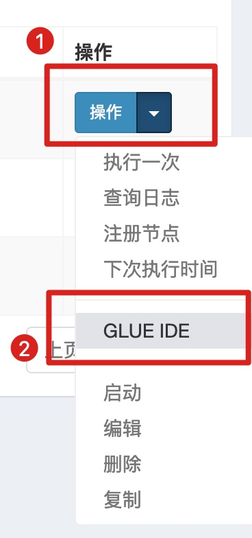

### Spring Boot 2.4 集成 xxl-job 分布式定时任务  


​    

### 1 摘要

xxl-job 作为一款优秀的国内开源的分布式定时任务处理框架，具备低耦合(调度与执行分开)、易拓展、简单易上手、文档详尽等特点，在国内应用广泛。本文将基于 Spring Boot 2.4 集成 xxl-job 定时任务单机模式与集群模式。  

官方文档: [https://www.xuxueli.com/xxl-job](https://www.xuxueli.com/xxl-job "https://www.xuxueli.com/xxl-job")  

​    

### 2 项目架构说明  

在上手 xxl-job 之前，需要先了解 xxl-job 的基本架构。xxl-job 主要分为两个模块: 任务调度模块和任务执行模块。这里简单说明各个模块的功能与使用。

任务调度模块: 相当于一个控制中心，有 WEB 界面，可以手动添加、修改定时任务负载。  

任务执行模块: 用于执行定时任务负载的模块，与传统定时任务框架(Spring Task 和 Quartz) 不同的是，该模块中的定时任务在项目启动之后，并不会直接执行定时任务相关代码，而是需要向任务调度中心注册服务(类似于 Spring Cloud 的服务注册与发现)，然后在任务调度中心分配好任务并启动后，任务执行模块才会开始执行定时任务。  

分布式实现原理: 由任务调度中心管理多个任务执行模块，在集群状态下，每一次任务的执行由任务调度中心决定哪一台任务执行服务器去执行，从而实现了在分布式状态下保证同一时间只有一台服务器去执行定时任务的功能。  

​    

### 3 搭建任务调度中心  

直接下载 xxl-job 源码，修改 `xxl-job-admin` 配置信息，启动项目即可  

xxl-job github 源码地址: [https://github.com/xuxueli/xxl-job](https://github.com/xuxueli/xxl-job "https://github.com/xuxueli/xxl-job")  

```
./xxl-job-admin/src/main/resources/application.properties
```

```properties
### web
server.port=8560
server.servlet.context-path=/xxl-job-admin

### xxl-job, datasource
spring.datasource.url=jdbc:mysql://172.16.140.10:3306/xxl_job?useUnicode=true&characterEncoding=utf8\
            &useJDBCCompliantTimezoneShift=true&useLegacyDatetimeCode=false&serverTimezone=GMT%2b8\
            &useSSL=true&allowMultiQueries=true&autoReconnect=true&nullCatalogMeansCurrent=true
spring.datasource.username=root
spring.datasource.password=Qwert12345!
spring.datasource.driver-class-name=com.mysql.cj.jdbc.Driver

### xxl-job, email
spring.mail.host=smtp.qq.com
spring.mail.port=25
spring.mail.username=xxx@qq.com
spring.mail.from=xxx@qq.com
spring.mail.password=xxx
spring.mail.properties.mail.smtp.auth=true
spring.mail.properties.mail.smtp.starttls.enable=true
spring.mail.properties.mail.smtp.starttls.required=true
spring.mail.properties.mail.smtp.socketFactory.class=javax.net.ssl.SSLSocketFactory

### xxl-job, access token
xxl.job.accessToken=spring-boot-demo123

### xxl-job, i18n (default is zh_CN, and you can choose "zh_CN", "zh_TC" and "en")
xxl.job.i18n=zh_CN

## xxl-job, triggerpool max size
xxl.job.triggerpool.fast.max=200
xxl.job.triggerpool.slow.max=100

### xxl-job, log retention days
xxl.job.logretentiondays=30
```

以上配置根据项目需要进行修改  

在启动项目之前需要先初始化数据库，xxl-job 是基于 MySQL 数据库的，数据库脚本文件在源码中位置:   

 `/xxl-job/doc/db/tables_xxl_job.sql`  

启动 `xxl-job-admin` 模块，任务调度中心的管理地址为:  

```http
http://localhost:8560/xxl-job-admin
```

**系统自带用户密码:**  

```
admin/123456
```

登录之后主界面:  


​    

### 4 搭建任务执行器  

xxl-job 源码中 `xxl-job-executor-samples` 即为简单示例，下边为根据项目代码进行整理的文档  

#### 4.1 Maven 核心依赖  

```
./demo-schedule-xxl-job/pom.xml
```

```xml
        <!-- xxl-job -->
        <dependency>
            <groupId>com.xuxueli</groupId>
            <artifactId>xxl-job-core</artifactId>
            <version>${xxl-job.version}</version>
        </dependency>
```

其中 `${xxl-job.version}` 的版本为 `2.2.0`  

#### 4.2 任务执行器配置信息  

application 配置文件  

```
./demo-schedule-xxl-job/src/main/resources/application.yml
```

```yaml
## config
server:
  port: 8561

## xxl-job
xxl:
  job:
    admin:
      address: "http://127.0.0.1:8560/xxl-job-admin"
    executor:
      appName: demo-schedule-xxl-job
      ip:
      port: 8566
      logPath: /Users/ljq/logs/xxlJob
      logRetentionDays: 30
    accessToken: spring-boot-demo123
```

配置类  

```
./demo-schedule-xxl-job/src/main/java/com/ljq/demo/springboot/xxljob/common/config/XxlJobConfig.java
```

```java
package com.ljq.demo.springboot.xxljob.common.config;

import com.xxl.job.core.executor.impl.XxlJobSpringExecutor;
import lombok.Getter;
import org.springframework.beans.factory.annotation.Value;
import org.springframework.context.annotation.Bean;
import org.springframework.context.annotation.Configuration;

/**
 * @Description: xxl-job 配置信息
 * @Author: junqiang.lu
 * @Date: 2020/11/26
 */
@Getter
@Configuration
public class XxlJobConfig {

    /**
     * 调度中心部署地址，选填，可以多个地址，使用逗号分隔，为空则关闭自动注册
     */
    @Value("${xxl.job.admin.address}")
    private String adminAddress;
    /**
     * 执行器 App 名称，选填，执行器心跳注册分组依据，为空则关闭自动注册
     */
    @Value("${xxl.job.executor.appName}")
    private String appName;
    /**
     * 执行器 ip，选填，为空则自动获取 ip，多网卡可手动指定 ip，该 ip 不会绑定 host，仅作通讯使用；
     * 地址信息用于"执行器注册"和"调度中心请求并触发任务"
     */
    @Value("${xxl.job.executor.ip}")
    private String ip;
    /**
     * 执行器端口，选填，默认 9999
     */
    @Value("${xxl.job.executor.port}")
    private Integer port;
    /**
     * 执行器运行日志文件储存路径，选填
     */
    @Value("${xxl.job.executor.logPath}")
    private String logPath;
    /**
     * 执行器日志文件保留天数，至少为 7，选填，默认 -1，不清理
     */
    @Value("${xxl.job.executor.logRetentionDays}")
    private Integer logRetentionDays;
    /**
     * 执行器通讯认证 Token，选填
     */
    @Value("${xxl.job.accessToken}")
    private String accessToken;


    /**
     * 创建 xxl-job 执行器
     *
     * @return
     */
    @Bean
    public XxlJobSpringExecutor xxlJobSpringExecutor(){
        XxlJobSpringExecutor executor = new XxlJobSpringExecutor();
        executor.setAdminAddresses(adminAddress);
        executor.setAppname(appName);
        executor.setIp(ip);
        executor.setPort(port);
        executor.setLogPath(logPath);
        executor.setLogRetentionDays(logRetentionDays);
        executor.setAccessToken(accessToken);
        return executor;
    }


}
```

​    

#### 4.3 核心代码  

##### 4.3.1 定时任务负载-Bean 模式  

```
./demo-schedule-xxl-job/src/main/java/com/ljq/demo/springboot/xxljob/job/UserJob.java
```

```java
package com.ljq.demo.springboot.xxljob.job;

import com.xxl.job.core.biz.model.ReturnT;
import com.xxl.job.core.handler.annotation.XxlJob;
import lombok.extern.slf4j.Slf4j;
import org.springframework.stereotype.Component;

import java.util.concurrent.atomic.AtomicInteger;

/**
 * @Description: 用户定时任务负载类(Bean 模式)
 * @Author: junqiang.lu
 * @Date: 2020/11/27
 */
@Slf4j
@Component
public class UserJob {

    /**
     * 用户定时任务处理器名称
     */
    private static final String USER_JOB_HANDLE_NAME = "user-job-handle";

    private final AtomicInteger count = new AtomicInteger();

    /**
     * 用户定时任务处理方法
     *
     * @param param
     * @return
     * @throws Exception
     */
    @XxlJob(value = USER_JOB_HANDLE_NAME, init = "userJobInit", destroy = "userJobDestroy")
    public ReturnT<String> userJobHandle(String param) throws Exception {
        log.info("输入参数: {}", param);
        log.info("[Bean模式]第[{}]次执行定时任务",count.incrementAndGet());
        return ReturnT.SUCCESS;
    }

    /**
     * 用户定时任务初始化方法，仅在执行器第一次执行前执行
     * @return
     */
    public ReturnT<String> userJobInit() {
        log.info("[user-job-init]");
        return ReturnT.SUCCESS;
    }

    /**
     * 用户定时任务销毁方法，仅在执行器销毁时执行
     * @return
     */
    public ReturnT<String> userJobDestroy() {
        log.info("[user-job-destroy]");
        return ReturnT.SUCCESS;
    }

}

```

代码说明:  

`Bean模式` 为 xxl-job 的一种任务执行模式，类似于注册成 Spring 的 bean，通过 bean 的名称找到对应的方法执行  

`@XxlJob` 包含三个属性，其中 `value` 即为执行器中某一个具体的任务执行者的名称;`init` 属性为在执行该定时任务之前执行的方法，`destory` 为定时任务销毁时执行的方法，`init` 和 `destroy` 方法均需要和使用 `@XxlJob` 注解的方法在同一个类中。  

##### 4.3.2 定时任务负载GLUE-Java模式  

```
./demo-schedule-xxl-job/src/main/java/com/ljq/demo/springboot/xxljob/job/UserJob2.java
```

```java
package com.ljq.demo.springboot.xxljob.job;

import com.xxl.job.core.biz.model.ReturnT;
import com.xxl.job.core.handler.IJobHandler;
import com.xxl.job.core.log.XxlJobLogger;
import org.slf4j.Logger;
import org.slf4j.LoggerFactory;

import java.util.ArrayList;
import java.util.List;
import java.util.concurrent.atomic.AtomicInteger;

/**
 * @Description: 用户定时任务负载2(GLUE-Java 模式)
 * @Author: junqiang.lu
 * @Date: 2020/11/27
 */
public class UserJob2 extends IJobHandler {

    private final Logger log = LoggerFactory.getLogger(UserJob2.class);

    private final AtomicInteger count = new AtomicInteger();


    @Override
    public ReturnT<String> execute(String param) throws Exception {
        List<String> list = new ArrayList<>();

        log.info("入参: {}", param);
        XxlJobLogger.log("入参: {}", param);
        XxlJobLogger.log("[user-job-GLUE]方式第{}次执行", count.incrementAndGet());
        return ReturnT.SUCCESS;
    }
}
```

代码说明:  

GLUE模式可执行源码，xxl-job 支持 Java语言、Shell、PHP 等。其原理为使用 Groovy 动态编译源码，然后执行，使用 GLUE-Java 方式即可在任务调度中心编写定时任务的执行源码，从而能够更加灵活地配置定时任务，而无需重启服务。  

GLUE-Java 方式编写的 Java 类有以下要求:  

- 1 必须要继承 `com.xxl.job.core.handler.IJobHandler` 类，重写 `execute` 方法  
- 2 该类可以预先写在任务执行器的项目中，也可以不写在项目中，都能够执行  
- 3 不支持 Java 的 lambda 表达式  
- 4 类中如有引用第三方库，则必须保证执行器项目中也引用的有才可以  

##### 4.3.3 SpringBoot 启动类  

```
./demo-schedule-xxl-job/src/main/java/com/ljq/demo/springboot/xxljob/DemoScheduleXxlJobApplication.java
```

```java
package com.ljq.demo.springboot.xxljob;

import org.springframework.boot.SpringApplication;
import org.springframework.boot.autoconfigure.SpringBootApplication;

/**
 * @author junqiang.lu
 */
@SpringBootApplication
public class DemoScheduleXxlJobApplication {

    public static void main(String[] args) {
        SpringApplication.run(DemoScheduleXxlJobApplication.class, args);
    }

}
```

为了模拟分布式环境，这里编写了两个 SpringBoot 启动类，端口的配置略有不同  

```
./demo-schedule-xxl-job/src/main/java/com/ljq/demo/springboot/xxljob/DemoScheduleXxlJobApplication2.java
```

```java
package com.ljq.demo.springboot.xxljob;

import org.springframework.boot.SpringApplication;
import org.springframework.boot.autoconfigure.SpringBootApplication;

/**
 * @author junqiang.lu
 */
@SpringBootApplication
public class DemoScheduleXxlJobApplication2 {

    public static void main(String[] args) {
        System.setProperty("server.port", "8562");
        System.setProperty("xxl.job.executor.port","8567");
        SpringApplication.run(DemoScheduleXxlJobApplication2.class, args);
    }

}
```

​    

##### 4.3.4 日志输出  

在 `application.yml/properties` 中配置的日志路径为 `XxlJobLogger` 输出的路径地址，在 `logback.xml` 中的配置为执行器项目的日志配置，使用 `XxlJobLogger` 输出的日志不会在执行器的控制台显示，也不会记录在 `logback.xml` 配置的路径中，而是在任务调度中心的控制台可见  

​    

### 5 使用  

先后启动任务调度中心项目、任务执行器项目，打开任务调度中心的控制台  

#### 5.1 创建任务执行器  


其中**AppName**即为任务执行器中配置的 `xxl.job.executor.appName` ，**名称**则可以起一个和任务相关的中文名 

使用**自动注册**方式将不需要输入机器地址，添加完成之后，系统会自动填充进来(执行器服务会每隔30秒向服务注册中心发送注册信息)  

#### 5.2 添加定时任务-Bean模式  

  

#### 5.3 添加定时任务-GLUE-Java模式  

GLUE 模式任务的添加与Bean模式大同小异，选择 GLUE 模式则不需要填写 JobHandle，但是需要填写任务执行器源码，任务保存之后点击后边的操作按钮，选择GLUE IDE 即可进行编写，建议先在编译器中将代码写好，然后复制过来  




#### 5.4 启动任务  

在**任务管理**操作界面，点击任务记录下后边的**操作**按钮，在下拉列表中选择**启动**按钮，点击即可激活定时任务，也可以选择**执行一次**，用于测试执行效果  

从这里也可以看出这个定时任务框架的优点，将调度模块与执行模块进行分开，能够更好地控制定时任务的执行，也能够看到每一次的执行结果，执行日志，非常方便  

#### 5.5 调度日志  

在**调度日志**界面，可以看到每一次任务执行的结果，由哪一台服务器执行的，输出的日志等信息。在异调试异常的时候也能够快速定位问题  


​    

以上便是 SpringBoot 2.4 简易集成 xxl-job 2.2 的操作文档  

​    

### 6 本次提交记录  

```bash
commit d3cf135df991d4d30385182c4c1ca96e85e5cc34 (HEAD -> master, origin/master, origin/dev, origin/HEAD, dev)
Author: ljq <flying9001@gmail.com>
Date:   Sun Nov 29 10:59:44 2020 +0800

    代码-新增 SpringBoot 2.4 集成 xxl-job 定时任务单机模式与集群模式代码
```

版本回退命令  

```bash
git reset --soft d3cf135df991d4d30385182c4c1ca96e85e5cc34
```

