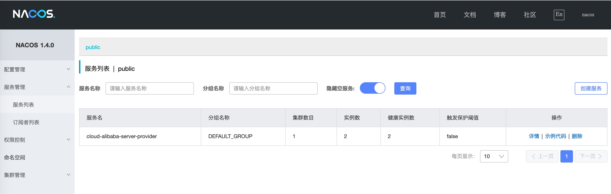
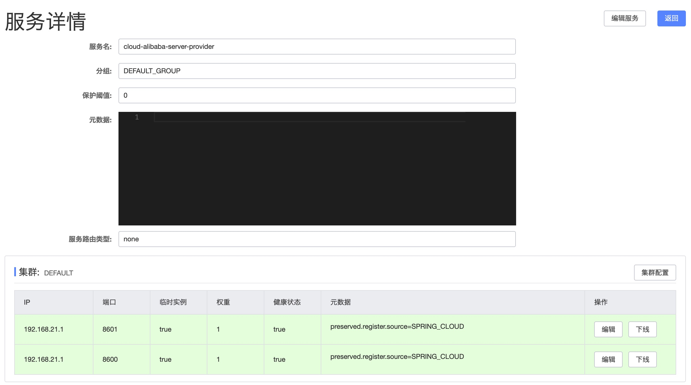

## Spring Cloud Alibaba 2.2 服务提供者(Service Providor)  


​    
​    

### 1 摘要  

在 Netflix 停止对 Spring Cloud Eureka 组件提供官方支持之后，国内的开发者逐步转向了阿里开源的微服务组件 Nacos ，阿里将其命名为 Spring Cloud Alibaba。Spring Cloud Alibaba 提供了一套完整的微服务治理体系，包括服务的发现与注册、分布式配置、网关、服务限流等等。本文将介绍基于 Spring Cloud Alibaba 2.2 如何搭建服务提供者。  

在搭建之前，有一些准备工作需要提前完成:  

安装 Nacos: [Alibaba Nacos 安装教程](./53.alibaba_nacos_install.md)  

Spring Cloud Alibaba Github 地址: [https://github.com/alibaba/spring-cloud-alibaba](https://github.com/alibaba/spring-cloud-alibaba "https://github.com/alibaba/spring-cloud-alibaba")  

​    

### 2 核心 Maven 依赖  

```
./cloud-alibaba-server-provider/pom.xml
```

```xml
    <dependencies>
        <!-- cloud alibaba -->
        <dependency>
            <groupId>com.alibaba.cloud</groupId>
            <artifactId>spring-cloud-starter-alibaba-nacos-discovery</artifactId>
            <version>${spring-cloud-alibaba.version}</version>
        </dependency>
        
        <!-- 省略其他依赖 -->

    </dependencies>

    <dependencyManagement>
        <dependencies>
            <dependency>
                <groupId>com.alibaba.cloud</groupId>
                <artifactId>spring-cloud-alibaba-dependencies</artifactId>
                <version>${spring-cloud-alibaba.version}</version>
                <type>pom</type>
                <scope>import</scope>
            </dependency>
        </dependencies>
    </dependencyManagement>
```

其中 `${spring-cloud-alibaba.version}` 的版本为 `2.2.3.RELEASE`  

**注意事项**: Spring Cloud Alibaba 2.2.3.RELEASE 版本支持的 Spring Boot 版本为 `2.3.1.RELEASE` ，建议在搭建项目时要保持版本的一致性，Spring Boot 版本过高或过低都可能导致不兼容问题   

​    

### 3 application 配置文件  

```
./cloud-alibaba-server-provider/src/main/resources/application.yml
```

```yaml
## config

## server
server:
  port: 8600

## spring
spring:
  application:
    name: cloud-alibaba-server-provider
  cloud:
    nacos:
      discovery:
        server-addr: 172.16.140.10:8688

## endpoint
management:
  endpoints:
    web:
      exposure:
        include: "*"
```

简要配置说明:  

`spring.application.name`: 应用名称，同时也是服务的名称  

`spring.cloud.nacos.discovery.server-addr`: Nacos 服务的地址，包括 ip 和 端口，这里需要保证 Nacos 服务器的端口可访问  

​    

### 4 SpringBoot 启动类  

```
./cloud-alibaba-server-provider/src/main/java/com/ljq/demo/pringboot/alibaba/server/provider/CloudAlibabaServerProviderApplication.java
```

```java
package com.ljq.demo.pringboot.alibaba.server.provider;

import org.springframework.boot.SpringApplication;
import org.springframework.boot.autoconfigure.SpringBootApplication;
import org.springframework.cloud.client.discovery.EnableDiscoveryClient;

/**
 * @author junqiang.lu
 */
@EnableDiscoveryClient
@SpringBootApplication
public class CloudAlibabaServerProviderApplication {

    public static void main(String[] args) {
        SpringApplication.run(CloudAlibabaServerProviderApplication.class, args);
    }

}
```

为模拟集群环境，创建了两个 SpringBoot 启动类,修改端口以避免冲突  

```
./cloud-alibaba-server-provider/src/main/java/com/ljq/demo/pringboot/alibaba/server/provider/CloudAlibabaServerProviderApplication2.java
```

```java
package com.ljq.demo.pringboot.alibaba.server.provider;

import org.springframework.boot.SpringApplication;
import org.springframework.boot.autoconfigure.SpringBootApplication;
import org.springframework.cloud.client.discovery.EnableDiscoveryClient;

/**
 * @author junqiang.lu
 */
@EnableDiscoveryClient
@SpringBootApplication
public class CloudAlibabaServerProviderApplication2 {

    public static void main(String[] args) {
        System.setProperty("server.port", "8601");
        SpringApplication.run(CloudAlibabaServerProviderApplication2.class, args);
    }

}
```

包含多个 SpringBoot 启动类的 Maven 配置，需要指定打包的主类  

```xml
    <build>
        <finalName>cloud-alibaba-server-provider</finalName>
        <plugins>
            <plugin>
                <groupId>org.springframework.boot</groupId>
                <artifactId>spring-boot-maven-plugin</artifactId>
                <configuration>
                    <mainClass>com.ljq.demo.pringboot.alibaba.server.provider.CloudAlibabaServerProviderApplication</mainClass>
                </configuration>
            </plugin>
        </plugins>
    </build>

```


### 5 请求测试类(Controller等)  

请求参数接收 Bean  

```
./cloud-alibaba-server-provider/src/main/java/com/ljq/demo/pringboot/alibaba/server/provider/model/param/HelloParam.java
```

```java
package com.ljq.demo.pringboot.alibaba.server.provider.model.param;

import lombok.Data;

import java.io.Serializable;

/**
 * @Description: 用户实体类
 * @Author: junqiang.lu
 * @Date: 2020/12/2
 */
@Data
public class HelloParam implements Serializable {

    /**
     * 用户名
     */
    private String name;
}
```

Controller 层  

```
./cloud-alibaba-server-provider/src/main/java/com/ljq/demo/pringboot/alibaba/server/provider/controller/NacosProviderController.java
```

```java
package com.ljq.demo.pringboot.alibaba.server.provider.controller;

import com.ljq.demo.pringboot.alibaba.server.provider.model.param.HelloParam;
import lombok.extern.slf4j.Slf4j;
import org.springframework.beans.factory.annotation.Value;
import org.springframework.http.MediaType;
import org.springframework.http.ResponseEntity;
import org.springframework.web.bind.annotation.*;

/**
 * @Description: nacos 服务提供者控制层
 * @Author: junqiang.lu
 * @Date: 2020/12/1
 */
@Slf4j
@RestController
@RequestMapping("/api/nacos")
public class NacosProviderController {

    @Value("${server.port}")
    private Integer port;

    /**
     * hello 方法
     *
     * @param helloParam
     * @return
     */
    @GetMapping(value = "/hello", produces = {MediaType.APPLICATION_JSON_VALUE})
    public ResponseEntity<String> sayHello(HelloParam helloParam) {
        String result = "Hello," + helloParam.getName();
        log.info("serverPort: {}", port);
        log.info("result: {}", result);
        return ResponseEntity.ok(result);
    }

    /**
     * 回复方法
     *
     * @param helloParam
     * @return
     */
    @PostMapping(value = "/replay", produces = {MediaType.APPLICATION_JSON_VALUE})
    public ResponseEntity<String> replay(@RequestBody HelloParam helloParam) {
        String result = "Hi," + helloParam.getName() + ",I'm fine,Thank you.";
        log.info("result: {}", result);
        return ResponseEntity.ok(result);
    }

}
```

​    

### 6 Nacos 控制台  

启动项目，打开 Nacos 的控制台，查看服务信息  





​    

### 7 请求测试  

请求接口与参数  

```http
http://127.0.0.1:8600/api/nacos/hello?name=%E5%BE%B7%E7%8E%9B%E8%A5%BF%E4%BA%9A
```

请求方式: GET  

返回参数:  

```
Hello,德玛西亚
```

后台日志:  

```verilog
2020-12-15 09:42:43.619  INFO 64361 --- [nio-8600-exec-1] c.l.d.p.a.s.p.c.NacosProviderController  : serverPort: 8600
2020-12-15 09:42:43.619  INFO 64361 --- [nio-8600-exec-1] c.l.d.p.a.s.p.c.NacosProviderController  : result: Hello,德玛西亚
```

至此，一个 Spring Cloud Alibaba 服务提供者以及搭建成功  

​    

### 8 推荐参考资料  

[官方文档: Spring Cloud Alibaba Nacos Discovery](https://github.com/alibaba/spring-cloud-alibaba/wiki/Nacos-discovery "https://github.com/alibaba/spring-cloud-alibaba/wiki/Nacos-discovery")  

[Spring Cloud Alibaba系列教程 - Spring Cloud Alibaba 创建服务提供者](https://www.jianshu.com/p/7b4ae6cd60f2 "https://www.jianshu.com/p/7b4ae6cd60f2")  

​    

### 9 本次提交记录  

```bash
commit f4271a5c834e0975b14ba3bc06dc59747f927400 (HEAD -> dev, origin/master, origin/dev, origin/HEAD, master)
Author: ljq <flying9001@gmail.com>
Date:   Sun Dec 13 12:01:36 2020 +0800

    代码-新增基于 Spring boot 2.3 搭建 Spring Cloud Alibaba 2.2 微服务框架
```

版本回退命令  

```
git reset --soft f4271a5c834e0975b14ba3bc06dc59747f927400
```


