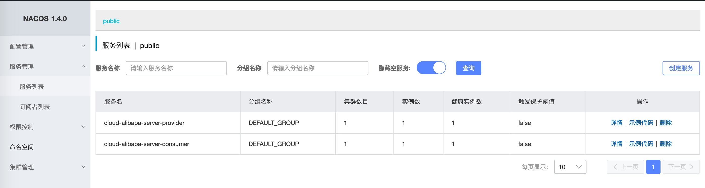

## Spring Cloud Alibaba 2.2 服务消费者(Ribbon)  


​    
​    

### 1 摘要  

本文将介绍基于 Spring Cloud Alibaba 2.2 使用 RestTemplete(Ribbon)搭建服务消费者。  

​    

### 2 核心 Maven 依赖  

```
./cloud-alibaba-server-consumer/pom.xml
```

```xml
    <dependencies>
        <!-- cloud alibaba -->
        <dependency>
            <groupId>com.alibaba.cloud</groupId>
            <artifactId>spring-cloud-starter-alibaba-nacos-discovery</artifactId>
            <version>${spring-cloud-alibaba.version}</version>
        </dependency>
        
        <!-- 省略其他依赖 -->

    </dependencies>

    <dependencyManagement>
        <dependencies>
            <dependency>
                <groupId>com.alibaba.cloud</groupId>
                <artifactId>spring-cloud-alibaba-dependencies</artifactId>
                <version>${spring-cloud-alibaba.version}</version>
                <type>pom</type>
                <scope>import</scope>
            </dependency>
        </dependencies>
    </dependencyManagement>
```

其中 `${spring-cloud-alibaba.version}` 的版本为 `2.2.3.RELEASE`  

**注意事项**: Spring Cloud Alibaba 2.2.3.RELEASE 版本支持的 Spring Boot 版本为 `2.3.1.RELEASE` ，建议在搭建项目时要保持版本的一致性，Spring Boot 版本过高或过低都可能导致不兼容问题   

​    

### 3 核心代码

#### 3.1 application 配置文件  

```
./cloud-alibaba-server-consumer/src/main/resources/application.yml
```

```yaml
## config

## server
server:
  port: 8602

## spring
spring:
  application:
    name: cloud-alibaba-server-consumer
  cloud:
    nacos:
      discovery:
        server-addr: 172.16.140.10:8688

## endpoint
management:
  endpoints:
    web:
      exposure:
        include: "*"
```

简要配置说明:  

`spring.application.name`: 应用名称，同时也是服务的名称  

`spring.cloud.nacos.discovery.server-addr`: Nacos 服务的地址，包括 ip 和 端口，这里需要保证 Nacos 服务器的端口可访问  

#### 3.2 Service 层-服务调用  

Service 接口  

```
./cloud-alibaba-server-consumer/src/main/java/com/ljq/demo/springboot/alibaba/server/consumer/service/NacosConsumerService.java
```

```java
package com.ljq.demo.springboot.alibaba.server.consumer.service;

import com.ljq.demo.springboot.alibaba.server.consumer.model.param.HelloParam;

/**
 * @Description: Nacos 服务消费者业务层
 * @Author: junqiang.lu
 * @Date: 2020/12/2
 */
public interface NacosConsumerService {

    /**
     * hello
     *
     * @param helloParam
     * @return
     */
    String hello(HelloParam helloParam);

    /**
     * 回复
     *
     * @param helloParam
     * @return
     */
    String replay(HelloParam helloParam);
}
```

Service 实现类  

```
./cloud-alibaba-server-consumer/src/main/java/com/ljq/demo/springboot/alibaba/server/consumer/service/impl/NacosConsumerServiceImpl.java
```

```java
package com.ljq.demo.springboot.alibaba.server.consumer.service.impl;

import com.ljq.demo.springboot.alibaba.server.consumer.common.constant.NacosConst;
import com.ljq.demo.springboot.alibaba.server.consumer.model.param.HelloParam;
import com.ljq.demo.springboot.alibaba.server.consumer.service.NacosConsumerService;
import lombok.extern.slf4j.Slf4j;
import org.springframework.http.ResponseEntity;
import org.springframework.stereotype.Service;
import org.springframework.util.CollectionUtils;
import org.springframework.web.client.RestTemplate;

import javax.annotation.Resource;
import java.util.HashMap;
import java.util.Map;

/**
 * @Description: Nacos 服务消费者业务实现类
 * @Author: junqiang.lu
 * @Date: 2020/12/2
 */
@Slf4j
@Service("nacosConsumerService")
public class NacosConsumerServiceImpl implements NacosConsumerService {

    private static final String HELLO_URL = "/api/nacos/hello";
    private static final String REPLAY_URL = "/api/nacos/replay";

    @Resource
    private RestTemplate template;

    /**
     * hello
     *
     * @param helloParam
     * @return
     */
    @Override
    public String hello(HelloParam helloParam) {
        Map<String, Object> param = new HashMap<>(16);
        param.put("name", helloParam.getName());
        String url = convertGetUrl(NacosConst.NACOS_SERVER_PROVIDER_NAME, HELLO_URL, param);
        ResponseEntity<String> response = template.getForEntity(url, String.class);
        log.info("response: {}", response.getBody());
        return response.getBody();
    }

    /**
     * 回复
     *
     * @param helloParam
     * @return
     */
    @Override
    public String replay(HelloParam helloParam) {
        String url = convertGetUrl(NacosConst.NACOS_SERVER_PROVIDER_NAME, REPLAY_URL, null);
        ResponseEntity<String> response = template.postForEntity(url, helloParam, String.class);
        log.info("response: {}", response.getBody());
        return response.getBody();
    }

    /**
     * 组装 Get 请求 URL
     * @param serverName 服务名称
     * @param apiAddress 接口地址
     * @param param 请求参数
     * @return
     */
    private String convertGetUrl(String serverName, String apiAddress, Map<String, Object> param) {
        StringBuilder urlBuilder = new StringBuilder("http://");
        urlBuilder.append(serverName).append(apiAddress);
        if (!CollectionUtils.isEmpty(param)) {
            urlBuilder.append("?");
            param.forEach((k, v) -> {
                urlBuilder.append(k).append("=").append(v).append("&");
            });
            urlBuilder.deleteCharAt(urlBuilder.lastIndexOf("&"));
        }
        return urlBuilder.toString();
    }


}
```

使用 Spring 提供的 RestTemplate 请求微服务，这里的 RestTemplate 是经过负载均衡的，实际发送的请求会解析为服务，而非将服务名作为域名进行请求，**负载均衡配置在SpringBoot 启动类中**   

#### 3.3 Controller 控制层  

```
./cloud-alibaba-server-consumer/src/main/java/com/ljq/demo/springboot/alibaba/server/consumer/controller/NacosConsumerController.java
```

```java
package com.ljq.demo.springboot.alibaba.server.consumer.controller;

import com.ljq.demo.springboot.alibaba.server.consumer.model.param.HelloParam;
import com.ljq.demo.springboot.alibaba.server.consumer.service.NacosConsumerService;
import lombok.extern.slf4j.Slf4j;
import org.springframework.beans.factory.annotation.Autowired;
import org.springframework.http.MediaType;
import org.springframework.http.ResponseEntity;
import org.springframework.web.bind.annotation.*;

/**
 * @Description: Nacos 服务消费者控制层
 * @Author: junqiang.lu
 * @Date: 2020/12/1
 */
@Slf4j
@RestController
@RequestMapping("/api/nacos/consumer")
public class NacosConsumerController {

    @Autowired
    private NacosConsumerService consumerService;
  
    @GetMapping(value = "/hello", produces = {MediaType.APPLICATION_JSON_VALUE})
    public ResponseEntity<String> sayHello(HelloParam helloParam) {
        String result = consumerService.hello(helloParam);
        return ResponseEntity.ok(result);
    }

    @PostMapping(value = "/replay", produces = {MediaType.APPLICATION_JSON_VALUE})
    public ResponseEntity<String> replay(@RequestBody HelloParam helloParam) {
        String result = consumerService.replay(helloParam);
        return ResponseEntity.ok(result);
    }
}
```

#### 3.5 SpringBoot 启动类  

```
./cloud-alibaba-server-consumer/src/main/java/com/ljq/demo/springboot/alibaba/server/consumer/CloudAlibabaServerConsumerApplication.java
```

```java
package com.ljq.demo.springboot.alibaba.server.consumer;

import org.springframework.boot.SpringApplication;
import org.springframework.boot.autoconfigure.SpringBootApplication;
import org.springframework.cloud.client.discovery.EnableDiscoveryClient;
import org.springframework.cloud.client.loadbalancer.LoadBalanced;
import org.springframework.context.annotation.Bean;
import org.springframework.web.client.RestTemplate;

/**
 * @author junqiang.lu
 */
@EnableDiscoveryClient
@SpringBootApplication
public class CloudAlibabaServerConsumerApplication {

    public static void main(String[] args) {
        SpringApplication.run(CloudAlibabaServerConsumerApplication.class, args);
    }

    @Bean
    @LoadBalanced
    public RestTemplate restTemplate() {
        return new RestTemplate();
    }

}
```

简要代码说明:  

`@EnableDiscoveryClient`: spring cloud 服务发现注解，使用该注解可以在服务注册中心发现、管理该服务  

`@Bean`: 将对象注册为 Spring 的一个 Bean，通过 Spring 来管理其生命周期  

`@LoadBalanced` ： Ribbon 的负载均衡注解,简单来说其作用就是对请求的URI进行转换获取到具体应该请求哪个服务实例ServiceInstance  

关于 `Ribbon` 的 `@LoadBalanced` 注解,其作用是实现客户端负载均衡，具体说明可参考:  

[由springcloud ribbon的 @LoadBalanced注解的使用理解](https://blog.csdn.net/xiao_jun_0820/article/details/78917215 "https://blog.csdn.net/xiao_jun_0820/article/details/78917215")    

#### 3.6 其他相关代码  

定义服务名称的常量类  

```
./cloud-alibaba-server-consumer/src/main/java/com/ljq/demo/springboot/alibaba/server/consumer/common/constant/NacosConst.java
```

```java
package com.ljq.demo.springboot.alibaba.server.consumer.common.constant;

/**
 * @Description: Nacos 相关常量
 * @Author: junqiang.lu
 * @Date: 2020/12/2
 */
public class NacosConst {

    private NacosConst() {
    }

    public static final String NACOS_SERVER_PROVIDER_NAME = "cloud-alibaba-server-provider";
}
```

请求参数接收类  

```
./cloud-alibaba-server-consumer/src/main/java/com/ljq/demo/springboot/alibaba/server/consumer/model/param/HelloParam.java
```

```java
package com.ljq.demo.springboot.alibaba.server.consumer.model.param;

import lombok.Data;

import java.io.Serializable;

/**
 * @Description: 用户实体类
 * @Author: junqiang.lu
 * @Date: 2020/12/2
 */
@Data
public class HelloParam implements Serializable {

    /**
     * 用户名
     */
    private String name;
}
```

​    

### 4 请求测试  

依次启动服务提供者项目 `cloud-alibaba-server-provider`，服务消费者项目 `cloud-alibaba-server-consumer`  

打开 Nacos 控制台，可以看到两个服务  



请求服务消费者的接口  

#### 4.1 GET 方式请求接口  

接口地址与请求参数:  

```http
http://127.0.0.1:8602/api/nacos/consumer/hello?name=%E5%BE%B7%E7%8E%9B%E8%A5%BF%E4%BA%9A
```

请求方式: GET  

返回结果:  

```
Hello,德玛西亚
```

服务消费者日志:  

```verilog
2020-12-15 11:07:01.147  INFO 67805 --- [nio-8602-exec-1] l.d.s.a.s.c.s.i.NacosConsumerServiceImpl : response: Hello,德玛西亚
```

服务提供者日志:  

```verilog
2020-12-15 11:07:01.105  INFO 67789 --- [nio-8600-exec-1] c.l.d.p.a.s.p.c.NacosProviderController  : serverPort: 8600
2020-12-15 11:07:01.105  INFO 67789 --- [nio-8600-exec-1] c.l.d.p.a.s.p.c.NacosProviderController  : result: Hello,德玛西亚
```

#### 4.2 POST 方式请求接口  

接口地址:  

```http
http://127.0.0.1:8602/api/nacos/consumer/replay
```

请求参数:  

```json
{
    "name": "卢本伟"
}
```

请求方式: POST  

返回结果:  

```
Hi,卢本伟,I'm fine,Thank you.
```

服务消费者日志:  

```verilog
2020-12-15 11:10:18.759  INFO 67805 --- [nio-8602-exec-3] l.d.s.a.s.c.s.i.NacosConsumerServiceImpl : response: Hi,卢本伟,I'm fine,Thank you.
```

服务提供者日志:  

```verilog
2020-12-15 11:10:18.757  INFO 67789 --- [nio-8600-exec-3] c.l.d.p.a.s.p.c.NacosProviderController  : result: Hi,卢本伟,I'm fine,Thank you.
```

至此，一个基于 Spring Cloud Alibaba 2.2 的服务消费者框架已经搭建完成  

​    

### 5 推荐参考资料  

[官方文档: Spring Cloud Alibaba Nacos Discovery](https://github.com/alibaba/spring-cloud-alibaba/wiki/Nacos-discovery "https://github.com/alibaba/spring-cloud-alibaba/wiki/Nacos-discovery")  

[Spring Cloud Alibaba系列教程 - Spring Cloud Alibaba 创建服务消费者](https://www.jianshu.com/p/9cdcad44e53e "https://www.jianshu.com/p/9cdcad44e53e")  

​    

### 6 本次提交记录  

```bash
commit f4271a5c834e0975b14ba3bc06dc59747f927400 (HEAD -> dev, origin/master, origin/dev, origin/HEAD, master)
Author: ljq <flying9001@gmail.com>
Date:   Sun Dec 13 12:01:36 2020 +0800

    代码-新增基于 Spring boot 2.3 搭建 Spring Cloud Alibaba 2.2 微服务框架
```

版本回退命令  

```
git reset --soft f4271a5c834e0975b14ba3bc06dc59747f927400
```


