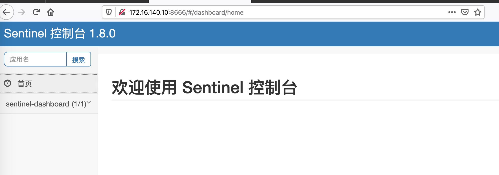
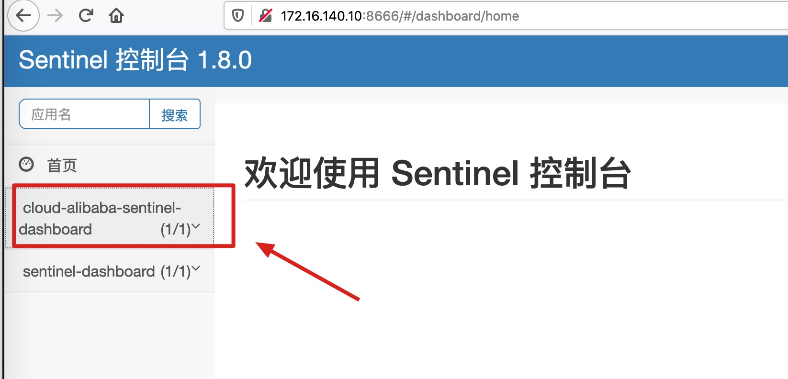
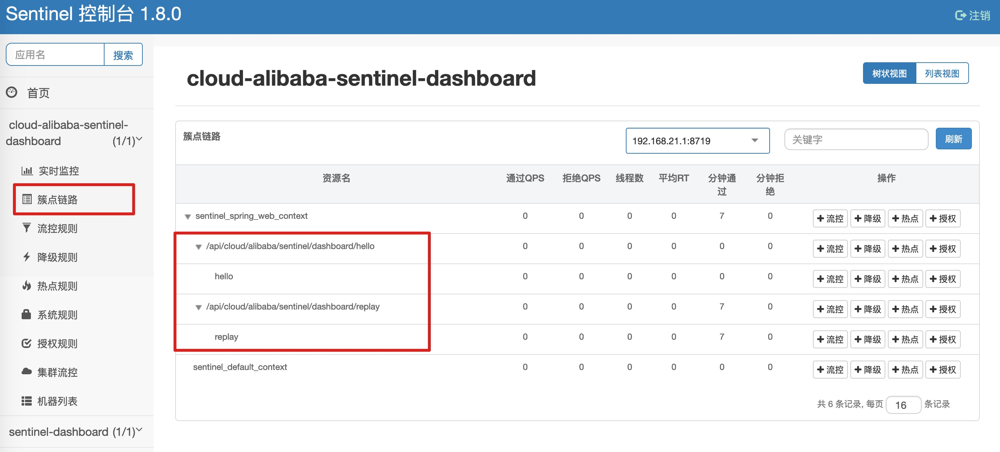
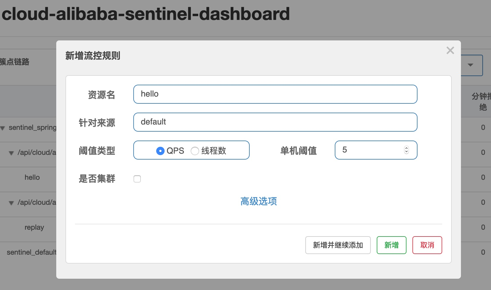
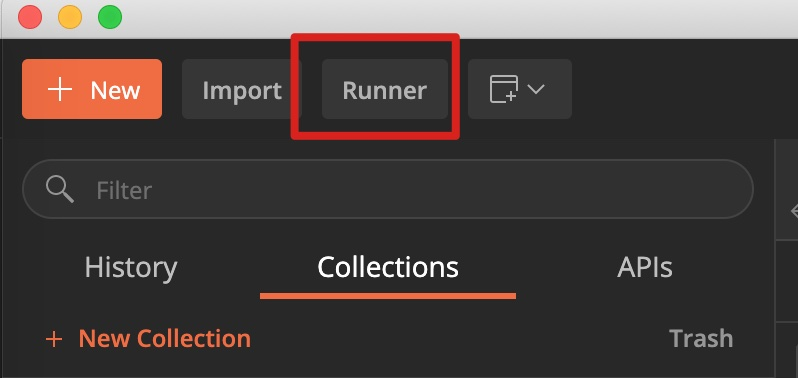
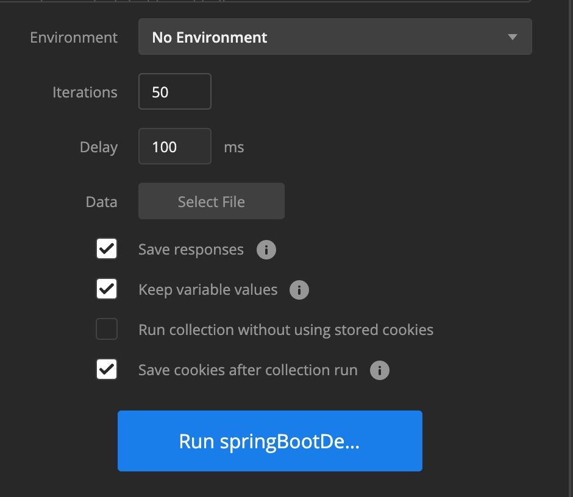
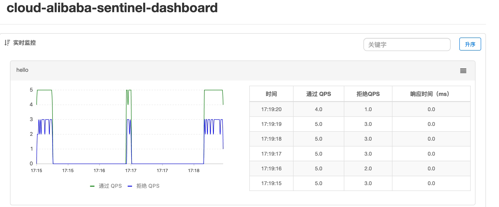
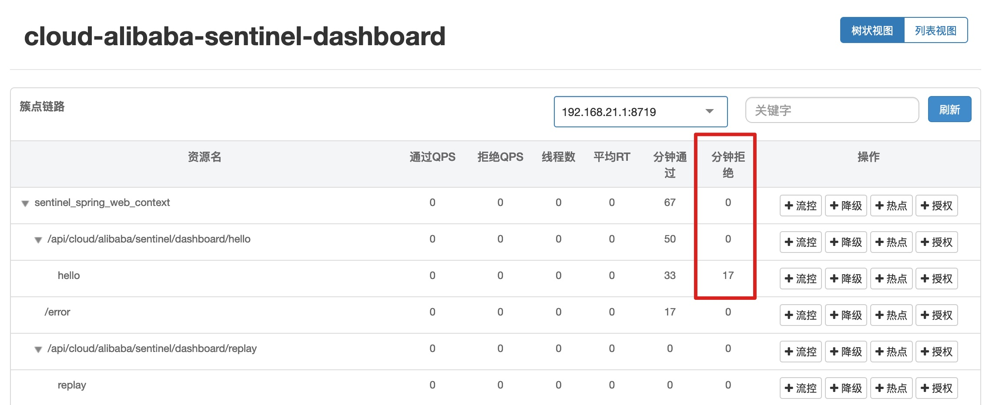
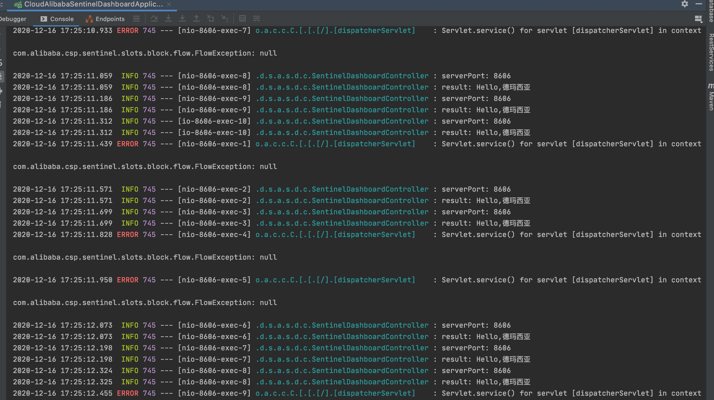

## Spring Cloud Alibaba Sentinel 流量限制控制台  


​    
​    
### 1 摘要  

Sentinel 是阿里开源的微服务流量监控框架。本文将介绍基于 Spring Cloud Alibaba 2.2 集成 Sentinel。  

Sentinel Github: [https://github.com/alibaba/Sentinel](https://github.com/alibaba/Sentinel "https://github.com/alibaba/Sentinel")  

准备工作:  

[安装 Alibaba Sentinel](./57.alibaba_sentinel_install.md "./57.alibaba_sentinel_install.md")  

​    

### 2 核心 Maven 依赖  

```
./cloud-alibaba-sentinel-dashboard/pom.xml
```

```xml
    <dependencies>
        <!-- cloud alibaba -->
        <dependency>
            <groupId>com.alibaba.cloud</groupId>
            <artifactId>spring-cloud-starter-alibaba-nacos-discovery</artifactId>
            <version>${spring-cloud-alibaba.version}</version>
        </dependency>
        <dependency>
            <groupId>com.alibaba.cloud</groupId>
            <artifactId>spring-cloud-starter-alibaba-sentinel</artifactId>
            <version>${spring-cloud-alibaba.version}</version>
        </dependency>
        
        <!-- 省略其他依赖 -->

    </dependencies>

    <dependencyManagement>
        <dependencies>
            <dependency>
                <groupId>com.alibaba.cloud</groupId>
                <artifactId>spring-cloud-alibaba-dependencies</artifactId>
                <version>${spring-cloud-alibaba.version}</version>
                <type>pom</type>
                <scope>import</scope>
            </dependency>
        </dependencies>
    </dependencyManagement>
```

其中 `${spring-cloud-alibaba.version}` 的版本为 `2.2.3.RELEASE`  

**注意事项**: Spring Cloud Alibaba 2.2.3.RELEASE 版本支持的 Spring Boot 版本为 `2.3.1.RELEASE` ，建议在搭建项目时要保持版本的一致性，Spring Boot 版本过高或过低都可能导致不兼容问题   

​    

### 3 核心代码  

#### 3.1 application 配置文件  

```
./cloud-alibaba-sentinel-dashboard/src/main/resources/application.yml
```

```yaml
## config

## server
server:
  port: 8606

## spring
spring:
  application:
    name: cloud-alibaba-sentinel-dashboard
  cloud:
    nacos:
      discovery:
        server-addr: 172.16.140.10:8688
    sentinel:
      transport:
        dashboard: 172.16.140.10:8666
        port: 8719

## endpoint
management:
  endpoints:
    web:
      exposure:
        include: "*"
```

配置简要说明:  

`spring.application.name`: 应用名称， Nacos 服务名称  

`spring.cloud.nacos.discovery.server-addr`: Nacos 服务注册中心地址  

`spring.cloud.sentinel.transport.dashboard`: Sentinel 控制台地址，包括 ip 和端口  

`spring.cloud.sentinel.transport.port`: 客户端与 Sentinel 控制台的通讯端口，是项目所在服务器的端口，不是 Sentinel 控制台所在服务器的端口  

#### 3.2 Controller 控制层  

```
./cloud-alibaba-sentinel-dashboard/src/main/java/com/ljq/demo/springboot/alibaba/sentinel/dashboard/controller/SentinelDashboardController.java
```

```java
package com.ljq.demo.springboot.alibaba.sentinel.dashboard.controller;

import com.alibaba.csp.sentinel.annotation.SentinelResource;
import com.ljq.demo.springboot.alibaba.sentinel.dashboard.model.param.HelloParam;
import lombok.extern.slf4j.Slf4j;
import org.springframework.beans.factory.annotation.Value;
import org.springframework.http.MediaType;
import org.springframework.http.ResponseEntity;
import org.springframework.web.bind.annotation.*;

/**
 * @Description: nacos 服务提供者控制层
 * @Author: junqiang.lu
 * @Date: 2020/12/1
 */
@Slf4j
@RestController
@RequestMapping("/api/cloud/alibaba/sentinel/dashboard")
public class SentinelDashboardController {

    @Value("${server.port}")
    private Integer port;

    /**
     * hello 方法
     *
     * @param helloParam
     * @return
     */
    @SentinelResource(value = "hello")
    @GetMapping(value = "/hello", produces = {MediaType.APPLICATION_JSON_VALUE})
    public ResponseEntity<String> sayHello(HelloParam helloParam) {
        String result = "Hello," + helloParam.getName();
        log.info("serverPort: {}", port);
        log.info("result: {}", result);
        return ResponseEntity.ok(result);
    }

    /**
     * 回复方法
     *
     * @param helloParam
     * @return
     */
    @SentinelResource(value = "replay")
    @PostMapping(value = "/replay", produces = {MediaType.APPLICATION_JSON_VALUE})
    public ResponseEntity<String> replay(@RequestBody HelloParam helloParam) {
        String result = "Hi," + helloParam.getName() + ",I'm fine,Thank you.";
        log.info("result: {}", result);
        return ResponseEntity.ok(result);
    }


}
```

#### 3.3 SpringBoot 启动类  

```
./cloud-alibaba-sentinel-dashboard/src/main/java/com/ljq/demo/springboot/alibaba/sentinel/dashboard/CloudAlibabaSentinelDashboardApplication.java
```

```java
package com.ljq.demo.springboot.alibaba.sentinel.dashboard;

import org.springframework.boot.SpringApplication;
import org.springframework.boot.autoconfigure.SpringBootApplication;
import org.springframework.cloud.client.discovery.EnableDiscoveryClient;

/**
 * @author junqiang.lu
 */
@EnableDiscoveryClient
@SpringBootApplication
public class CloudAlibabaSentinelDashboardApplication {

    public static void main(String[] args) {
        SpringApplication.run(CloudAlibabaSentinelDashboardApplication.class, args);
    }

}
```

#### 3.4 其他相关代码  

请求参数类  

```
./cloud-alibaba-sentinel-dashboard/src/main/java/com/ljq/demo/springboot/alibaba/sentinel/dashboard/model/param/HelloParam.java
```

```java
package com.ljq.demo.springboot.alibaba.sentinel.dashboard.model.param;

import lombok.Data;

import java.io.Serializable;

/**
 * @Description: 用户实体类
 * @Author: junqiang.lu
 * @Date: 2020/12/2
 */
@Data
public class HelloParam implements Serializable {

    private static final long serialVersionUID = 7668092420785539494L;

    /**
     * 用户名
     */
    private String name;
}
```

​    

### 4 Sentinel 限流与监控  

#### 4.1 打开 Sentinel 控制台

启动当前项目，在浏览器打开 Sentinel 控制台  



此时控制台只有一个 Sentinel 控制台本身的应用，并没有当前创建的 `cloud-alibaba-sentinel-dashboard`，这是因为 Sentinel 的设计模式为**客户端必须有流量访问，才会向 Sentinel 控制台进行服务注册**  

[官方文档: Sentinel 触发客户端初始化](https://github.com/alibaba/Sentinel/wiki/%E6%8E%A7%E5%88%B6%E5%8F%B0#33-%E8%A7%A6%E5%8F%91%E5%AE%A2%E6%88%B7%E7%AB%AF%E5%88%9D%E5%A7%8B%E5%8C%96)

#### 4.2 测试接口请求  

接口一  

接口地址与请求参数:  

```
http://127.0.0.1:8606/api/cloud/alibaba/sentinel/dashboard/hello?name=%E5%BE%B7%E7%8E%9B%E8%A5%BF%E4%BA%9A
```

请求方式: GET  

返回参数:  

```
Hello,德玛西亚
```

后台日志:  

```verilog
2020-12-16 16:52:54.114  INFO 745 --- [nio-8606-exec-1] .d.s.a.s.d.c.SentinelDashboardController : serverPort: 8606
2020-12-16 16:52:54.114  INFO 745 --- [nio-8606-exec-1] .d.s.a.s.d.c.SentinelDashboardController : result: Hello,德玛西亚
```

接口二  

接口地址:  

```
http://127.0.0.1:8606/api/cloud/alibaba/sentinel/dashboard/replay
```

请求参数:  

```json
{
    "name": "卢本伟"
}
```

返回参数:  

```
Hi,卢本伟,I'm fine,Thank you.
```

后台日志:  

```verilog
2020-12-16 16:54:12.811  INFO 745 --- [nio-8606-exec-3] .d.s.a.s.d.c.SentinelDashboardController : result: Hi,卢本伟,I'm fine,Thank you.
```

#### 4.3 接口限流  

在经过 4.2 接口请求操作之后，刷新 Sentinel 控制台页面，`cloud-alibaba-sentinel-dashboard` 就会出现在应用列表中  



在 Sentinel 控制台点击 `cloud-alibaba-sentinel-dashboard`,展开之后，点击「簇点链路」，可以看到被 Sentinel 标记出来的接口。**只有被请求过的接口才会被标记出来，从来没有请求过的接口不会被标记出来**。



在「簇点链路」界面，选择某一个接口，点击「流控」按钮，即可实现限制流量的功能。  

这里以 `/api/cloud/alibaba/sentinel/dashboard/hello` 接口为例  



限制该接口的 QPS 为5，即每秒只处理5个请求  

使用测试工具来对该接口进行流量测试  

这里以 Postman 的 Runner 功能为例  





这里 Runner 设置的参数意思为: 总共请求 50 次，每次请求间隔 100 毫秒。  

这样每秒会有 10 次接口请求，即 QPS = 10，超过了 Sentinel 设置的流量限制值  

运行 Runner  

Sentinel 控制台「实时监控」界面  



Sentinel 控制台「簇点链路」界面  



项目控制台部分日志截图  



至此，已经实现了使用 Sentinel 对服务进行流量限制和监控的功能  

​    

### 5 推荐参考资料  

[官方文档: Spring Cloud Alibaba Sentinel](https://github.com/alibaba/spring-cloud-alibaba/wiki/Sentinel "https://github.com/alibaba/spring-cloud-alibaba/wiki/Sentinel")  

[官方文档: Sentinel 控制台](https://github.com/alibaba/Sentinel/wiki/%E6%8E%A7%E5%88%B6%E5%8F%B0 "https://github.com/alibaba/Sentinel/wiki/%E6%8E%A7%E5%88%B6%E5%8F%B0")  

[Spring Cloud Alibaba系列教程 - Spring Cloud Alibaba 熔断器仪表盘监控](https://www.jianshu.com/p/117483b31c19 "https://www.jianshu.com/p/117483b31c19")  

​    

### 6 本次提交记录  

```bash
commit f4271a5c834e0975b14ba3bc06dc59747f927400 (HEAD -> dev, origin/master, origin/dev, origin/HEAD, master)
Author: ljq <flying9001@gmail.com>
Date:   Sun Dec 13 12:01:36 2020 +0800

    代码-新增基于 Spring boot 2.3 搭建 Spring Cloud Alibaba 2.2 微服务框架
```

版本回退命令  

```
git reset --soft f4271a5c834e0975b14ba3bc06dc59747f927400
```


