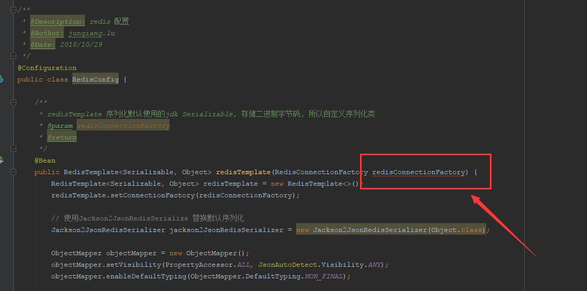
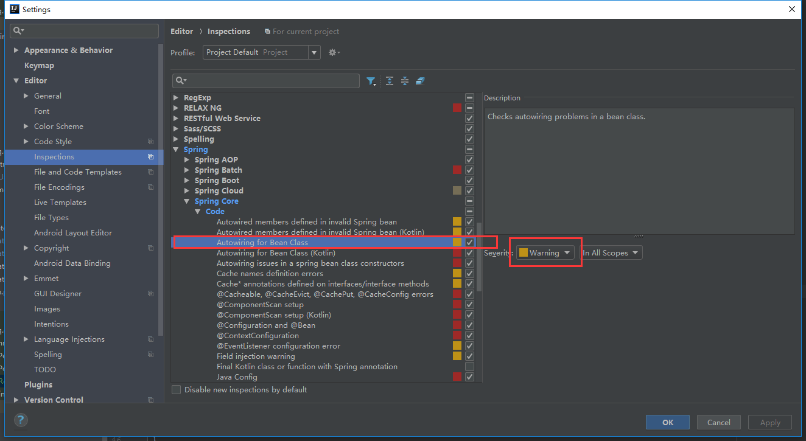
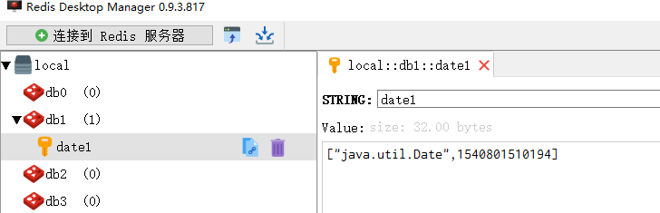
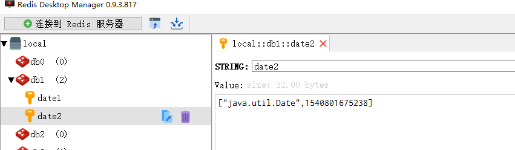
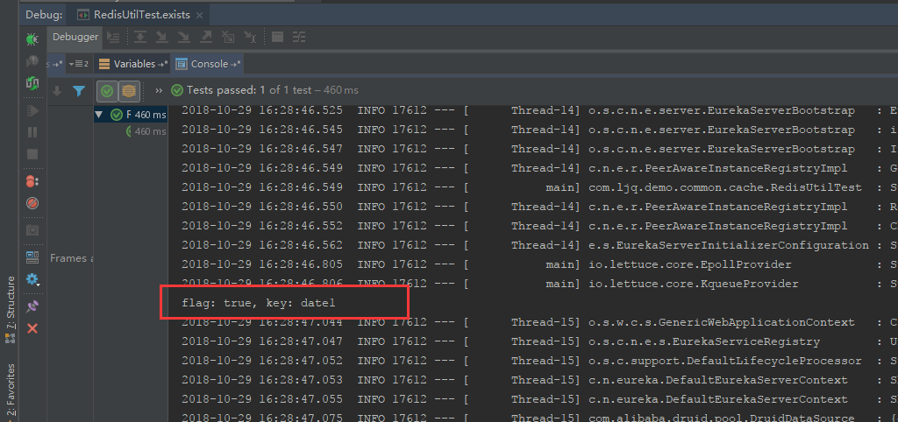
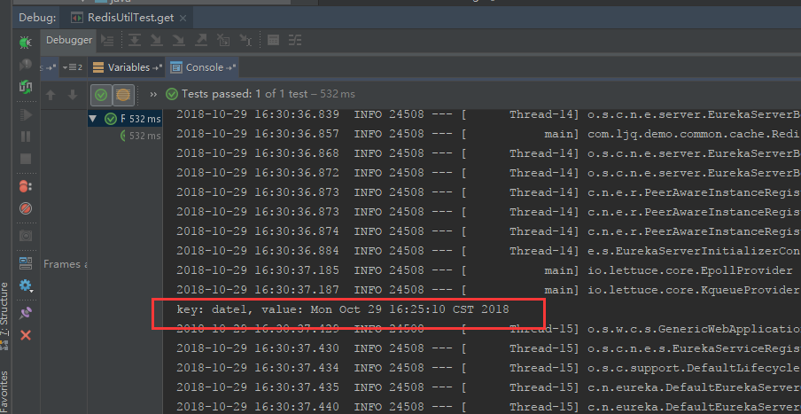
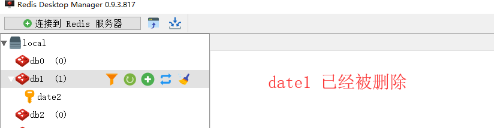
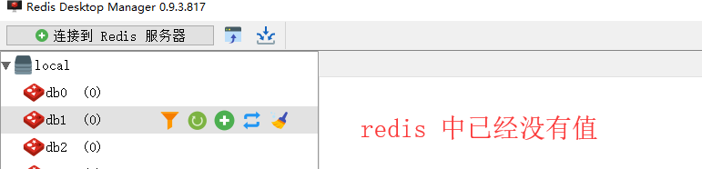

## spring boot 2.0 整合 redis  

​    
​    
​    
Spring boot 2.0 与 spring boot 1.0 区别较多,这里是基于 **Spring boot 2.0** 进行 redis 的整合教程  

### 1 添加 `Maven` 依赖    

[pom.xml](../pom.xml "../pom.xml")

```xml
        <!-- redis -->
        <dependency>
            <groupId>org.springframework.boot</groupId>
            <artifactId>spring-boot-starter-data-redis</artifactId>
        </dependency>
```

redis 序列化所需要的依赖:  

```xml
        <dependency>
            <groupId>com.fasterxml.jackson.core</groupId>
            <artifactId>jackson-databind</artifactId>
            <version>${jackson}</version>
        </dependency>
```

其中,`jackson` 的版本为: `2.9.6`  


### 2 配置 redis      

#### 2.1 在 spring boot 配置文件 application.yml 中配置 redis  

参考:  

 [../demo-web/src/main/resources/application-dev.yml](../demo-web/src/main/resources/application-dev.yml "../demo-web/src/main/resources/application-dev.yml")  

[../demo-web/src/main/resources/application-test.yml](../demo-web/src/main/resources/application-test.yml "../demo-web/src/main/resources/application-test.yml")  

[../demo-web/src/main/resources/application-pro.yml](../demo-web/src/main/resources/application-pro.yml "../demo-web/src/main/resources/application-pro.yml")  

../demo-web/src/main/resources/application-dev.yml:  

```yaml
spring:
  # redis
  redis:
    database: 1
    host: 127.0.0.1
    port: 7749
    password: demo@apq
    timeout: 10000ms
    jedis:
      pool:
        max-active: 200
        max-idle: 500
        min-idle: 50
        max-wait: 100s
```


#### 2.2 java redis 配置类:  

[com.ljq.demo.common.config.RedisConfig](../demo-common/src/main/java/com/ljq/demo/common/config/RedisConfig.java "../demo-common/src/main/java/com/ljq/demo/common/config/RedisConfig.java")

```java
package com.ljq.demo.common.config;

import com.fasterxml.jackson.annotation.JsonAutoDetect;
import com.fasterxml.jackson.annotation.PropertyAccessor;
import com.fasterxml.jackson.databind.ObjectMapper;
import org.springframework.context.annotation.Bean;
import org.springframework.context.annotation.Configuration;
import org.springframework.data.redis.connection.RedisConnectionFactory;
import org.springframework.data.redis.core.RedisTemplate;
import org.springframework.data.redis.serializer.Jackson2JsonRedisSerializer;
import org.springframework.data.redis.serializer.StringRedisSerializer;

import java.io.Serializable;

/**
 * @Description: redis 配置
 * @Author: junqiang.lu
 * @Date: 2018/10/29
 */
@Configuration
public class RedisConfig {

    /**
     * redisTemplate 序列化默认使用的jdk Serializable, 存储二进制字节码, 所以自定义序列化类
     * @param redisConnectionFactory
     * @return
     */
    @Bean
    public RedisTemplate<Serializable, Object> redisTemplate(RedisConnectionFactory redisConnectionFactory) {
        RedisTemplate<Serializable, Object> redisTemplate = new RedisTemplate<>();
        redisTemplate.setConnectionFactory(redisConnectionFactory);

        // 使用Jackson2JsonRedisSerialize 替换默认序列化
        Jackson2JsonRedisSerializer jackson2JsonRedisSerializer = new Jackson2JsonRedisSerializer(Object.class);

        ObjectMapper objectMapper = new ObjectMapper();
        objectMapper.setVisibility(PropertyAccessor.ALL, JsonAutoDetect.Visibility.ANY);
        objectMapper.enableDefaultTyping(ObjectMapper.DefaultTyping.NON_FINAL);

        jackson2JsonRedisSerializer.setObjectMapper(objectMapper);

        // 设置value的序列化规则和 key的序列化规则
        redisTemplate.setKeySerializer(new StringRedisSerializer());
        redisTemplate.setValueSerializer(jackson2JsonRedisSerializer);
        redisTemplate.afterPropertiesSet();
        return redisTemplate;
    }
}
```


redis 配置的测试类:  

[com.ljq.demo.common.config.RedisConfigTest](../demo-web/src/test/java/com/ljq/demo/common/config/RedisConfigTest.java "../demo-web/src/test/java/com/ljq/demo/common/config/RedisConfigTest.java")  

```java
package com.ljq.demo.common.config;

import org.junit.Test;
import org.junit.runner.RunWith;
import org.mybatis.spring.annotation.MapperScan;
import org.springframework.beans.factory.annotation.Autowired;
import org.springframework.boot.test.context.SpringBootTest;
import org.springframework.context.annotation.ComponentScan;
import org.springframework.data.redis.core.RedisTemplate;
import org.springframework.test.context.junit4.SpringRunner;

import java.io.Serializable;
import java.util.Date;

@RunWith(SpringRunner.class)
@SpringBootTest(classes = {com.ljq.demo.common.config.RedisConfig.class})
@ComponentScan(basePackages = {"com.ljq.demo.springboot"})
@MapperScan("com.ljq.demo.springboot.dao")
public class RedisConfigTest {

    /**
     * redisTemplate 泛型必须与 RedisConfig 类中定义的一致,否则会出现类型不匹配错误
     */
    @Autowired
    private RedisTemplate<Serializable, Object> redisTemplate;

    /**
     * 测试 spring boot 2.0 整合 redis
     */
    @Test
    public void redisTest() {
        String keyDemo = "date";
        redisTemplate.opsForValue().set(keyDemo,new Date());
        Date result = (Date) redisTemplate.opsForValue().get(keyDemo);
        System.out.println(String.format("key: %s, value: %s.", keyDemo, result));
    }

}
```


**注意**: 在使用 `@SpringBootTest` 的测试类中,如果所测试的类不在当前模块,则需要在,`@SpringBootTest` 后边添加所测试的类,如 `@SpringBootTest(classes = {com.ljq.demo.common.config.RedisConfig.class})`;如果测试的类包含自动装配的(使用 `@Autowired` 修饰)类,则必须使用 `@ComponentScan` 注解,指定测试类扫描组件的范围,如:  `@ComponentScan(basePackages = {"com.ljq.demo.springboot"})`; 其他和资源相关的配置文件也需要添加配置,如配置 `mybatis` 的 `mapper`则使用 `@MapperScan` 注解,如: `@MapperScan("com.ljq.demo.springboot.dao")`   


如果没有添加以上注解,则会抛出以下异常:    

```java
***************************
APPLICATION FAILED TO START
***************************

Description:

Parameter 0 of method redisTemplate in com.ljq.demo.common.config.RedisConfig required a bean of type 'org.springframework.data.redis.connection.RedisConnectionFactory' that could not be found.


Action:

Consider defining a bean of type 'org.springframework.data.redis.connection.RedisConnectionFactory' in your configuration.

2018-10-29 15:59:51.665 ERROR 27824 --- [           main] o.s.test.context.TestContextManager      : Caught exception while allowing TestExecutionListener [org.springframework.test.context.web.ServletTestExecutionListener@95e33cc] to prepare test instance [com.ljq.demo.common.config.RedisConfigTest@20134094]

java.lang.IllegalStateException: Failed to load ApplicationContext

```

关于在 intelliJ IDEA 中Spring 自动装配 `bean` 对象报红的问题,如图:   



解决办法:  

  

具体可参考:   

[IntelliJ Idea解决Could not autowire. No beans of 'xxxx' type found的错误提示](https://blog.csdn.net/u012453843/article/details/54906905 "https://blog.csdn.net/u012453843/article/details/54906905")  


### 3 封装 redis 的操作工具类  

使用 `RedisTemplate` 来操作 redis  

[com.ljq.demo.common.cache.RedisUtil](../demo-common/src/main/java/com/ljq/demo/common/cache/RedisUtil.java "../demo-common/src/main/java/com/ljq/demo/common/cache/RedisUtil.java")  

```java
package com.ljq.demo.common.cache;

import org.springframework.beans.factory.annotation.Autowired;
import org.springframework.data.redis.core.RedisTemplate;
import org.springframework.data.redis.core.ValueOperations;
import org.springframework.stereotype.Component;

import java.io.Serializable;
import java.util.HashSet;
import java.util.List;
import java.util.Set;
import java.util.concurrent.TimeUnit;

/**
 * @Description: redis 工具类
 * @Author: junqiang.lu
 * @Date: 2018/10/29
 */
@Component
public class RedisUtil implements Serializable {

    private static final long serialVersionUID = 894291893913244121L;

    @Autowired
    private RedisTemplate<Serializable, Object> redisTemplate;

    /**
     * 写入缓存
     * 不指定保存时间,永久保存
     *
     * @param key
     * @param value
     * @return
     */
    public boolean set(final String key, Object value) {
        boolean result = false;
        try {
            ValueOperations<Serializable, Object> operations = redisTemplate.opsForValue();
            operations.set(key, value);
            result = true;
        } catch (Exception e) {
            e.printStackTrace();
        }
        return result;
    }

    /**
     * 写入缓存
     * 指定保存时间,单位：秒,超时将自动删除
     *
     * @param key
     * @param value
     * @param expireTime
     * @return
     */
    public boolean set(final String key, Object value, Long expireTime) {
        boolean result = false;
        try {
            ValueOperations<Serializable, Object> operations = redisTemplate.opsForValue();
            operations.set(key, value);
            redisTemplate.expire(key, expireTime, TimeUnit.SECONDS);
            result = true;
        } catch (Exception e) {
            e.printStackTrace();
        }
        return result;
    }

    /**
     * 判断缓存中是否有对应的 key
     *
     * @param key
     * @return
     */
    public boolean exists(final String key) {
        return redisTemplate.hasKey(key);
    }

    /**
     * 读取缓存
     *
     * @param key
     * @return
     */
    public Object get(final String key) {
        ValueOperations<Serializable, Object> operations = redisTemplate.opsForValue();
        Object result = operations.get(key);
        return result;
    }

    /**
     * 删除一条记录
     *
     * @param key
     */
    public void remove(final String key) {
        if (exists(key)) {
            redisTemplate.delete(key);
        }
    }

    /**
     * 批量删除
     *
     * @param keyList
     */
    public void removeBatch(final List<String> keyList) {
        Set<Serializable> keys = new HashSet<>(keyList);
        if (keys.size() > 0){
            redisTemplate.delete(keys);
        }
    }

}
```

**注意**: 这里 `RedisTemplate` 的泛型必须与 `RedisConfig` 类中定义的保持一致;在使用 redis 的工具类时必须使用 spring 的 `@Autowired` 进行装配,不可直接 `new` 对象  

redis 操作工具类测试:  

[com.ljq.demo.common.cache.RedisUtilTest](../demo-web/src/test/java/com/ljq/demo/common/cache/RedisUtilTest.java "../demo-web/src/test/java/com/ljq/demo/common/cache/RedisUtilTest.java")  

```java
package com.ljq.demo.common.cache;

import org.junit.Test;
import org.junit.runner.RunWith;
import org.mybatis.spring.annotation.MapperScan;
import org.springframework.beans.factory.annotation.Autowired;
import org.springframework.boot.test.context.SpringBootTest;
import org.springframework.context.annotation.ComponentScan;
import org.springframework.test.context.junit4.SpringRunner;

import java.util.ArrayList;
import java.util.Date;
import java.util.List;

@RunWith(SpringRunner.class)
@SpringBootTest(classes = {com.ljq.demo.common.cache.RedisUtil.class,com.ljq.demo.common.config.RedisConfig.class})
@ComponentScan(basePackages = {"com.ljq.demo.springboot"})
@MapperScan("com.ljq.demo.springboot.dao")
public class RedisUtilTest {

    @Autowired
    private RedisUtil redisUtil;

    @Test
    public void set() {
        String keyDemo = "date1";
        Date valueDemo = new Date();
        redisUtil.set(keyDemo, valueDemo);
    }

    @Test
    public void set1() {
        String keyDemo = "date2";
        Date valueDemo = new Date();
        Long expireTime = 5 * 60L;
        redisUtil.set(keyDemo, valueDemo, expireTime);
    }

    @Test
    public void exists() {
        String keyDemo = "date1";
        boolean flag = redisUtil.exists(keyDemo);
        System.out.println(String.format("flag: %s, key: %s ", flag, keyDemo));
    }

    @Test
    public void get() {
        String keyDemo = "date1";
        Object valueDemo = redisUtil.get(keyDemo);
        System.out.println(String.format("key: %s, value: %s ", keyDemo, valueDemo));
    }

    @Test
    public void remove() {
        String keyDemo = "date1";
        redisUtil.remove(keyDemo);
    }

    @Test
    public void removeBatch() {
        List<String> keyDemoList = new ArrayList<>(16);
        keyDemoList.add("date1");
        keyDemoList.add("date2");
        redisUtil.removeBatch(keyDemoList);

    }
}
```

`set()` 方法测试结果:    

  

`set1()` 方法测试结果:  

  

`exists()` 方法测试结果:  

```java
flag: true, key: date1
```

  

`get()` 方法测试结果:  

```java
key: date1, value: Mon Oct 29 16:25:10 CST 2018
```

  

`remove()` 方法测试结果:  

  

`removeBatch()` 方法测试结果:  

  


本次提交记录:  

```bash
commit b23037b7c18f06730ad35cbe1308f016987bbe50 (HEAD -> dev, origin/master, origin/dev, master)
Author: junqiang.lu <flying9001@gmail.com>
Date:   Mon Oct 29 15:21:37 2018 +0800

    spring boot 2.0 整合 redis,规范 pom 文件
```


git 版本回退命令:   

```bash
git reset --soft b23037b7c18f06730ad35cbe1308f016987bbe50
```


